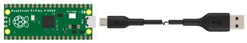
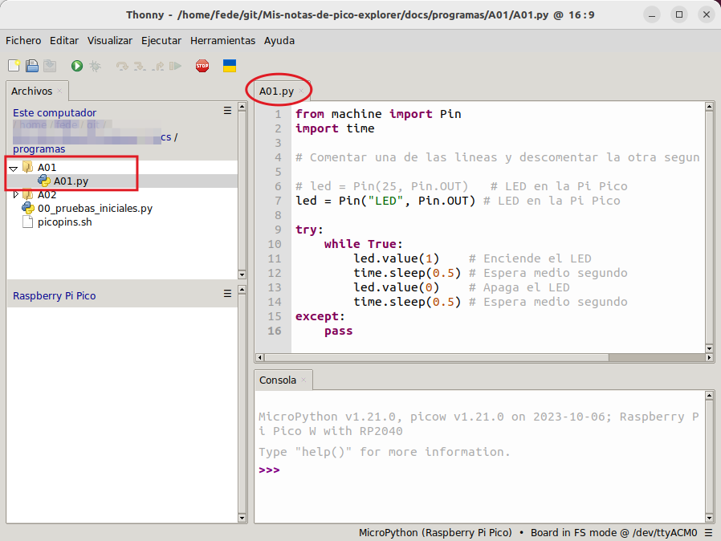
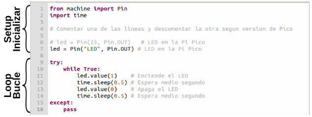

# <FONT COLOR=#8B008B>A01.Parpadeo onboard</font>
Esta actividad marca el punto de partida en la construcción y exploración de proyectos electrónicos con Raspberry Pi Pico.

Utilizaremos esta actividad para introducir conocimientos referentes a la carga de programas en la Pi Pico, como se importan archivos Python y por supuesto veremos los conocimientos de Python necesarios para un mejor entendimiento de la misma.

## <FONT COLOR=#007575>**Enunciado**</font>
Se trata de hacer parpadear el LED que incorpora la placa Pi Pico próximo al conector USB que está conectado a GP25.

## <FONT COLOR=#007575>**Lista de componentes**</font>

* [ ] **\*** 1 Raspberry Pi Pico o Pico W
* [ ] **\*** 1 Cable USB A a USB micro que utilizaremos para programar y alimentar la Pi Pico

## <FONT COLOR=#007575>**Esquema del circuito**</font>
Es tan simple como conectar la Pi Pico al ordenador mediante el cable USB.

<center>

  
*A01*

</center>

## <FONT COLOR=#007575>**Programa**</font>

### <FONT COLOR=#AA0000>Código</font>
El código de la actividad es el siguiente:

~~~py
from machine import Pin
import time

# Comentar una de las lineas y descomentar la otra segun version de Pico

# led = Pin(25, Pin.OUT)   # LED en la Pi Pico
led = Pin("LED", Pin.OUT) # LED en la Pi Pico

try:
    while True:
        led.value(1)    # Enciende el LED
        time.sleep(0.5) # Espera medio segundo
        led.value(0)    # Apaga el LED
        time.sleep(0.5) # Espera medio segundo
except:
    pass
~~~

Copiamos el código anterior en Thonny sin preocuparnos demasiado por entenderlo en este momento. Antes de continuar lo primero que haremos es guardar el proyecto en nuestro caso le ponemos como nombre el número de actividad y lo guardamos en un directorio con el mismo nombre.

<center>

  
*A01_archivo_y_carpeta_guardados*

</center>

Lo que vamos a hacer ahora es, con un código válido y que realiza una tarea, entender como se ejecuta y como se carga en la Pi Pico. Nos dirigimos al enlace siguiente para ver esto:

<center>Firmware y software -> Software Thonny -> [Ejecutando código](../up/soft.md/#ejecutar)</center>

El programa lo podemos descargar de:

* [A01_parpadeo LED onboard](../programas/A01/A01.py)

### <FONT COLOR=#AA0000>Explicación</font>
El programa de la imagen siguiente se ejecutará de arriba a abajo línea a línea. Cuando se encuentra un bucle ejecutará la sentencia del mismo según su condición.

<center>

  
*A01_programa*

</center>

Para trabajar con la Pi Pico necesitamos importar los módulos correspondientes a las funciones que vamos a emplear, en nuestro caso:

~~~py
from machine import Pin
import time
~~~

A continuación configuramos la patilla GPIO a la que está conectado el LED onboard como salida realizamos una asignación a ```led```. Se trata del pin GP25, que en la Pi Pico W se llama como objeto "LED" mientras que en la Pi Pico se llama por el número de pin al que está conectado, el 25 en este caso.

~~~py
# led = Pin(25, Pin.OUT)
led = Pin("LED", Pin.OUT)
~~~

Esto significa que a partir de ahora, el LED que representa a GP25 está en modo de salida.

Procedemos a poner a 1 ```led``` y el pin GP25 pasará a estar a nivel alto, encendiendo el LED.

~~~py
led.value(1)
~~~

Para apagar el LED basta con poner un estado bajo en GP25:

~~~py
led.value(0)
~~~

Entre encendido y apagado establecemos un tiempo de espera:

~~~py
time.sleep(0.5)
~~~

El código se ejecuta dentro de un bucle while:

~~~py
while True:
        led.value(1)
        time.sleep(0.5)
        led.value(0)
        time.sleep(0.5
~~~

Este bucle es infinito puesto que la condición ```True``` no se cambia y siempre es cierta. 

Siempre es conveniente poner las instrucciones que pueden causar errores dentro de un bloque ```try:``` y las sentencias a ejecutar en caso de error en un bloque ```except:```. En el programa normalmente se ejecutan las sentencias del bloque ```try:```. Cuando se produce un error en la Raspberry Pi Pico se ejecutarán las del bloque ```except```. En este caso en ```except``` se pone la sentencia ```pass```, que no hace nada, estándo su utilidad en marcar de forma completa la estructura del código.

~~~py
try:
    while True:
    ...
except:
    pass
~~~

MicroPython utiliza sangrías para distinguir diferentes bloques de código. El número de sangrías es modificable, pero debe ser consistente a lo largo de un bloque. Si la sangría del mismo bloque de código es inconsistente, causará errores cuando se ejecute el programa.
