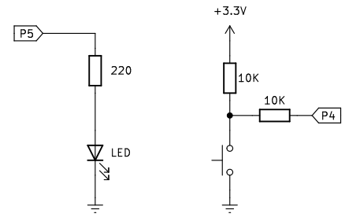

# <FONT COLOR=#8B008B>A03. Pulsador y LED</font>
La actividad está pensada para aprender a controlar un LED con un pulsador. Lo primero que deberemos hacer es leer el estado del pulsador para después decidir si el LED se enciende o no basándonos en esa lectura.

Contenidos de electrónica básica que se aconseja repasar:

* [Cables Dupont](https://fgcoca.github.io/Conceptos-basicos-electronica/apartados/cables_conn/#cables-dupont)
* [Protoboard](https://fgcoca.github.io/Conceptos-basicos-electronica/apartados/cables_conn/#protoboard)
* [Resistencias fijas](https://fgcoca.github.io/Conceptos-basicos-electronica/apartados/resistencias/#resistencias-fijas)
* [Diodo LED](https://fgcoca.github.io/Conceptos-basicos-electronica/apartados/semi_disc/#diodo-led-y-elementos-con-leds)
* [Pulsador](https://fgcoca.github.io/Conceptos-basicos-electronica/apartados/pulsa_int/#pulsador)
* [Rebotes](https://fgcoca.github.io/Conceptos-basicos-electronica/apartados/pulsa_int/#rebotes)

## <FONT COLOR=#007575>**Enunciado**</font>
En esta actividad vamos a controlar el estado de un diodo LED mediante un botón pulsador. Cuando presionemos el botón el LED debe encenderse y cuando lo soltemos debe apagarse.

## <FONT COLOR=#007575>**Lista de componentes**</font>

* [ ] - Placa pico explorer con Pi Pico
* [ ] - 1 Cable USB A a USB micro que utilizaremos para programar y alimentar la Pi Pico
* [ ] - 1 Diodo LED
* [ ] - 1 Resistencia de 220R
* [ ] - 2 Resistencia de 100K
* [ ] - 1 pulsador
* [ ] - Cables dupont

## <FONT COLOR=#007575>**Esquema del circuito**</font>
El circuito que vamos a montar es el siguiente:

<center>



</center>

## <FONT COLOR=#007575>**Programa**</font>

### <FONT COLOR=#AA0000>Código</font>
El código de la actividad es el siguiente:

~~~py
from machine import Pin

led = Pin(5, Pin.OUT)

#crea 'pulsador' y habilita su resistencia pull-up
pulsador = Pin(4, Pin.IN, Pin.PULL_UP)

try:
    while True:
        if not pulsador.value():
            led.value(1)
        else:
            led.value(0)
except:
    pass
~~~

El programa lo podemos descargar de:

* [A03_pulsador y botón](../programas/A03/A03.py)

### <FONT COLOR=#AA0000>Explicación</font>
El programa de la imagen siguiente se ejecutará de arriba a abajo línea a línea. Cuando se encuentra un bucle o un condicional ejecutará la sentencia del mismo según su condición.

<center>

  
*A03_programa*

</center>

Para trabajar con la Pi Pico necesitamos importar los módulos correspondientes a las funciones que vamos a emplear, en nuestro caso:

~~~py
from machine import Pin
~~~

A continuación configuramos la patilla GPIO a la que conectamos el LED como salida, realizamos una asignación a ```led``` del pin GP5 y también configuramos como entrada el pin GP4 activando su resistencia de pull-up y asignándolo a ```pulsador```.

~~~py
led = Pin(5, Pin.OUT)

#crea 'pulsador' y habilita su resistencia pull-up
pulsador = Pin(4, Pin.IN, Pin.PULL_UP)
~~~

Leemos el estado del pin del botón con la función value(). Al accionar el pulsador, la función devuelve nivel bajo y el resultado de ```if``` es verdadero (debido al ```not```) y el LED se encenderá; de lo contrario, el LED estará apagado.

~~~py
if not pulsador.value():
            led.value(1)
        else:
            led.value(0)
~~~
