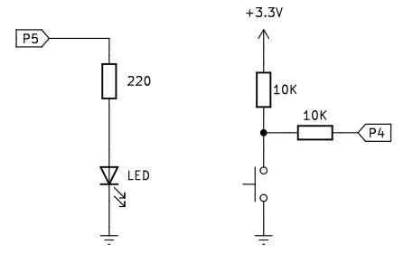
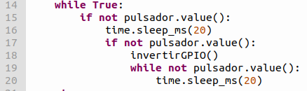
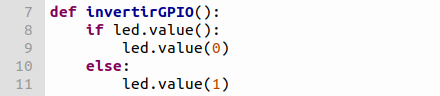

# <FONT COLOR=#8B008B>A04. Pulsador como interruptor</font>

## <FONT COLOR=#007575>**Enunciado**</font>
En esta actividad vamos a controlar el estado de un diodo LED mediante un botón pulsador pero de manera diferente a la actividad A03. Cuando presionemos el botón el LED se encenderá si estaba apagado o se apagará si estaba encendido. Es decir, la acción del pulsador ya no es momentánea ya que el LED va a permanecer encendido sin necesidad de estar acionanándolo de forma continua.

Contenidos de electrónica básica que se aconseja repasar:

* [Cables Dupont](https://fgcoca.github.io/Conceptos-basicos-electronica/apartados/cables_conn/#cables-dupont)
* [Protoboard](https://fgcoca.github.io/Conceptos-basicos-electronica/apartados/cables_conn/#protoboard)
* [Resistencias fijas](https://fgcoca.github.io/Conceptos-basicos-electronica/apartados/resistencias/#resistencias-fijas)
* [Diodo LED](https://fgcoca.github.io/Conceptos-basicos-electronica/apartados/semi_disc/#diodo-led-y-elementos-con-leds)
* [Pulsador](https://fgcoca.github.io/Conceptos-basicos-electronica/apartados/pulsa_int/#pulsador)
* [Rebotes](https://fgcoca.github.io/Conceptos-basicos-electronica/apartados/pulsa_int/#rebotes)

## <FONT COLOR=#007575>**Lista de componentes**</font>

* [ ] - Placa pico explorer con Pi Pico
* [ ] - 1 Cable USB A a USB micro que utilizaremos para programar y alimentar la Pi Pico
* [ ] - 1 Diodo LED
* [ ] - 1 Resistencia de 220R
* [ ] - 2 Resistencia de 100K
* [ ] - 1 pulsador
* [ ] - Cables dupont

## <FONT COLOR=#007575>**Esquema del circuito**</font>
El circuito que vamos a montar es el siguiente:

<center>



</center>

## <FONT COLOR=#007575>**Programa**</font>

### <FONT COLOR=#AA0000>Código</font>
El código de la actividad es el siguiente:

~~~py
from machine import Pin
import time

led = Pin(5, Pin.OUT)
pulsador = Pin(4, Pin.IN, Pin.PULL_UP)

def invertirGPIO():
    if led.value():
        led.value(0)
    else:
        led.value(1)
    
try:
    while True:
        if not pulsador.value():
            time.sleep_ms(20)
            if not pulsador.value():
                invertirGPIO()
                while not pulsador.value():
                    time.sleep_ms(20)
except:
    pass
~~~

El programa lo podemos descargar de:

* [A04_pulsador como interruptor](../programas/A04/A04.py)

### <FONT COLOR=#AA0000>Explicación</font>
Veamos el funcionamiento del programa:

* Importación de módulos y configuración de pines. Ver actividades anteriores.
* Bucle infinito:

<center>

  
*A04_bucle infinito*

</center>

Cuando se detecta que se ha pulsado el botón (primer if), se genera un retardo de 20 ms para evitar el efecto rebote y, a continuación, se comprueba si el botón ha sido pulsado de nuevo (segundo if). En caso afirmativo, se ejecutará la sentencia condicional, en caso contrario no se ejecutará. Si el segundo if se cumple se invoca a la función ```invertirGPIO()```.

* Función ```invertirGPIO()```:

<center>

  
*A04_función invertir estado GPIO*

</center>

Se evalúa el estado de ```led``` y si está a 1 lo pone a 0 o viceversa.
