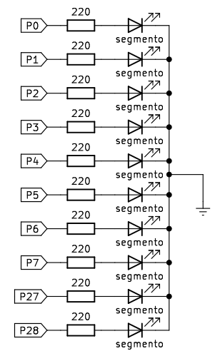
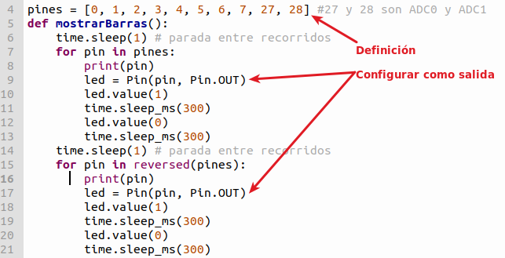
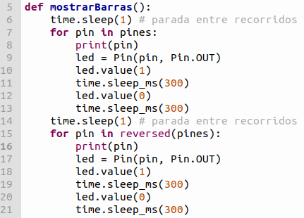
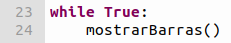

# <FONT COLOR=#8B008B>A05. Barra de LEDs</font>

## <FONT COLOR=#007575>**Enunciado**</font>
En esta actividad vamos a hacer un proyecto sencillo que haga que los LEDs se enciendan y apaguen simulando un desplazamiento del LED encendido. Jugaremos un poco con el valor de los retardos para dar sensación de aceleración.

Contenidos de electrónica básica que se aconseja repasar:

* [Cables Dupont](https://fgcoca.github.io/Conceptos-basicos-electronica/apartados/cables_conn/#cables-dupont)
* [Protoboard](https://fgcoca.github.io/Conceptos-basicos-electronica/apartados/cables_conn/#protoboard)
* [Resistencias fijas](https://fgcoca.github.io/Conceptos-basicos-electronica/apartados/resistencias/#resistencias-fijas)
* [Barras de LEDs](https://fgcoca.github.io/Conceptos-basicos-electronica/apartados/semi_disc/#Barras-de-leds)

## <FONT COLOR=#007575>**Lista de componentes**</font>

* [ ] - Placa pico explorer con Pi Pico
* [ ] - 1 Cable USB A a USB micro que utilizaremos para programar y alimentar la Pi Pico
* [ ] - 10 Resistencia de 220R
* [ ] - 1 barra de 10 LEDs
* [ ] - Cables dupont

## <FONT COLOR=#007575>**Esquema del circuito**</font>
El circuito que vamos a montar es el siguiente:

<center>



</center>

## <FONT COLOR=#007575>**Programa**</font>

### <FONT COLOR=#AA0000>Código</font>
El código de la actividad es el siguiente:

~~~py
from machine import Pin
import time

pines = [0, 1, 2, 3, 4, 5, 6, 7, 27, 28] #27 y 28 son ADC0 y ADC1
def mostrarBarras(): 
    time.sleep(1) # parada entre recorridos
    for pin in pines:
        print(pin)
        led = Pin(pin, Pin.OUT)
        led.value(1)
        time.sleep_ms(300)
        led.value(0)
        time.sleep_ms(300)        
    time.sleep(1) # parada entre recorridos
    for pin in reversed(pines):
        print(pin)
        led = Pin(pin, Pin.OUT)
        led.value(1)
        time.sleep_ms(300)
        led.value(0)
        time.sleep_ms(300)
          
while True:
    mostrarBarras()
~~~

El programa lo podemos descargar de:

* [A05_barra de LEDs](../programas/A05/A05.py)

### <FONT COLOR=#AA0000>Explicación</font>
Veamos el funcionamiento del programa:

* Importación de módulos. Ver actividades anteriores.
* Configuración de pines. La definición se realiza mediante una matriz de 10 elementos, en correspondencia con los 10 pines que usaremos. Los pines 27 y 28 son los pines ADC0 y ADC1 usados como digitales en este caso. La configuración de los pines como salida se realiza en la función ```mostrarBarras()``` con la variable ```led```

<center>

  
*A05_configuración de pines*

</center>

* Se realiza la definición de la función ```mostrarBarras()``` que incluye dos bucles ```for```, uno para encender los segmentos en un sentido y el otro para hacerlo en sentido contrario (reversed). Cada bucle va precedido de un retardo de un segundo antes de iniciarse.

<center>

  
*A05_definición de la función mostrarBarras()*

</center>

* Bucle infinito: Se invoca la función definida.

<center>

  
*A05_bucle infinito*

</center>
