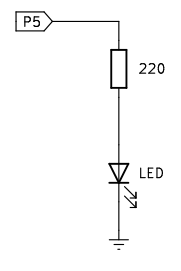

# <FONT COLOR=#8B008B>A06.Control PWM de LED externo</font>
Contenidos de electrónica básica que se aconseja repasar:

* [Cables Dupont](https://fgcoca.github.io/Conceptos-basicos-electronica/apartados/cables_conn/#cables-dupont)
* [Protoboard](https://fgcoca.github.io/Conceptos-basicos-electronica/apartados/cables_conn/#protoboard)
* [Resistencias fijas](https://fgcoca.github.io/Conceptos-basicos-electronica/apartados/resistencias/#resistencias-fijas)
* [Diodo LED](https://fgcoca.github.io/Conceptos-basicos-electronica/apartados/semi_disc/#diodo-led-y-elementos-con-leds)
* [Señales](https://fgcoca.github.io/Conceptos-basicos-electronica/seccion/signals/)

## <FONT COLOR=#007575>**Enunciado**</font>
En esta actividad haremos que un LED montado en la placa protoboard de la Pico Explorer se vaya iluminando de menos a mas hasta obtener el brillo maximo y después que este disminuya hasta el total apagado.

## <FONT COLOR=#007575>**Lista de componentes**</font>

* [ ] - Placa pico explorer con Pi Pico
* [ ] - 1 Cable USB A a USB micro que utilizaremos para programar y alimentar la Pi Pico
* [ ] - 1 Diodo LED
* [ ] - 1 Resistencia de 220R (opcional)
* [ ] - Cables dupont

## <FONT COLOR=#007575>**Esquema del circuito**</font>
El circuito que vamos a montar es el siguiente:

<center>

  

</center>

La resistencia serie se puede omitir dado que Pico Explorer ya incluye una de 100 ohmios.

## <FONT COLOR=#007575>**Programa**</font>
El código del programa es:

~~~py
from machine import Pin, PWM
import time

# crea y configura GP7 como salida PWM
pwm5 = PWM(Pin(5))
pwm5.freq(10000) # metodo freq para hacer f=10kHz en GP5

try:
    while True:
        for i in range(0, 65535):
            pwm5.duty_u16(i)
            time.sleep_us(100)
        for i in range(65535, 0, -1):
            pwm5.duty_u16(i)
            time.sleep_us(100)
except:
    pwm5.deinit()
~~~

El programa lo podemos descargar de:

* [A06_controlPWM_LED_externo](../programas/A06/A06.py)

El rango del ciclo de trabajo va de 0 a 65535. El primer bucle for controla el PWM cambiando el valor del ciclo de trabajo para que la salida PWM varíe de 0% a 100%. El segundo bucle for hace variar la salida PWM de 100% a 0%.

Cada vez que se utiliza el PWM, el temporizador de hardware se pondrá en ON para trabajar con él. Por lo tanto, después de cada uso de PWM, se debe llamar a la función ```deinit()``` que es la encargada de apagar el temporizador. De lo contrario, el PWM puede fallar la próxima vez que intentemos trabajar con él.
