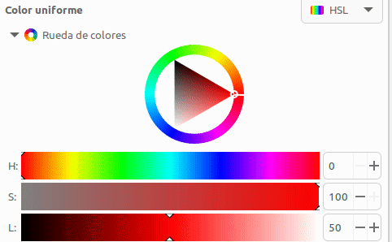

# A07.LED RGB
Contenidos de electrónica básica que se aconseja repasar:

* [Cables Dupont](https://fgcoca.github.io/Conceptos-basicos-electronica/apartados/cables_conn/#cables-dupont)
* [Protoboard](https://fgcoca.github.io/Conceptos-basicos-electronica/apartados/cables_conn/#protoboard)
* [Resistencias fijas](https://fgcoca.github.io/Conceptos-basicos-electronica/apartados/resistencias/#resistencias-fijas)
* [LED RGB](https://fgcoca.github.io/Conceptos-basicos-electronica/apartados/semi_disc/#led-rgb)

## **Enunciado**
En esta actividad vamos a controlar un diodo LED multicolor o LED RGB que haremos que cambie entre diferentes colores de forma automática.

## **Lista de componentes**

* [ ] - Placa pico explorer con Pi Pico
* [ ] - 1 Cable USB A a USB micro que utilizaremos para programar y alimentar la Pi Pico
* [ ] - 1 Diodo LED RGB
* [ ] - 3 Resistencias de 220R (opcionales)
* [ ] - Cables dupont

## **Esquema del circuito**
El circuito que vamos a montar es el siguiente:

  

La resistencia serie se puede omitir dado que Pico Explorer ya incluye una de 100 ohmios.

## **Programa**
El código del programa es:

~~~py
# --1--> Importar los módulos necesarios
from machine import Pin, PWM
from random import randint
import time # <--1--

# --2--> Configurar pines GP3, GP4 y GP5 como salidas PWM y frecuencia de 10 kHz
pines = [3,4,5]
frecuencia = 10000

pwm0 = PWM(Pin(pines[0]))
pwm1 = PWM(Pin(pines[1]))
pwm2 = PWM(Pin(pines[2]))
pwm0.freq(frecuencia)
pwm1.freq(frecuencia)
pwm2.freq(frecuencia) # <--2--

# --3--> Definicion de la funcion para establecer color del LED RGB
def establecer_color(r,g,b):
    pwm0.duty_u16(65535 - r)
    pwm1.duty_u16(65535 - g)
    pwm2.duty_u16(65535 - b) #<--3--
    
try:
    while True:
        #--4--> Generar tres colores aleatorios y llamar funcion cada 150ms
        rojo = randint(0, 65535)
        verde = randint(0, 65535)
        azul = randint(0, 65535)
        establecer_color(rojo,verde,azul)
        time.sleep_ms(150) # <--4--
except:
    #--5--> Apagado de los temporizadores de hardware
    pwm0.deinit()
    pwm1.deinit()
    pwm2.deinit() # <--5--
~~~

El programa lo podemos descargar de:

* [A07_LED_RGB](../programas/A07/A07.py)

## **Ampliación**
En el ejmplo hemos programado un cambio de colores aleatorio que hace dificil su seguimiento. Lo que vamos a hacer a continuación es realizar cambios de color de una manera mas suave haciendo un modelo de color que cambie entre 0 y 255. La idea es trabajar con colores HSL (Hue, Saturation, Lightness), que es un método para definir un color por su tono (color en el espectro óptico), saturación (intensidad/pureza) y claridad. El rango de la saturación varía desde un color puro hasta el gris. El rango para la claridad varía desde el negro hasta el blanco. El rango de valores para el tono va desde 0 hasta 255. En la animación siguiente vemos la rueda de colores HSL de Inkscape. En ella vemos que el tono H para elegir el color varia entre 0 y 255 en el círculo o rueda externa y la saturación y la claridad se mueven en el triángulo interno entre los valores indicados.

El programa explicado con comentarios es el siguiente:

~~~py
# --1--> Importar los módulos necesarios
from machine import Pin, PWM
import time # <--1--

# --2--> Configurar pines GP3, GP4 y GP5 como salidas PWM y frecuencia de 1 kHz
pines = [3,4,5]
frecuencia = 1000

pwm0 = PWM(Pin(pines[0]))
pwm1 = PWM(Pin(pines[1]))
pwm2 = PWM(Pin(pines[2]))
pwm0.freq(frecuencia)
pwm1.freq(frecuencia)
pwm2.freq(frecuencia) # <--2--

# --3--> Definicion de funcion para que variable rgb represente el valor RGB
# El rango PWM es 0 a 65535 (2^16). Se obtiene el cada canal con una operación
# a nivel de bit.
def establecer_color(rgb):
    pwm0.duty_u16(65535 - (rgb >> 4))
    pwm1.duty_u16(65535 - (rgb >> 1))
    pwm2.duty_u16(65535 - (rgb >> 0)) #<--3--

# --4--> La función rueda() es un método de selección de color del modelo de
# color introducido en establecer_color(). El rango de valores del parámetro
# parámetro posicion es 0-65535. La función devolverá un dato que contiene
# el valor del ciclo de trabajo
def rueda(posicion):
    posicion_rueda = posicion % 65535
    if posicion_rueda < 21845:
        return (((65535 - posicion_rueda*3) << 4) | ((posicion_rueda*3) << 1))
    elif posicion_rueda >= 21845 and posicion_rueda < 43690:
        posicion_rueda -= 21845
        return (((65535 - posicion_rueda*3) << 1) | (posicion_rueda*3))
    else:
        posicion_rueda -= 43690
        return (((posicion_rueda*3) << 4) | (65535 - posicion_rueda*3)) # <--4--
        
try:
    while True:
        #--5--> Recorrer el rango de valores invocando a rueda() con un valor
        # cada 5ms
        for i in range(0, 65535):
            establecer_color(rueda(i))
            time.sleep_ms(5) # <--5--
except:
    #--6--> Apagado de los temporizadores de hardware
    pwm0.deinit()
    pwm1.deinit()
    pwm2.deinit() # <--6--
~~~

El programa lo podemos descargar de:

* [A07_Ampliación_LED_RGB](../programas/A07/A07_ampliacion.py)