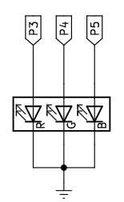

# A07.LED RGB
Contenidos de electrónica básica que se aconseja repasar:

* [Cables Dupont](https://fgcoca.github.io/Conceptos-basicos-electronica/apartados/cables_conn/#cables-dupont)
* [Protoboard](https://fgcoca.github.io/Conceptos-basicos-electronica/apartados/cables_conn/#protoboard)
* [Resistencias fijas](https://fgcoca.github.io/Conceptos-basicos-electronica/apartados/resistencias/#resistencias-fijas)
* [LED RGB](https://fgcoca.github.io/Conceptos-basicos-electronica/apartados/semi_disc/#led-rgb)

## **Enunciado**
En esta actividad vamos a controlar un diodo LED multicolor o LED RGB que haremos que cambie entre diferentes colores de forma automática.

## **Lista de componentes**

* [ ] - Placa pico explorer con Pi Pico
* [ ] - 1 Cable USB A a USB micro que utilizaremos para programar y alimentar la Pi Pico
* [ ] - 1 Diodo LED RGB
* [ ] - 3 Resistencias de 220R (opcionales)
* [ ] - Cables dupont

## **Esquema del circuito**
El circuito que vamos a montar es el siguiente:

  

La resistencia serie se puede omitir dado que Pico Explorer ya incluye una de 100 ohmios.

## **Programa**
El código del programa es:

~~~py
# --1--> Importar los módulos necesarios
from machine import Pin, PWM
from random import randint
import time # <--1--

# --2--> Configurar pines GP3, GP4 y GP5 como salidas PWM y frecuencia de 10 kHz
pines = [3,4,5]
frecuencia = 10000

pwm0 = PWM(Pin(pines[0]))
pwm1 = PWM(Pin(pines[1]))
pwm2 = PWM(Pin(pines[2]))
pwm0.freq(frecuencia)
pwm1.freq(frecuencia)
pwm2.freq(frecuencia) # <--2--

# --3--> Definicion de la funcion para establecer color del LED RGB
def establecer_color(r,g,b):
    pwm0.duty_u16(65535 - r)
    pwm1.duty_u16(65535 - g)
    pwm2.duty_u16(65535 - b) #<--3--
    
try:
    while True:
        #--4--> Generar tres colores aleatorios y llamar funcion cada 150ms
        rojo = randint(0, 65535)
        verde = randint(0, 65535)
        azul = randint(0, 65535)
        establecer_color(rojo,verde,azul)
        time.sleep_ms(150) # <--4--
except:
    #--5--> Apagado de los temporizadores de hardware
    pwm0.deinit()
    pwm1.deinit()
    pwm2.deinit() # <--5--
~~~

El programa lo podemos descargar de:

* [A07_LED_RGB](../programas/A07/A07.py)
