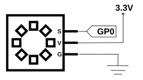

# A08.Módulo 8 LEDs direccionables
Contenidos de electrónica básica que se aconseja repasar:

* [Cables Dupont](https://fgcoca.github.io/Conceptos-basicos-electronica/apartados/cables_conn/#cables-dupont)
* [Protoboard](https://fgcoca.github.io/Conceptos-basicos-electronica/apartados/cables_conn/#protoboard)
* [Resistencias fijas](https://fgcoca.github.io/Conceptos-basicos-electronica/apartados/resistencias/#resistencias-fijas)
* [LED RGB direccionable](https://fgcoca.github.io/Conceptos-basicos-electronica/apartados/semi_disc/#led-rgb-direccionable)
* [Alimentación de Neopixeles](https://fgcoca.github.io/Conceptos-basicos-electronica/seccion/alim_neop/)

## **Enunciado**
Vamos a dividir la actividad en dos partes: la primera simplemente haremos una secuencia de encendido de los LEDs en los colores RGB para así aprender a manejar el módulo y en la segunda se realizan diferentes secuencias con los LEDS, un ciclo de encendido, un efecto rebote, un fundido entrada/salida y un apagado.

## **Lista de componentes**

* [ ] - Placa pico explorer con Pi Pico
* [ ] - 1 Cable USB A a USB micro que utilizaremos para programar y alimentar la Pi Pico
* [ ] - 1 Módulo de 8 LED direccionables
* [ ] - Cables dupont

## **Esquema del circuito**
El circuito que vamos a montar es el siguiente:

  

## **Programa**
El código comentado del programa es:

~~~py
# --1--> Importar los módulos necesarios
import machine, neopixel
import time # <--1--

# --2--> Crear objeto definiendo el pin y el numero de LEDs
np = neopixel.NeoPixel(machine.Pin(0), 8) # <--2--

while True:
    # --3--> Bucle para gradiente de rojo
    for i in range(0, 8):
        if i == 0:
            np[0] = (2, 0, 0)
        else:
            np[i] = (i*8, 0, 0)
            np.write()
            time.sleep_ms(500) # <--3--

    time.sleep(1) # Retardo entre gradientes

    # --4--> Bucle para gradiente de verde
    for i in range(0, 8):
        if i == 0:
            np[0] = (0, 2, 0)
        else:
            np[i] = (0, i*8, 0)
            np.write()
            time.sleep_ms(500) # <--4--

    time.sleep(1) # Retardo entre gradientes

    # --5--> Bucle para gradiente de azul
    for i in range(0, 8):
        if i == 0:
            np[0] = (0, 0, 2)
        else:
            np[i] = (0, 0, i*8)
            np.write()
            time.sleep_ms(500) # <--5--

    time.sleep(1) # Retardo entre gradientes

    # --5--> Apagado
    for i in range(0, 8):
        np[i] = (0, 0, 0)
        np.write() # <--5--
~~~

El programa lo podemos descargar de:

* [A08_Neopixel_1](../programas/A08/A08_1.py)

## **Ampliación**
El programa explicado con comentarios es el siguiente:

~~~py
# --1--> Importar los módulos necesarios
import machine, neopixel
import time # <--1--

# --2--> Crear objeto definiendo el pin y el numero de LEDs
np = neopixel.NeoPixel(machine.Pin(0), 8) # <--2--

# --3--> Funcion con las distintas secuencias
def demo(np):
    n = np.n # Numero de LEDs
    
    # Ruleta de encendido en blanco a brillo maximo
    for i in range(4 * n):
        for j in range(n):
            np[j] = (0, 0, 0)
        np[i % n] = (255, 255, 255)
        np.write()
        time.sleep_ms(100)

    # Efecto rebote
    for i in range(4 * n):
        for j in range(n):
            np[j] = (0, 0, 128)
        if (i // n) % 2 == 0:
            np[i % n] = (0, 0, 0)
        else:
            np[n - 1 - (i % n)] = (0, 0, 0)
        np.write()
        time.sleep_ms(100)

    # Fundido rojo de menos a mas brillo y viceversa
    for i in range(0, 4 * 256, 8):
        for j in range(n):
            if (i // 256) % 2 == 0:
                val = i & 0xff
            else:
                val = 255 - (i & 0xff)
            np[j] = (val, 0, 0)
        np.write()
        time.sleep_ms(50)

    # Apagado
    for i in range(n):
        np[i] = (0, 0, 0)
    np.write()
    time.sleep(3)
# <--4--

while True:
    demo(np)
~~~

El programa lo podemos descargar de:

* [A08_Neopixel_2](../programas/A08/A08_2.py)
