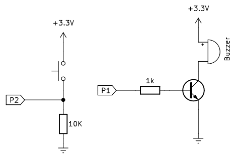

# A09.Buzzer activo y pasivo
Contenidos de electrónica básica que se aconseja repasar:

* [Cables Dupont](https://fgcoca.github.io/Conceptos-basicos-electronica/apartados/cables_conn/#cables-dupont)
* [Protoboard](https://fgcoca.github.io/Conceptos-basicos-electronica/apartados/cables_conn/#protoboard)
* [Resistencias fijas](https://fgcoca.github.io/Conceptos-basicos-electronica/apartados/resistencias/#resistencias-fijas)
* [El transistor bipolar o BJT](https://fgcoca.github.io/Conceptos-basicos-electronica/apartados/semi_disc/#el-transistor-bipolar-o-bjt)
* [Pulsador e interruptor](https://fgcoca.github.io/Conceptos-basicos-electronica/apartados/pulsa_int/)
* [Reproductores de sonido](https://fgcoca.github.io/Conceptos-basicos-electronica/apartados/buzzer/)

## **Enunciado**
En esta actividad vamos a crear dos sencillos ejemplos, uno para probar un zumbador activo y otro para activar uno pasivo.

## **Lista de componentes**

* [ ] - Placa pico explorer con Pi Pico
* [ ] - 1 Cable USB A a USB micro que utilizaremos para programar y alimentar la Pi Pico
* [ ] - 1 Resistencia de 1k
* [ ] - 2 resistencias de 10k
* [ ] - 1 pulsador
* [ ] - 1 transistor S8050 o similar
* [ ] - 1 buzzer pasivo
* [ ] - 1 buzzer activo
* [ ] - Cables dupont

## **Esquema del circuito**
El circuito que vamos a montar es el siguiente:

  

El circuito es idéntico para ambos tipos de zumbador y lo único que se requiere es cambiar el zumbador por el adecuado según la actividad que estemos realizando.

## **Programa zumbador activo**
El código del programa es:

~~~py
from machine import Pin
import time

boton = Pin(1, Pin.IN, Pin.PULL_UP)
buzzer = Pin(0, Pin.OUT)
 
while True:
    if boton.value() == 0:
        print("Boton pulsado")
        buzzer.value(1)
        time.sleep(1)
    else:
        buzzer.value(0)
~~~

El programa lo podemos descargar de:

* [A09_buzzer_activo](../programas/A09/A09_activo.py)

## **Programa zumbador pasivo**
El código del programa es:

~~~py
# --1--> Importar pines, PWM, time y matematicas
from machine import Pin, PWM
import math
import time # <--1--

# --2--> Contantes, variables e inicializaciones
PI = 3.14
boton = Pin(1, Pin.IN, Pin.PULL_UP)
buzzerPasivo = PWM(Pin(0))
buzzerPasivo.freq(1000) # <--2--

# --3--> Definicion de funcion
def alarma():
    for x in range(0, 36):
        # mediante la función seno se crea la frecuencia del buzzer
        Valor_seno = math.sin(x * 10 * PI / 180)
        tono = 1500 + int(Valor_seno*500)
        buzzerPasivo.freq(tono)
        time.sleep_ms(10) # <--3--

try:
    while True:
        if not boton.value():
            buzzerPasivo.duty_u16(4092*2)
            alarma()
        else:
            buzzerPasivo.duty_u16(0)
except:
    buzzerPasivo.deinit() # Cuando se deja de usar PWM se apagan temporizadores
~~~

El programa lo podemos descargar de:

* [A09_buzzer_pasivo](../programas/A09/A09_pasivo.py)
