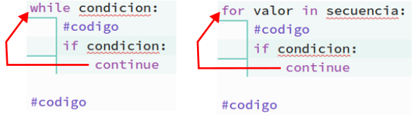

# <FONT COLOR=#8B008B>Estructuras de control</font>
Los programas se ejecutan de manera secuencial línea tras línea de código, pero existen muchas situaciones en las que nos va a interesar que esto no sea así, como por ejemplo hacer dos cosas diferentes según el valor de una variable o repetir un determinado número de veces o hasta que se cumpla una condición dada ciertas instrucciones. Para realizar estas tareas se utilizan las estructuras de control que vamos a describir seguidamente.

## <FONT COLOR=#007575>**Condicional if**</font>
En este apartado vamos en primer lugar a estudiar la función if para posteriormente ver como realizar una instrucción muy útil que existe en otros lenguajes, pero no en Python, se trata de ```switch```.

### <FONT COLOR=#AA0000>if</font>
En programación se utiliza la sentencia if para ejecutar un bloque de código sólo cuando se cumple una determinada condición. La sintaxis básica de ```if``` es:

~~~py
...
sentencias previas a if
...
if condicion:
    sentecia 1
    sentencia 2
    ...
continua el programa despues de if
~~~

Se evalúa ```condicion``` siempre y:

* Si el resultado es cierto (True o 1) se ejecuta el bloque de sentencias y se continúa el programa
* Si el resultado es falsa (False o 0) se omite el bloque de sentencias y se continúa el programa

En el ```if``` la condición tiene que ser una expresión lógica que se pueda evaluar como ```True``` o como ```False```. Esta línea siemrpe tiene que acabar con dos puntos (:).

En la figura siguiente vemos la explicación de forma gráfica mediante un ejemplo:

<center>


</center>

Veamos un ejemplo sencillo de uso. Se trata de que introduzcamos un valor por teclado y el programa nos indique si es el número es positivo y el valor introducido.

~~~py
numero = int(input("Escribe un número y pulsa Enter: "))
if numero > 0:
    print("El número introducido es positivo")
print("El número es:", numero)
~~~

En la imagen vemos la respuesta a dos entradas diferentes, una negativa y la otra positiva.

<center>


</center>

### <FONT COLOR=#AA0000>if...else</font>
Una sentencia ```if``` puede tener de manera opcional una clausula ```else```. La sintaxis de esta declaración en Python tiene la forma siguiente:

~~~py
if condicion:
    # Bloque de sentencias si condicion es True

    else:
    # Bloque de sentencias si condicion es False
~~~

La sentencia se evalúa de la siguiente forma: Si ```condición``` es ```True``` se ejecuta el código dentro del ```if``` y el código dentro del ```else``` se omite. Si ```condición``` es ```False``` se ejecuta el código dentro del ```else``` y el código dentro del ```if``` se omite. Cuando finaliza bien la parte del ```if``` o bien la del ```else``` el programa continua con la siguiente sentencia del programa.

En la figura siguiente vemos la explicación de forma gráfica.

<center>


</center>

### <FONT COLOR=#AA0000>if...elif...else</font>
La sentencia `` `` se utiliza para ejecutar un bloque de código entre dos alternativas posibles. Sin embargo, si necesitamos elegir entre más de dos alternativas debemos utilizar la sentencia ```if...elif...else```. Su sintaxis es:

~~~py
if condicion_1:
    # Bloque 1
elif condicion_2:
    #Bloque 2

    else:
    # Bloque 3
~~~

Se evalúa así: Si ```condicion_1``` es ```True```, se ejecuta Bloque 1. Si ```condicion_1``` es ```False```, se evalúa ```condicion_2```. Si ```condicion_2``` es ```True```, se ejecuta Bloque 2. Si ```condicion_2``` es ```False```, se ejecuta Bloque 3. Y así sucesivamente tantas veces como sea necesario. Opcionalmente esta sentencia también puede tener una clausula ```else``` que se ejecutará si no se cumple ninguna de las condiciones.

En la figura siguiente vemos la explicación de forma gráfica.

<center>


</center>

### <FONT COLOR=#AA0000>Switch</font>
La sentencia ```switch``` junto con ```case``` (en el caso de lenguaje C) está pensada para el control de sentencias condicionales de bifurcación complejas y su funcionamiento es muy similar al de un conmutador rotativo de múltiples posiciones, siendo ```case``` cada una de estas posiciones. Es decir, se evalúa la expresión de ```switch``` y en función del resultado (un número entero) se transfiere el control a un ```case``` o posición determinada. Esta sentencia además tiene una clausula ```default``` para devolver un valor si no se cumple ninguna de las condiciones, es decir no existe el case para el valor obtenido.

Este tipo de sentencia resulta muy útil en algunos casos pero en Python no está implementada, así que tendremos que crear código con ```if``` que simulen su comportamiento.

Se puede utilizar ```elif``` para hacerlo, pero si el númereo de condiciones es elevado el tiempo en el que se evalúa cada una puede ser importante. Tenemos que tener en cuenta que las sentencias de evaluan de manera secuencial y no transcurre el mismo tiempo en que se evaluen las primeras que las última en un conjunto de 200 sentencias.

~~~py
if caso == 1:
    print("1")
elif caso == 2:
    print("2")
elif caso == 3:
    print("3")
elif caso == 4:
    print("4")
# ...
elif caso == 200:
    print("200")
else:
    print("Equivale a default")
~~~

Vamos a ver un ejemplo en el que emularemos de dos maneras diferentees a ```switch``` para convertir los caracteres del sistema de numeración octal en binario de tres digititos creando sendas funciones mediante ```def```.

* ```switch``` con ```if```:

~~~py
def switch_if(octal):
    if octal == '0':
        return "000"
    elif octal == '1':
        return "001"
     elif octal == '2':
        return "010"
     elif octal == '3':
        return "011"
     elif octal == '4':
        return "100"
     elif octal == '5':
        return "101"
     elif octal == '6':
        return "110"
     elif octal == '7':
        return "111"
    else:
        return "NAN" #Not A Number
~~~

* ```switch``` con un diccionario:

~~~py
dicc = {
    '0':'000',
    '1':'001',
    '2':'010',
    '3':'011',
    '4':'100',
    '5':'101',
    '6':'110',
    '7':'111',
    }
def switch_dicc(octal):
    return dicc.get(octal, "NAN")
~~~

## <FONT COLOR=#007575>**Bucle for**</font>
En los bucles ```for``` la acción está dirigida a contar el número de veces que ocurre algo o realizar una acción un determinado número de veces. Es especialmente útil para recorrer los datos de una lista, tupla o diccionario.

La sintaxis de este tipo de bucles en Python es:

~~~py
for variable in secuencia:
    declaracion
~~~

Siendo "```variable```" la variable que se va a recorrer en el bucle de forma que cuando se alcance el valor establecido se sale del bucle.

La variable puede ser una cadena, un rango de valores que se expresa con ```range(n)```, siendo n el número de valores del rango que se inicia en 0 y que pueden ser iterados con una variable. Mas ampliamente, la sintaxis de ```range()``` es ```range(start, stop, step)``` siendo ```start``` y ```stop``` opcionales.

El bucle ```for``` se utiliza para ejecutar un programa sin fin e iterar en el orden de los elementos (una lista o una cadena) en la secuencia.

Usos comunes son:

~~~py
for pin in pines
~~~

Donde ```pines``` es una lista de elementos que son iterados por un bucle ```for``` y asignados a la variable del bucle ```pin``` cada vez.

~~~py
for i in range(start, end, num: 1)
~~~

Donde:

* [ ] - ```start```: es el valor inicial, a partir del cual el bucle for empieza a contar. El valor inicial por defecto es 0. Por ejemplo, ```range(5)``` es igual a ```range(0, 5)```.
* [ ] - ```end```: es el valor con el que termina. El bucle for cuenta hasta llegar a este valor, pero este valor no se incluye en el conteo.
* [ ] - ```num```: El valor de incremento del bucle. El valor por defecto es 1.

En el bucle ```for ``` existe un iterable que define las veces que se ejecutará el código del mismo. Un ejemplo de ```for``` sería:

~~~py
for i in range(0,7):
    print(i)
~~~

Genera la siguiente salida:

~~~py
0
1
2
3
4
5
6
~~~

Vamos a crear un ejemplo de ```for``` que realice iteraciones sobre una cadena de texto:

~~~py
for i in "Cadena de texto":
    print(i)
~~~

Genera la siguiente salida:

~~~py
C
a
d
e
n
a
 
d
e
 
t
e
x
t
o
~~~

### <FONT COLOR=#AA0000>For anidados</font>
Los bucles se pueden anidar, es decir se puede crear un bucle dentro de otro del mismo o diferente tipo, de forma que por cada iteración del bucle mas externo se tienen que producir todas las iteraciones del bucle mas interno. Esto resulta muy útil si por ejemplo tenemos listas anidadas (cada elemento de la lista es otra lista). Veamos un  ejemplo:

~~~py
lista_de_listas = [[5, 7, 9], ["Cadena", "de", "texto"], [2, 4, 6]]
for i in lista_de_listas:
    print(i)
~~~

Un solo ```for``` simplemente nos muestra la lista:

~~~py
[5, 7, 9]
['Cadena', 'de', 'texto']
[2, 4, 6]
~~~

En este caso podemos acceder a cada elemento individual anidando dos ```for```, así:

~~~py
lista_de_listas = [[5, 7, 9], ["Cadena", "de", "texto"], [2, 4, 6]]
for i in lista_de_listas:
    for j in i:
        print(j)
~~~

Que nos devuelve:

~~~py
5
7
9
Cadena
de
texto
2
4
6
~~~

El bucle for puede tener de manera opcional un bloque else cuyas sentencias se ejecutan cuando se han realizado todas las iteraciones del bucle. Un ejemplo lo vemos a continuación:

~~~py
for var in range(5):
    print(var)
else:
    print("bucle finalizado")
~~~

### <FONT COLOR=#AA0000>Bucle for decontando</font>
Se trata del mismo bucle for pero ahora la cuenta la realizamos hacia atrás. Hay dos formas sencillas de hacerlo:

* Utilizando la función range(). Si queremos darle un enfoque Pythonic simplemente configuramos los argumentos de la función de manera que se indique el principio, el final y el incremento, que será logicamente negativo.

~~~py
for i in range(20, 0, -2): #imprimere 20, 18, 16, ... 0
~~~

* Utilizando la función reversed(). Es una función incorporada en la que hay que indicar como primer argumento el final de la cuenta, como segundo el principio, teniendo en cuenta que se omite, y como tercero el decremento si es ditintos de 1, pero se especifica en módulo. Se utiliza así:

~~~py
for i in reversed(range(0,21,2)): #imprimere 20, 18, 16, ... 0
~~~

## <FONT COLOR=#007575>**Range**</font>
Una de las operaciones mas comunes en programación es iterar números entre un valor dado (muy usual comenzar por 0) y un número ```n```. Si por ejemplo queremos iterar una variable ```i``` entre 0 y 4 podemos escribir:

~~~py
for i in (0,1,2,3,4):
    print(i)
~~~

Que nos devuelve una salida con:

~~~py
0
1
2
3
4
~~~

Esto es totalmente correcto ya que la tupla ```(0,1,2,3,4)``` es perfectamente iterable. Pero no es una buena práctica, sobre todo si esa tupla tiene un número muy elevado de elementos. En Python es posible hacer esto mismo utilizando ```range()```:

~~~py
for i in range(5):
    print(i)
~~~

Nos va a devolver el mismo resultado y podemos observar que el parámetro de range es el número de elementos y como se comienza en 0 se iterará hasta el 4, o sea el número de elementos menos uno.

En ```range()``` podemos pasar hasta tres parámetros en lugar de utilizar la opción por defecto del número de elementos. Tendría una sintaxis como:

~~~py
for i in range(inicio, fin, incremento)
~~~

donde ```inicio``` es  el valor inicial de la iteración, ```fin``` es el valor final e ```incremento``` es el salto entre valores. Cabe destacar que ```incremento``` puede ser un valor negativo. Un ejemplo nos aclara estos términos:

~~~py
for i in range(20, 51, 10):
    print(i)
print("----------------------------")
for j in range(50, 19, -10):
    print(j)
~~~

Genera el siguiente resultado:

~~~py
20
30
40
50
----------------------------
50
40
30
20
~~~

Observese la congruencia de los valores inicial y final con el valor de incremento de las variables. Si hacemos:

~~~py
for j in range(19, 50, -10):
    print(j)
~~~

No devolverá ningún resultado porque es imposible realizar esa iteración.

## <FONT COLOR=#007575>**Bucle While**</font>
La sintaxis de while es la siguiente:

~~~py
while condicion:
    bloque de codigo
~~~

donde "condicion", que se evalúa en cada iteración, puede ser cualquier expresión realizado con operadores condicionales que devuelva como resultado un valor ```True``` o ```False```. Mientra que "bloque de codigo" es el conjunto de instrucciones que se estarán ejecutando mientras la condición sea ```verdadera``` (```True``` o '```1```'). Es lo mismo poner ```while true:``` que ```poner while 1:```.

El bucle ```while``` es de los bucles que no tienen un número definido de iteraciones. Un ejemplo sencillo nos va a permitir entender su estructura y funcionamiento:

~~~py
valor = 4
while valor > 0:
    valor -= 1
    print(valor) # salida: 3, 2, 1, 0
print("Iteraciones finalizadas")
~~~

Las dos partes de este bucle ```while``` son:

* **Condición**: ```valor > 0```
* **Bloque de código**: ```x -= 1``` y ```print(valor)```
* **proceso de ejecución**: El programa sigue esta secuencia de pasos:

>
- **Primera iteración**: La primera vez entra con ```valor = 4``` que es mayor que 0, por lo que se decrementa en 1 y se imprime la variable (se obtiene el 3) finalizando la primera iteración para volver a evaluar condición.
- **Segunda iteración**: Ahora la variable es ```valor = 3``` que es mayor que 0, por lo que se decrementa en 1 y se imprime la variable (se obtiene el 2) y ha terminado la segunda iteración volviéndose a evaluar condición.
- **Tercera iteración**: La variable es ```valor = 2``` que es mayor que 0, por lo que se decrementa en 1 y se imprime la variable (se obtiene el 1) y se pone fin a la tercera iteración para volver a evaluar condición.
- **Cuarta iteración**: Ahora la variable es ```valor = 1``` que es mayor que 0, por lo que se decrementa en 1 y se imprime la variable (se obtiene el 0) y ha terminado la cuarta iteración volviéndose a evaluar condición.
- **Salida de while**: Ya no se cumple la condición por lo que se finaliza el while y se imprime el mensaje del ```print()``` final.

### <FONT COLOR=#AA0000>Cláusula ```else```</font>
El bucle while puede tener de manera opcional una clausula else cuyas sentencias se ejecutan cuando se han realizado todas las iteraciones del bucle. Vamos a ver su uso continuando con el ejemplo anterior:

~~~py
valor = 4
while valor > 0:
    valor -= 1
    print(valor) # salida: 3, 2, 1, 0
else:
    print("Iteraciones del while finalizadas")
    print("")
    print("---------------------------")

print("Continuación del programa")
valor = 8
print("Cambiado valor a:",valor)
print("... mas programa")
~~~

Esto nos devuelve el siguiente resultado:

~~~
3
2
1
0
Iteraciones del while finalizadas

---------------------------
Continuación del programa
Cambiado valor a: 8
... mas programa
~~~

### <FONT COLOR=#AA0000>Anidar while</font>
Los bucles ```while``` se pueden anidar de manera similar a los bucles ```for``` y pueden a su vez tener o no cláusula ```else``` tanto el primero como el o los anidados. Vamos a ver un ejemplo en que se generan todas las combinaciones de los valores de tres números dados variando sus valores entre 0 y 2. Generaremos una tabla a partir de estas combinaciones:

~~~py
i, j, k = 0, 0, 0
print("| i | j | k |")
print("-------------")
while i < 3:
    while j < 3:
        while k < 3:
            print("|",i,"|",j,"|",k,"|")
            k += 1
            j += 1
        k = 0
    i += 1
    j = 0
~~~

El resultado que devuelve el programa es:

~~~
| i | j | k |
-------------
| 0 | 0 | 0 |
| 0 | 1 | 1 |
| 0 | 2 | 2 |
| 1 | 0 | 0 |
| 1 | 1 | 1 |
| 1 | 2 | 2 |
| 2 | 0 | 0 |
| 2 | 1 | 1 |
| 2 | 2 | 2 |
~~~

### <FONT COLOR=#AA0000>Ejemplos</font>
Para terminar de explicar vamos a ver como resolver en Python dos ejemplos clásicos de programación:

* **Sucesión de Fibonacci**. La sucesión de Fibonacci es una sucesión infinita de números naturales que comienza con los valores 0 y 1 y en la que se van obteniendo 'hijos de Fibonacci' sumando los dos términos anteriores:

<center>1,1,2,3,5,8,13,21,34,55,89,144,...</center>

Un programa que resuelve esto sería:

~~~py
print("Hijos de Fibonacci menores o iguales a 5000:")
x,y = 0,1
while y < 5000:
    print(y)
    x,y = y, x + y
~~~

El resultado para ese u otros límites lo puede observar el lector creando el programa.

* **Iterar una cadena**. El ejemplo va aclararnos el funcionamiento de while pero no es la mejor forma de iterar una cadena.

~~~py
texto = "Cadena de texto"
i=0
while i < len(texto):
    print(texto[:i +  1])
    i += 1
~~~

Se nuevo invitamos al lector a ver los resultados creando el programa.

## <FONT COLOR=#007575>**Break**</font>
La sentencia ```break``` se utiliza para terminar un bucle ```for``` o ```while``` de manera inmediata al ser encontrada. En la imagen vemos la sintaxis de la sentencia ```break``` y su funcionamiento.

<center>


</center>

Veamos un ejemplo de uso de ```break``` con un bucle```for``` para iterar una cadena hasta que encontremos un caracter concreto.

~~~py
texto = "Cadena de texto"
for caracter in texto:
    if caracter == 't':
        print("He encontrado la letra t")
        break 
    print(caracter)
~~~

Con el siguiente resultado:

~~~
C
a
d
e
n
a
 
d
e
 
He encontrado la letra t
~~~

Vamos a retomar un ejemplo anterior para ver ahora un ejemplo de ```break``` en un bucle ```while``` y como su uso inadecuado va a impedir que se ejecute la cláusula ```else``` del mismo.

~~~py
valor = 4
while True:
    valor -= 1
    print(valor) # salida: 3, 2, 1, 0
    if valor == 0:
        break
else:
    print("Iteraciones del while finalizadas")
    print("")
    print("---------------------------")

print("Continuación del programa")
valor = 8
print("Cambiado valor a:",valor)
print("... mas programa")
~~~

Comprobamos como efectivamente la cláusula ```else``` no tiene ningún efecto debido al break por lo que las sentencias del else nunca se ejecutarán:

~~~
3
2
1
0
Continuación del programa
Cambiado valor a: 8
... mas programa
~~~

## <FONT COLOR=#007575>**Continue**</font>
La sentencia ```continue``` se utiliza para saltar la iteración actual del bucle y el flujo de control del programa pasa a la siguiente iteración. En la imagen vemos la sintaxis de la sentencia ```continue``` y su funcionamiento.

<center>



</center>

La sentencia ```continue``` se salta el código restante en la iteración actual y vuelve al principio siempre que aún queden iteraciones por realizar.

La diferencia entre ```break``` y ```continue``` es que este último no rompe el bucle, si no que pasa a la siguiente iteración saltandose el código pendiente.

Un ejemplo como:

~~~py
cuenta = 0
while cuenta < 10:
    cuenta += 1
    if (cuenta % 2) == 0: # el número es par
        continue # se salta por ser par
    print(cuenta)
~~~

Da como salida los números impares:

~~~py
1
3
5
7
9
~~~

Este otro ejemplo muestra como eliminar un número en la iteración:

~~~py
for i in range(5):
    if i == 2: # vamos a saltarnos el 2
        continue
    print(i)
~~~

Genera el siguiente resultado:

~~~py
0
1
3
4
~~~
