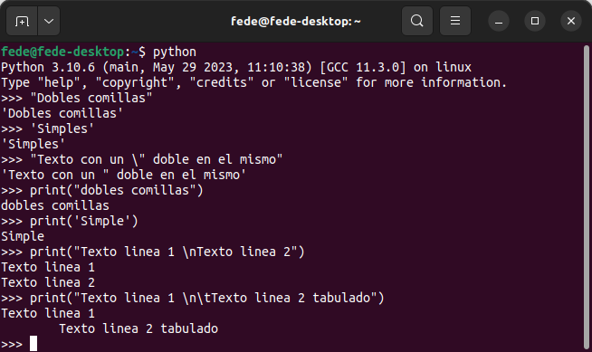
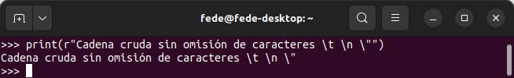
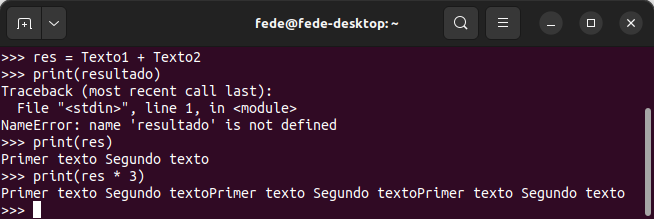

# <FONT COLOR=#8B008B>Datos en Python</font>
En Python, al igual que en programación en general, los tipos de datos especifican el tipo de datos que puede almacenarse en una variable.

## <FONT COLOR=#007575>**Numéricos**</font>
Contienen valores numéricos y sabemos que:

>
* Los números enteros son de tipo int
* Los fraccionarios son de tipo float
* La división (/) siempre devuelve un número en coma flotante
* Para obtener la parte entera de una división se usa el operador //
* Para calcular el resto de una división se usa el operador %
* Para calcular potencias podemos usar el operador **
* Los paréntesis se pueden usar para agrupar expresiones
* El signo igual (=) se utiliza para asignar un valor (números, booleanos, cadenas, …) a una variable
* El tipo de la variable será el del dato asignado, no se declara el tipo de la variable al crearla
* Por convención el nombre comienza en minúscula y si son varias palabras se unen por guión bajo

Los tipos básicos de datos son:

>
* **```int```**: números enteros con signo sin límite de tamaño, ejemplo: entero = 5
* **```float```**: números reales, decimales o de coma flotante con precisión de hasta 15 decimales, ejemplo: real = 5.6
* **```complex```**: números complejos, por ejemplo 5.5 - 5j
* Para averiguar el tipo de dato usamos la función ```type()```.

Podemos realizar conversión de tipos así:

* A entero int(variable)
* A real float(variable)

## <FONT COLOR=#007575>**Cadenas**</font>
Contienen secuencias de caracteres. Una cadena es una secuencia de caracteres representada entre comillas simples o dobles.

Las cadenas pueden estar encerradas entre comillas simples ('...') o dobles ("...") con el mismo resultado. Podemos usar \ para incluir comillas en una cadena.

La función print() devuelve la cadena que encierra entre los paréntesis, omitiendo las comillas que la encierran.

En la imagen siguiente se ven varios ejemplos con cadenas utilizando como editor el IDLE que por defecto se instala con Python y que se abre desde una terminal simplemente invocando a Python.

<center>

  
*Cadenas en el IDLE*

</center>

Una cadena raw (cruda) se interpreta tal como se escribe, es decir, se omiten los caracteres especiales expresados con \. Las cadenas raw se escriben entrecomilladas y van precedidas del carácter 'r'. En la imagen vemos un ejemplo.

<center>

  
*Cadena cruda en el IDLE*

</center>

Es posible aplicar la operación de multiplicar a textos haciendo que estos se repitan. En la imagen siguientes vemos ejemplos de concatenación y multiplicación, así como un error cometido.

<center>

  
*Concatenar y multiplicar textos en el IDLE*

</center>

## <FONT COLOR=#007575>**Secuencias**</font>
Contienen colecciones de datos, como las listas, las tuplas, las colecciones de datos (set) o los diccionarios.

Una lista es una colección ordenada de elementos similares o de distinto tipo separados por comas y encerrados entre corchetes [ ].

Tupla es una secuencia ordenada de elementos, igual que una lista. La única diferencia es que las tuplas son inmutables. Una vez creadas, las tuplas no pueden modificarse. En Python, se utilizan los paréntesis () para almacenar los elementos de una tupla.

Las colecciones de datos son un conjunto desordenada de elementos únicos. Una colección de datos se define por valores separados por comas dentro de llaves { }.

Un diccionario es una colección ordenada de elementos. Almacena los elementos como pares clave/valor. Siendo las claves identificadores únicos que se asocian a cada valor.

Estudiaremos estos últimos tipos mas extensamente cuando los necesitemos.

Los datos de tipo booleano solamente pueden contener ```True``` o ```False```.

Dado que en programación Python todo es un objeto, los tipos de datos son en realidad clases y las variables son instancias(objeto) de estas clases.

