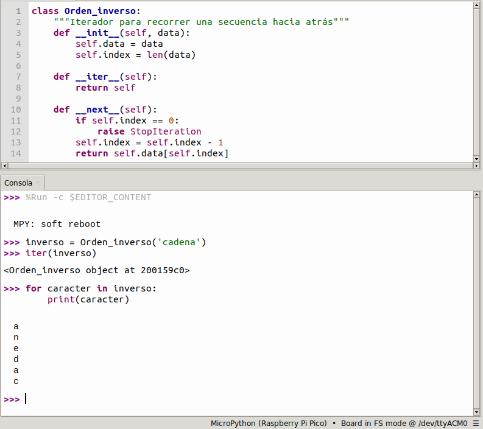

# <FONT COLOR=#8B008B>Estructuras de datos en Python</font>
En estructuras de datos y de control en Python es habitual utilizar los conceptos de ```iterable``` e ```iterador``` por lo que antes de nada vamos a describir estos dos conceptos un tanto abstractos y complicados de entender. Utilizaremos para su descripción la sentencia de control ```for```.

## <FONT COLOR=#007575>**iterables e iteradores**</font>
Iterar significa que se repite o se ha repetido muchas veces. En programación una iteración es un conjunto de instrucciones que se repiten una o varias veces hasta que una condición se cumple o deja de cumplirse.

Los ```iterables``` son objetos que pueden ser indexados y los ```iteradores``` son objetos que hacen referencia a un elemento. Los iteradores tienen un método ```next``` que permite hacer referencia al siguiente objeto.

La mayoría de objetos contenedores se pueden recorrer en bucle utilizando una sentencia for:

~~~py
for element in [1, 2, 3]:
    print(element)
for element in (1, 2, 3):
    print(element)
for key in {'one':1, 'two':2}:
    print(key)
for char in "123":
    print(char)
for line in open("mifichero.txt"):
    print(line, end='')
~~~

Este estilo de acceso es claro, conciso y cómodo. La sentencia ```for``` llama a ```iter()``` sobre el objeto contenedor. La función devuelve un objeto iterador que define el método ```__next__()``` que accede a los elementos del contenedor de uno en uno. Cuando no hay más elementos, ```__next__()``` lanza una excepción ```StopIteration``` que indica al bucle ```for``` que termine. El método ```__next__()``` se invoca utilizando la función incorporada ```next()```; A continuación vemos una imagen de un ejemplo de iteraciones desde la consola que muestra cómo funciona esto:

<center>

  
*Ejemplo de uso de next() en iteraciones*

</center>

Podemos añadir un comportamiento iterador a nuestras clases. Definimos un método `` `` que devuelva un objeto con un método ```__next__()```. Si la clase define ```__next__()```, entonces ```__iter__()``` puede devolver simplemente ```self```. Hacemos un ejemplo de recorrer una cadena en orden inverso al escrito. Definimos la clase ```Orden_inverso```

~~~py
class Orden_inverso:
    """Iterador para recorrer una secuencia hacia atrás"""
    def __init__(self, data):
        self.data = data
        self.index = len(data)

    def __iter__(self):
        return self

    def __next__(self):
        if self.index == 0:
            raise StopIteration
        self.index = self.index - 1
        return self.data[self.index]
~~~

Con la clase definida ponemos el interprete en marcha y trabajamos en la consola haciendo lo que vemos en la imagen siguiente:

<center>

  
*Ejemplo de definición de clase y iterar usándola*

</center>

En Python la función ```iter()``` solamente puede ser llamada sobre un objeto que sea iterable, lo que nos devolverá un iterador. En el ejemplo anterior el iterable es 'cadena' y cuando invocamos ```iter()``` nos retorna el iterador ```<Orden_inverso object at 200159c0>```. Veamos otro ejemplo con una lista sencilla:

~~~py
lista = [7, 2, 5, 4, 6, 1, 3]
iteradora = iter(lista)
print(iteradora) # muestra el iterador
print(type(iteradora)) # muestra el tipo de iterador y su clase
~~~

Nos devuelve el resultado siguiente en consola:

~~~py
MPY: soft reboot
<iterator>
<class 'iterator'>
~~~

Lavariable ```iteradora``` itera sobre la lista lo que permite acceder a sus elementos con ```next()```. Siguiendo con el ejemplo, si hacemos:

~~~py
lista = [7, 2, 5, 4, 6, 1, 3]
iteradora = iter(lista)
print(iteradora) # muestra el iterador
print(next(iteradora)) # muestra el primer elemento
print(next(iteradora)) # muestra el segundo elemento
print(next(iteradora)) # muestra el tercer elemento
print(next(iteradora)) # muestra el cuarto elemento
print(next(iteradora)) # muestra el quinto elemento
print(next(iteradora)) # muestra el sexto elemento
print(next(iteradora)) # muestra el septimo elemento
~~~

Da como resultado:

~~~py
lista = [7, 2, 5, 4, 6, 1, 3]
iteradora = iter(lista)
print(iteradora) # muestra el iterador
print(next(iteradora)) # muestra el primer elemento
print(next(iteradora)) # muestra el segundo elemento
print(next(iteradora)) # muestra el tercer elemento
print(next(iteradora)) # muestra el cuarto elemento
print(next(iteradora)) # muestra el quinto elemento
print(next(iteradora)) # muestra el sexto elemento
print(next(iteradora)) # muestra el septimo elemento
~~~

Exsiten iteradores para otras  clases, y estos son:

* ```str_iterator``` para cadenas
* ```list_iterator``` para listas
* ```tuple_iterator``` para tuplas
* ```dict_keyiterator``` para diccionarios

Se pueden tener varios iteradores para la misma lista y tendrán un funcionamiento totalmente independiente unos de otros.

## <FONT COLOR=#007575>**Las listas (list)**</font>
Se trata de un tipo de dato que permite almacenar series de datos de cualquier tipo bajo su estructura. Se suelen asociar a las matrices o arrays de otros lenguajes de programación.

En Python las listas son muy versatiles permitiendo almacenar un conjunto arbitrario de datos. Es decir, podemos guardar en ellas lo que sea.

Una lista se crea con ```[]``` y sus elementos se separan por comas. Una gran ventaja es que pueden tener datos de diferentes tipos.

~~~python
lista = [1, "Hola", 3.141592, [1 , 2, 3], Image.HAPPY]
~~~

Algunas de las principales propiedades de las listas:

* Son ordenadas, mantienen el orden en el que han sido definidas
* Pueden ser formadas por tipos arbitrarios de datos
* Pueden ser indexadas con [i]
* Se pueden anidar, es decir, meter una lista dentro de otra
* Son mutables, ya que sus elementos pueden ser modificados
* Son dinámicas, ya que se pueden añadir o eliminar elementos

Hay dos métodos aplicables:

* **```append```**. Permite agregar elementos a la lista.
* **```remove```**. Elimina elementos de la lista.
* **```insert(pos,elem)```**. Inserta el elemento ```elem``` en la posición ```pos``` indicada.

En el ejemplo vemos el funcionamiento.

<center>

  
*Ejemplo de listas y sus métodos*

</center>

### <FONT COLOR=#AA0000>**Trabajando con listas**</font>
Una vez que tenemos una lista creada sus elementos son accesibles para trabajar con ellos, modificarlos o incluso eliminar o añadir elementos a la lista. Vamos a trabajar con un ejemplo sencillo para que se entienda mejor. 

* **Acceso por índice**. Un programa como el siguiente:

~~~py
lista = [1,2,"texto",2.87]
print(lista[0]) # indice 0 -> valor =  1 entero
print(lista[2]) # indice 2 -> valor = texto
print(lista[3]) # indice 3 -> valor = 2.87 real
~~~

Nos devuelve en la consola:

~~~py
1
texto
2.87
~~~

Casos especiales de valores de índice son:

~~~py
lista = [1,2,"texto",2.87]
print(lista[-1]) # ultimo elemento
print(lista[-2]) # penultimo elemento
print(lista[-3]) # antepenultimo elemento
print(lista[4]) # Error fuera de rango
~~~

Que da el siguiente resultado:

~~~py
2.87
texto
2
Traceback (most recent call last):
  File "<stdin>", line 5, in <module>
IndexError: list index out of range
~~~

* **Modificar elementos**. Continuamos con el mismo ejemplo.

~~~py
lista = [1,2,"texto",2.87]
print(lista)
lista[2] = "nuevo texto" # cambio en elemento 2
print(lista)
del lista[1] # se elimina el elemento 1
print(lista)
~~~

Resultado:

~~~py
[1, 2, 'texto', 2.87]
[1, 2, 'nuevo texto', 2.87]
[1, 'nuevo texto', 2.87]
~~~

* **Listas anidadas**. Es posible crear dentro de otras listas e incluso dentro de otra lista. El acceso a los elementos consiste en utilizar tantos [] como anidados tengamos. Ejemplo de lista con tres niveles de anidado.

~~~py
lista = [1,"texto",2,[22,"pico",45,'p'],[50,60]]
print(lista)
print(lista[1]) #texto
print(lista[3][0]) # 2lista
print(lista[3][-1]) # p
print(lista[4][0]) # 50
~~~

Resultado:

~~~py
[1, 'texto', 2, [22, 'pico', 45, 'p'], [50, 60]]
texto
22
p
50
~~~

* **Sublistas**. Son listas obtenidas a partir de otra de mayor tamaño. Se utiliza el operador dos puntos (:) entre corchetes dejando a la izquierda el valor de inicio y a la derecha el valor siguiente al final, dado que el último valor indicado no se incluye. Utilizando el concepto de sublista se pueden modificar varios valores de una sola vez. A continuación vemos esto con un ejemplo.

~~~py
lista = [1,"texto",2,3,4,'p']
print(lista)
print(lista[2:4]) # sublista [2,3]
print(lista[2:6]) # sublista [2,3,4,'p']
lista[2:6]=[22,33,44,'pp'] # modificacion de multiples valores
print(lista)
~~~

Devuelve el siguiente resultado:

~~~py
[1, 'texto', 2, 3, 4, 'p']
[2, 3]
[2, 3, 4, 'p']
[1, 'texto', 22, 33, 44, 'pp']
~~~

* **otras funcionalidades**. Se puede utilizar el operador suma (+) para añadir elementos a una lista y el operador de asignación (=) para asignar los valores de una lista a variables discretas. Veamos un ejemplo:

~~~py
lista = [1,"texto",2,3,4,'p']
lista += [20,30,"otro texto"]
print(lista)
a,b,c,d,e,f,g,h,i = lista
print(a,b,c,d,e,f,g,h,i)
~~~

Que devuelve lo siguiente:

~~~py
[1, 'texto', 2, 3, 4, 'p', 20, 30, 'otro texto']
1 texto 2 3 4 p 20 30 otro texto
~~~

### <FONT COLOR=#AA0000>**Iterar**</font>
Las listas se pueden iterar de diferentes formas, tal y como vemos a continuación.

* **Con índices**. Se trata de recorrer la  lista utilizando los índices. Para ello se suele utilizar lafunción ```len()```, que devuelve la longitud de la lista, y así por ejemplo:

~~~py
lista = [1,2,'texto',3]
# iteramos toda la lista
for i in range(0, len(lista)):
    print(lista[i])

print("------")

#iteramos parte de la lista
for i in range(2, len(lista)):
    print(lista[i])
~~~

Nos mostrará en consola el siguiente resultado:

~~~py
1
2
texto
3
------
texto
3
~~~

* **recorriendola**. Se trata de recorrer la lista mostrando el valor de cada elemento de la misma. Por ejemplo:

~~~py
lista = [1,2,'texto',3]
# iteramos toda la lista
for indice in lista:
    print(indice)
# iteramos un elemento por su índice
print(lista[2])
~~~

Nos devuelve el siguiente resultado:

~~~py
1
2
texto
3
texto
~~~

* **enumerando elementos**. Se trata de mostrar tanto el índice como el valor. Como ejemplo hacemos:

~~~py
lista = [1,2,'texto',3]
for indice,valor in enumerate(lista):
    print("Elemento", indice, "=", valor)
~~~

Que nos devuelve como resultado lo siguiente:

~~~py
Elemento 0 = 1
Elemento 1 = 2
Elemento 2 = texto
Elemento 3 = 3
~~~

* **iterando varias listas a la vez**. Un ejemplo que utiliza esta técnica es:

~~~py
lista1 = [1,2,'tres',4]
lista2 = ["uno","dos",3,"cuatro"]
for v1,v2 in zip(lista1,lista2):
    print(v1,v2)
~~~

Que devuelve el siguiente resultado:

~~~py
1 uno
2 dos
tres 3
4 cuatro
~~~

## <FONT COLOR=#007575>**Las tuplas (tuple)**</font>
Son muy similares a las listas con una diferencia principal con las mismas y es que las tuplas no pueden ser modificadas directamente, lo que implica que no dispone de los métodos vistos para listas. Una tupla permite tener agrupados un número **inmutable** de elementos. Cuando decimos inmutable significa que no pueden ser modificadas una vez declaradas.

Una tupla se inicializa con ```()``` en lugar de los corchetes y sus elementos se separan por comas. Los paréntesis se pueden omitir y dejar los elementos simplemente separados por comas.

~~~py
tupla = (1, 2, 3)
print(tupla)
~~~

Principales propiedades:

* Se pueden declarar sin usar los paréntesis, pero no se recomienda. No usarlos puede llevarnos a ambigüedades del tipo print(1, 2, 3) y print((1, 2, 3)).
* Si la tupla tiene un solo elemento esta debe finalizar con coma.
* Se pueden anidar tuplas, por ejemplo ```tupla2 = tupla1, 4, 5, 6, 7```.
* Se pueden declarar tuplas vacias, por ejemplo ```tupla3 = ()```.
* Las tuplas son *iterables* por lo que sus elementos pueden ser accesados mediante la notación de índice del elemento entre corchetes. Si se quiere acceder a un rango de indices se separan por ":" ambos índices.
* Es posible convertir listas en tuplas simplemente poniendo la lista dentro de los paréntesis de la tupla, por ejemplo:

```tupla_lista = ([1, "Hola", 3.141592, [1 , 2, 3]])```

A continuación vemos la imagen de un ejemplo donde se explica todo lo anterior.

<center>

  
*Ejemplo de tuplas*

</center>

Existen dos métodos aplicables a las tuplas:

* **```count()```**. Se utiliza para contar el número de veces que el objeto que le pasamos como parámetro se encuentra en la tupla.

~~~py
tupla = (1,2,'tres',4, 1,1,1,2,'tres')
print(tupla.count(1))
print(tupla.count(2))
print(tupla.count('tres'))
~~~

Resultado:

~~~py
4
2
2
~~~

* **```index()```**. Localiza y devuelve el índice del objeto pasado como parámetro. Si no encuentra nada devuelve un error. Este método acepta un segundo parámetro que permite indicar a partir de que elemento se comienza a buscar el objeto.

~~~py
tupla = (1,2,'tres',4, 1,1,1,2,'tres')
print(tupla.index(4)) # el indice del 4 es 3
print(tupla.index(2)) # primera aparicion del 2 en indice 1
print(tupla.index(2,2)) # aparicion del 2 tras la posicion 2
print(tupla.index(3)) # elemento no existente genera Error
~~~

Resultado:

~~~py
3
1
7
Traceback (most recent call last):
  File "<stdin>", line 5, in <module>
ValueError: object not in sequence
~~~

## <FONT COLOR=#007575>**Diccionarios (dict)**</font>
Estas estructuras contienen la colección de elementos con la forma ```clave:valor``` separados por comas y encerrados entre ```{}```. Las claves son objetos inmutables y los valores pueden ser de cualquier tipo. Sus principales características son:

* En lugar de por índice como en listas y tuplas, en diccionarios se acceder al valor por su clave.
* Permiten eliminar cualquier entrada.
* Al igual que las listas, el diccionario permite modificar los valores.
* El método ```dicc.get()``` accede a un valor por la clave del mismo.
* El método ```dicc.items()``` devuelve una lista de tuplas ```clave:valor```.
* El método ```dicc.keys()``` devuelve una lista de las claves.
* El método ```dicc.values()``` devuelve una lista de los valores.
* El método ```dicc.update()``` añade elemento ```clave:valor``` al diccionario.
* El método ```del dicc``` borra el par ```clave:valor```.
* El método ```dicc.pop()``` borra el par ```clave:valor```.

A continuación vemos un ejemplo.

<center>

  
*Ejemplo de diccionario*

</center>

En diccionarios tenemos disponibles los siguiente métodos:

* **```clear()```**. Vacía el diccionario eliminando todos sus elementos.
  
~~~py
dicc = {'Ana':40,'Juan':42,'Laura':36,'Isa':30}
print(dicc)
dicc.clear()
print(dicc)
~~~

Resultado:

~~~py
{'Isa': 30, 'Juan': 42, 'Laura': 36, 'Ana': 40}
{}
~~~

* **```copy()```**. Copia un diccionario.
  
~~~py
dicc = {'Ana':40,'Juan':42,'Laura':36,'Isa':30}
dicc_copia = dicc.copy()
print(dicc_copia)
~~~

Resultado:

~~~py
{'Isa': 30, 'Juan': 42, 'Laura': 36, 'Ana': 40}
~~~

* **```fromkeys()```**. Retorna un diccionario con las claves y el valor indicados. Es decir, el método ```fromkeys()``` se utiliza en diccionarios para crear un nuevo diccionario a partir de una relación de claves. De manera opcional se puede especificar un valor.
  
~~~py
dicc = {'Ana':40,'Juan':42,'Laura':36,'Isa':30}
nuevo_dicc = dicc.fromkeys(dicc)
print(nuevo_dicc)
~~~

Resultado:

~~~py
{'Ana': None, 'Juan': None, 'Isa': None, 'Laura': None}
~~~

* **```get()```**. Retorna el valor de la clave indicada. La ventaja de usar ```get()``` en lugar del acceso genérico por clave es que con ```get()``` no se genera una excepción KeyError si la clave no existe ya que devuelve un valor predeterminado. Si no indicamos un valor predeterminado devulve ```None```.
  
~~~py
dicc = {'Ana':40,'Juan':42,'Laura':36,'Isa':30}
clave1 = dicc.get('Ana')
clave2 = dicc.get('Isabel')
clave3 = dicc.get('Isa', "No existe")
clave4 = dicc.get('Isabel', "No existe")

print(clave1,clave2,clave3,clave4)
~~~

Resultado:

~~~py
40 None 30 No existe
~~~

* **```items()```**. Retorna una lista con una tupla por cada par de elementos.
  
~~~py
dicc = {'Ana':40,'Juan':42,'Laura':36,'Isa':30}
clave = dicc.items()
dicc['Ana']=38 # modificamos la clave 'Ana'
print(clave)
~~~

Resultado:

~~~py
dict_items([('Isa', 30), ('Juan', 42), ('Laura', 36), ('Ana', 38)])
~~~

* **```keys()```**. Retorna una lista con las claves del diccionario.
  
~~~py
dicc = {'Ana':40,'Juan':42,'Laura':36,'Isa':30}
clave = dicc.keys()
print(clave)
~~~

Resultado:

~~~py
dict_keys(['Isa', 'Juan', 'Laura', 'Ana'])
~~~

* **```pop()```**. Elimina el elemento con la clave indicada y devuelve el valor asociado a esa clave.
  
~~~py
dicc = {'Ana':40,'Juan':42,'Laura':36,'Isa':30}
clave_elminada = dicc.pop('Ana',"No existe") # elimina clave 'Ana'
print(dicc)
print(clave_elminada)
~~~

Resultado:

~~~py
{'Isa': 30, 'Juan': 42, 'Laura': 36}
40
~~~

* **```popitem()```**. Elimina el último par de clave-valor introducido. Se utiliza para eliminar y devolver un par clave/valor aleatorio.
  
~~~py
dicc = {'Ana':40,'Juan':42,'Laura':36,'Isabel':60,'Puri':50}
par_elminado = dicc.popitem() # elimina y obtiene par clave/valor aleatorio
print("El par clave/valor eliminado es:",par_elminado)
print("El diccionario queda asi:",dicc)
~~~

Resultado:

~~~py
El par clave/valor eliminado es: ('Isabel', 60)
El diccionario queda asi: {'Laura': 36, 'Puri': 50, 'Ana': 40, 'Juan': 42}
~~~

* **```setdefault()```**. Retorna el valor de la clave indicada. Si la clave no existe la inserta con el valor indicado. Si la clave existe, el método retorna el valor de esa clave sin realizar cambios en el diccionario.
  
~~~py
dicc = {'Ana':40,'Juan':42,'Laura':36,'Isabel':60,'Puri':50}
puri_edad = dicc.setdefault('Puri', 20)
emilia_edad = dicc.setdefault('Emilia',15)
print("Edad de Puri:",puri_edad)
print(dicc)
~~~

Resultado:

~~~py
Edad de Puri: 50
{'Juan': 42, 'Puri': 50, 'Laura': 36, 'Ana': 40, 'Emilia': 15, 'Isabel': 60}
~~~

* **```update()```**. Actualiza el diccionario con los pares clave-valor indicados. Se utiliza para actualizar o modificar un diccionario con una secuencia de pares clave/valor o bien con otro diccionario. Los pares clave/valor se agregan o actualizan  si ya existen.
  
~~~py
dicc = {'Ana':40,'Juan':42,'Laura':36,'Isabel':60,'Puri':50}
dicc.update({'Puri':55,'Juan':45})
print(dicc)
~~~

Resultado:

~~~py
{'Isabel': 60, 'Laura': 36, 'Puri': 55, 'Ana': 40, 'Juan': 45}
~~~

### <FONT COLOR=#AA0000>Iterar</font>
Los diccionarios se pueden iterar de forma similar a las listas. En el ejemplo vemos como hacerlo.

~~~py
dicc = {'Ana':40,'Juan':42,'Laura':36,'Isabel':60,'Puri':50}
for i in dicc:
    print(i) # imprime las claves
print("-------------------------")
for j in dicc:
    print(dicc[j]) # imprime los valores de las claves
print("-------------------------")
for k,l in dicc.items():
    print(k,":",l) # imprime los pares clave/valor
~~~

Que arroja el siguiente resultado:

~~~py
Isabel
Laura
Puri
Ana
Juan
------------------------
60
36
50
40
42
------------------------
Isabel : 60
Laura : 36
Puri : 50
Ana : 40
Juan : 42
~~~

## <FONT COLOR=#007575>**Set o conjuntos**</font>
Se trata de una estructura que se utiliza para almacenar datos de manera similar a las listas pero con las siguientes diferencias:

* En un ```set``` los elementos son únicos no pudiendo existir duplicados.
* Los ```set``` no mantienen un orden en sus elementos de cuando son declarados a cuando se trabaja con ellos.
* Los elementos de un ```set``` son inmutables.
* Los ```set``` se iteran de la misma forma que las listas.

La forma de crear un ```set``` en Python es:

~~~py
conjunto = {2,5,7,4,1} # forma simplificada
~~~

### <FONT COLOR=#AA0000>Operaciones con conjuntos</font>
Como conjuntos que son permiten realizar diferentes operaciones que vamos a mostrar a partir del ejemplo siguiente:

~~~py
set1 = {0,1,2,3,4,5}
set2 = {3,4,5,6,7,8}
# unión
union = set1.union(set2)
print(union)
# interseccion
inter = set1.intersection(set2)
print(inter)
# diferencia
dif = set1.difference(set2)
print(dif)
# agregar elementos
set1.add(6)
print(set1)
# elminar elementos
set1.remove(6)
print(set1)
~~~

El resultado de estas operaciones es:

~~~py
{0, 1, 2, 3, 4, 5, 6, 7, 8}
{4, 5, 3}
{0, 1, 2}
{0, 1, 2, 3, 4, 5, 6}
{0, 1, 2, 3, 4, 5}
~~~

### <FONT COLOR=#AA0000>Métodos</font>
Los conjuntos tienen disponibles los siguientes métodos:

* **add()**. Agrega un elemento al conjunto.
* **clear()**. Elimina todos los elementos de un conjunto.
* **copy()**. Retorna una copia del conjunto.
* **difference()**. Retorna un conjunto que es la diferencia entre dos o más conjuntos.
* **difference_update()**. Elimina los elementos de un conjunto están incluidos en otro conjunto especificado.
* **discard()**. Elimina el elemento especificado.
* **intersection()**. Retorna el conjunto intersección de dos o más conjuntos.
* **intersection_update()**. Elimina los elementos de un conjunto que no están presentes en otros conjuntos especificados.
* **isdisjoint()**. Retorna si dos conjuntos tienen una intersección o no.
* **issubset()**. Retorna si otro conjunto contiene a este conjunto o no.
* **issuperset()**. Retorna si este conjunto contiene otro conjunto o no.
* **pop()** Elimina un elemento del conjunto.
* **remove()**. Elimina el elemento especificado.
* **symmetric_difference()**. Retorna un conjunto con las diferencias simétricas de dos conjuntos.
* **symmetric_difference_update()**. Inserta las diferencias simétricas de este conjunto y otro conjunto.
* **union()**. Retorna el conjunto unión de conjuntos.
* **update()**. Actualiza el conjunto con otro conjunto, o cualquier otro dato iterable.

## <FONT COLOR=#007575>**Casting**</font>
Hacer casting es convertir de un tipo de dato a otro. Es decir, podemos convertir los tipos ```int```, ```float``` o ```string``` de uno a otro.

En Python existen dos tipos de *cast*:

* **Implicita**. Es la que realiza Python cuando tiene que trabjar con dos tipos distintos de datos. Se realiza de manera automática sin que intervengamos, pero es importante saber lo que está pasando realmente si no queremos tener problemas futuros. Vamos a ver un ejemplo en el que tenemos dos tipos de datos, uno ```int``` y otro ```float``` y operamos con ellos.

~~~py
entero = 5
real = 3.5
suma = entero + real
diferencia = entero - real
producto = entero * real
print("La suma es:", suma)
print("La diferencia es:",diferencia)
print("El producto es:",producto)
cadena ="2"
cociente = entero / cadena
~~~

El resultado es:

~~~py
La suma es: 8.5
La diferencia es: 1.5
El producto es: 17.5
Traceback (most recent call last):
  File "<stdin>", line 10, in <module>
TypeError: unsupported types for __truediv__: 'int', 'str'
~~~

El error se produce porque es evidente que no se puede dividir un número por la cadena "2". Imagenemos que en lugar de "2" la cadena fuese "Hola mundo!" ¿como vamos a realizar esa división?.

Es evidente entonces que Python realiza un ```cast()``` de forma automática si los datos son congruentes entre si.

* **Explicita**. Es la que realizamos nosotros y se  puede realizar a partir de las funciones que tiene Python. Las funciones mas comunes para hacer ```cast()``` son las siguientes:

>
- float()
- str()
- int()
- list()
- set()
- hex()
- oct()
- bin()

### <FONT COLOR=#AA0000>Conversion ```float``` a ```int```</font>
Para convertir un ```float``` en un ```int``` basta con utilizar la función ```int()``` teniendo en cuenta que perderemos la parte fraccionaria del número.

~~~py
x = 3.45
y = int(x) # y toma el valor 3 desapareciendo el 0.45
print(y) # da como resultado 3
~~~

### <FONT COLOR=#AA0000>Conversion ```float``` a ```string```</font>
Para convertir un ```float``` en un ```string``` vamos a utilizar la función ```str()```. En el ejemplo como hacerlo con un dato mediante ```casting```:

~~~py
x = 5.5 # tipo float
print(type(x)) # da como salida <class 'float'>
x = str(x) # casting de x y lo guardamos en x
print(type(x)) # da como salida <class 'str'>
~~~

### <FONT COLOR=#AA0000>Conversion ```string``` a ```float```</font>
Se puede convertir una cadena numérica en un float utilizando ```float()```. Es importante entender que se pueden convertir cadenas que tengan sentido numérico y no cualquier cadena. En el ejemplo vemos la conversión correcta y la incorrecta que genera un error.

~~~py
cadena = "5.5"
x = 2
y = 0.0 # siempre hay que usar punto como separador decimal
cadena2 = "Hola"
y = float(cadena) # cast de cadena
x = y/x # operamos entre cast de cadena y numero
print(x)
print(float(cadena2)) # conversion imposible
~~~

Nos genera el siguiente resultado:

~~~py
2.75
Traceback (most recent call last):
  File "<stdin>", line 8, in <module>
ValueError: invalid syntax for number
~~~

### <FONT COLOR=#AA0000>Conversion ```string``` a ```int```</font>
Totalmente similar a la conversión de ```string``` a ```float``` utilizando la función ```int()```. Un ejemplo similar nos lo aclara mejor:

~~~py
cadena = "5"
x = 2
y = 0
cadena2 = "Hola"
y = int(cadena) # cast de cadena
x = y/x # operamos entre cast de cadena y numero
print(x) # resultado float por cast implicito
print(int(cadena2)) # conversion imposible
~~~

Que nos devuelve el siguiente resultado:

~~~py
2.5
Traceback (most recent call last):
  File "<stdin>", line 8, in <module>
ValueError: invalid syntax for integer with base 10
~~~

### <FONT COLOR=#AA0000>Conversion ```int``` a ```string```</font>
Esta conversión se realiza con str(). Es una conversión que siempre es realizable porque cualquier número entero es susceptible de convertirse en una cadena.

~~~py
x = 5 # tipo int
print(type(x)) # da como salida <class 'int'>
x = str(x) # casting de x y lo guardamos en x
print(type(x)) # da como salida <class 'str'>
~~~

### <FONT COLOR=#AA0000>Conversion entre ```list``` y ```set```</font>
Es posibles hacer cast a lista con list(). Por ejemplo:

~~~py
set1 = {0,1,2,3,4,5}
lista = list(set1)
print(set1, type(set1))
print(lista, type(lista))
~~~

Resultado:

~~~py
{0, 1, 2, 3, 4, 5} <class 'set'>
[0, 1, 2, 3, 4, 5] <class 'list'>
~~~

De manera similar es posible convertir unalista en un set utilizando ```set()```. Por ejemplo

~~~py
lista = [0,1,2,3,4,5]
set1 = set(lista)
print(lista, type(lista))
print(set1, type(set1))
~~~

Resultado:

~~~py
[0, 1, 2, 3, 4, 5] <class 'list'>
{0, 1, 2, 3, 4, 5} <class 'set'>
~~~
