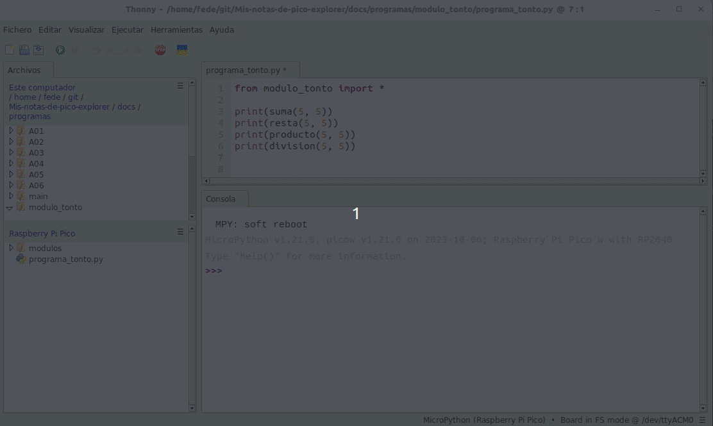
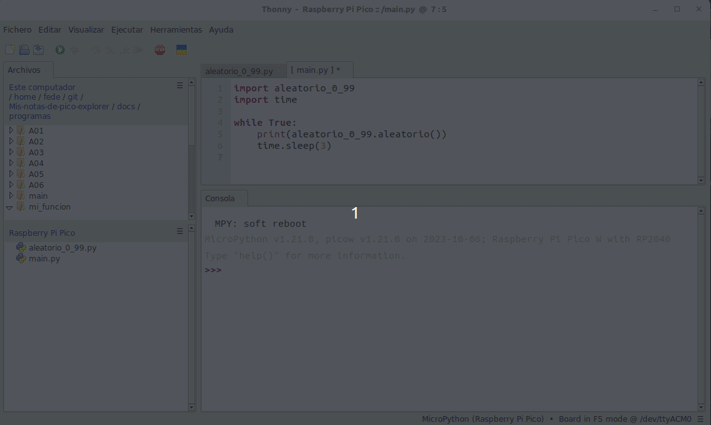

# <FONT COLOR=#8B008B>Módulos en Python</font>
Antes de nada decir que vamos a realizar una pasada bastante rápida por el tema y que no es ni mucho menos todo lo que hay que decir sobre los módulos, los paquetes y las librerías, el tema es mas complejo, pero dada la utilidad que nosotros le vamos a dar, entiendo que con esto será suficiente. Si se necesita se puede consultar la documentación de [Python en español](https://www.python.org/) y en concreto la de [módulos](https://docs.python.org/es/3/tutorial/modules.html).

## <FONT COLOR=#007575>**Introducción**</font>
Los módulos con archivos .py que pueden contiener funciones, variables o clases y que se pueden usar por otros módulos. Fundamentalmente sirven para reutilizar código. Vamos a analizar su funcionamiento en base a un ejemplo muy sencillo en el que definimos un módulo para sumar, restar, multiplicar y dividir dos números x e y.

El módulo sería:

~~~py
def suma(x, y):
    return x + y
def resta(x, y):
    return x - y
def producto(x, y):
    return x * y
def division(x, y):
    return x/y
~~~

Podemos observar que se han definido las funciones necesarias para realizar las operaciones citadas y retornas el resultado. Este módulo por si solo no hace nada pues no puede retornar valores si no recibe parámetros.

Vamos a implementar ahora un programa que utilice este módulo, sería:

~~~py
import modulo_tonto

print(modulo_tonto.suma(5, 5))
print(modulo_tonto.resta(5, 5))
print(modulo_tonto.producto(5, 5))
print(modulo_tonto.division(5, 5))
~~~

Pero <FONT COLOR=#FF0000>**ATENCIÓN**</font>, la situación que debemos tener en Thonny es la de la siguiente imagen:

<center>

  
*Situación en  Thonny para importar módulos*

</center>

Recuerdese que para subir archivos a la Pi Pico basta con hacer clic derecho sobre el nombre del archivo y escoger *Subir a  /* del menú contextual.

La importación del módulo se puede realizar también de la siguiente forma:

~~~py
from modulo_tonto import *

print(suma(5, 5))
print(resta(5, 5))
print(producto(5, 5))
print(division(5, 5))
~~~

Donde observamos queahora las funciones se invocan directamente y no a través del nombre del módulo. El resultado de la salida es exactamente el mismo que antes.

También es posible importa solamente ciertos componentes, tal y como vemos a continuación:

~~~py
from modulo_tonto import suma, producto

print(suma(5, 5))
print(producto(5, 5))
print(division(5, 5))
~~~

Que nos genera la siguiente salida:

~~~
10
25
Traceback (most recent call last):
  File "<stdin>", line 5, in <module>
NameError: name 'division' isn't defined
~~~

El error es evidentemente porque, aunque la función está definida en el módulo, esta no se ha importado y no es posible invocarla.

Cuando importamos un módulo es posible cambiarle el nombre de forma sencilla. Por ejemplo:

~~~py
import modulos.modulo_tonto as mt

print(mt.suma(5, 5))
print(mt.resta(5, 5))
print(mt.producto(5, 5))
print(mt.division(5, 5))
~~~

## <FONT COLOR=#007575>**Directorios y sus rutas**</font>
Como hemos visto en los ejemplos anteriores es habitual que los módulos estén situados en el mismo directorio que el archivo de proyecto, pero cuando se trabaja con programas mas extensos que usan varios módulos y archivos auxiliares, lo mas comodo va a ser tenerlo organizados por directorios.

Aunque por su sencillez no es necesario, lo vamos a hacer con el ejemplo anterior. Si partimos de la situación de la imagen inicial de la animación siguiente se nos producirá un error al intentar ejecutar el programa.

<center>

  
*Situación en Thonny con módulo en directorio*

</center>

En la misma animación se ve como acceder al directorio del módulo y solucionar el problema anterior.

Es importante conocer la forma en que Python busca los módulos. Inicialmente, cuando se importa un módulo, Python intenta buscar en los directorios indicados en el archivo ```sys.path```. Con un sencillo programa es posible consultar ```sys.path```:

~~~py
import sys
print(sys.path)
~~~

Que nos devolverá una lista de los directorios y el orden en que buscará.

Al tratarse de un fichero de sistema no se recomienda su modificación porque podemos estropear algo sin querer.

Es posible ver lon nombres de variables, funciones, clases, etc que están en nuestro ```namespace``` mediante la función ```dir()```:

* Sobre un módulo vacio veremos los nombres por defecto que ha generado Python:

~~~py
print(dir())
~~~

La lista que devuelve es ```['machine', 'cppmem', '__name__', 'rp2']```.

Si hacemos la consulta en un programa como el del ejemplo que llevamos viendo devolverá algo como:

```['machine', 'producto', '__name__', 'cppmem', 'division', 'rp2', 'resta', 'suma']```

Donde podemos apreciar como aparecen también las funciones creadas por nosotros.

## <FONT COLOR=#007575>**Módulos personalizados**</font>
Cada archivo con extensión .py, si está almacenado en el sistema de archivos de Raspberry Pi Pico, es un módulo. Si queremos importar un módulo personalizado su archivo debe estar ubicado en la ruta de la variable de entorno de MicroPython o en la misma ruta que el programa que está en ejecución.

Vamos a ver un ejemplo trabajando con la función ```main()```. 

* Primero, creamos un módulo python "aleatorio_0_99.py" en un directorio que denominaremos "mi_funcion" y le escribimos el siguiente código:

~~~py
import random

def aleatorio():
    num_aleatorio = random.randint(0, 100)
    return num_aleatorio
~~~

Una vez acabado de escribir el código subimos el módulo a la Pi Pico.

* Segundo, creamos un nuevo archivo de nombre "main.py", importamos el módulo anterior y escribimos el siguiente código:

~~~py
import aleatorio_0_99
import time

while True:
    print(aleatorio_0_99.aleatorio())
    time.sleep(3)
~~~

En la animación vemos su funcionamiento generando un número aleatorio cada tres segundos. Al tener un archivo ```main.py``` en la Pi Pico el programa se ejecutará con solo alimentar la misma sin necesidad de estar conectado a un ordenador.

<center>

  
*Ejemplo de generación de aleatorios*

</center>
