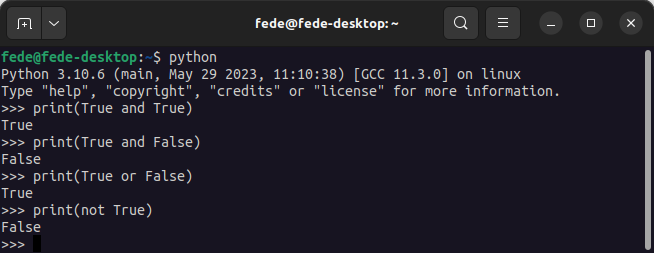

# <FONT COLOR=#8B008B>Operadores en Python</font>
Los operadores son símbolos especiales que realizan operaciones con variables y valores.

A continuación tenemos una lista de los diferentes tipos de operadores de Python:

* Operadores aritméticos
* Operadores de asignación
* Operadores de Comparación
* Operadores Lógicos
* Operadores Bitwise
* Operadores especiales

## <FONT COLOR=#007575>**Operadores aritméticos**</font>
Los operadores aritméticos se utilizan para realizar operaciones matemáticas como sumas, restas, multiplicaciones, etc.

<center>

|Operador| Descripción| Ejemplo |
|:-:|---|---|
|+|Suma o concatenación en textos|```5+3=8```, ```"Hola" + "Mundo" = "Hola Mundo```|
|-|Diferencia|```6-3=3```|
|*|Multiplicación|```3*3=9```|
|/|División|```6/2=3```|
|//|Parte entera de un cociente|```10//3=3```|
|%|Resto de un cociente|```10%3=1```|
|**|Potenciación|```5**2=25```|

</center>

## <FONT COLOR=#007575>**Operadores de asignación**</font>
Los operadores de asignación se utilizan para asignar valores a variables.

<center>

|Operador| Descripción| Ejemplo |
|:-:|---|---|
|=|Asignación|```x=4```, ```a = a + 1```|
|+=|Suma y asignación|```x+=1``` equivale a ```x = x + 1```|
|-=|Diferencia y asignación|```x-=1``` equivale a ```x = x - 1```|
|*=|Multiplicación y asignación|```x*=3``` equivale a ```x = x * 3``` |
|/=|División y asignación|```x/=3``` equivale a ```x = x / 3``` |
|%=|Asignación de restos|```x%=3``` equivale a ```x = x % 3```|
|**=|Asignación de exponentes|```x**=3``` equivale a ```x = x ** 3```|

</center>

## <FONT COLOR=#007575>**Operadores de Comparación**</font>
Los operadores de comparación comparan dos valores/variables y devuelven un resultado booleano: Verdadero o Falso ```True``` o ```False```.

<center>

|Operador| Descripción|Ejemplo|
|:-:|---|---|
|==|Igual a| ```2==3``` retorna ```False```|
|!=|Distinto de|```2!=3``` retorna ```True```|
|<|Menor que|```2<3``` retorna ```True```|
|>|Mayor que|```2>3``` retorna ```False```|
|<=|Menor o igual que|```2<=3``` retorna ```True```|
|>=|Mayor o igual que|```2>=3``` retorna ```False```|

</center>

## <FONT COLOR=#007575>**Operadores Lógicos**</font>
Los operadores lógicos se utilizan para comprobar si una expresión es Verdadera o Falsa. Se utilizan en la toma de decisiones.

<center>

|Operador| Descripción|Ejemplo|
|:-:|---|---|
|and|AND lógica|```a and b #True si a y b son ciertos``` |
|or|OR lógica|```a or b #True si a o b son ciertos``` |
|not|NOT lógica|```not a #True si el operador a es falso```|

</center>

En la figura siguiente vemos un ejemplo con lo que devuelve en cada caso.

<center>

  
*Ejemplos en el IDLE de operadores lógicos*

</center>

## <FONT COLOR=#007575>**Operadores Bitwise**</font>
Los operadores bit a bit o bitwise actúan sobre los operandos como si fueran cadenas de dígitos binarios. Operan bit a bit, de ahí su nombre.

<center>

|Operador| Descripción|Ejemplo|
|:-:|---|---|
|&|AND bit a bit|```5&6 # 101 & 110 = 110 = 4``` |
|\||OR bit a bit|```5 \| 6 # 101 \| 110 = 111 = 7```|
|~|NOT bit a bit|```~3 # ~011 = 100 = -4```|
|^|XOR bit a bit|```5^3 # 101^011 = 110 = 6```|
|<<|Desplazamiento izquierda|```4<<1 # 100 << 1 = 1000 = 8```|
|>>|Desplazamiento derecha|```4 >> 1 # 100 >> 1 = 010 = 2```|

</center>

## <FONT COLOR=#007575>**Operadores especiales**</font>
El lenguaje Python ofrece algunos tipos especiales de operadores como el operador de identidad (```identity```) y el operador de pertenencia (```membership```).

* **Operadores ```identity```**

En Python, ```is``` e ```is not``` se utilizan para comprobar si dos valores se encuentran en la misma parte de la memoria. Dos variables que son iguales no implica que sean idénticas. Algunos ejemplos aclaran mejor lo dicho.

~~~py
x1 = 5
y1 = 5
x2 = 'Hello'
y2 = 'Hello'

print(x1 is not y1)  # False

print(x2 is y2)  # True
~~~

Vemos que x1 e y1 son enteros con los mismos valores, por lo que son iguales e idénticos. Lo mismo ocurre con x2 e y2 (cadenas).

* **Operadores ```membership```**

En Python, ```in``` y ```not in``` son los operadores de pertenencia. Se utilizan para comprobar si un valor o variable se encuentra en una secuencia (cadena, lista, tupla, conjunto y diccionario).

En un diccionario sólo podemos comprobar la presencia de la clave, no del valor.
