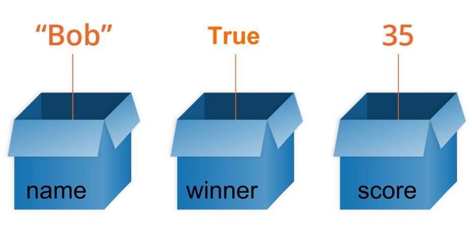

# <FONT COLOR=#8B008B>Sintaxis en Python</font>
Se puede decir que sintaxis es el conjunto de reglas que definen como se escribe código en un determinado lenguaje de programación, con un paralelismo total con la gramatica de una lengua. Por lo tanto la sintaxis indica la forma en la que debemos escribir las instrucciones de nuestro programa para que se entienda. A diferencia de la sintaxis del lenguaje, en programación es 100% estricta y no podemos cometer "faltas de ortografia". Vamos a ver que peculiaridades tiene el lenguaje Python.

Continuando con el paralelismo anterior ocurre exactamente lo mismo en un idioma que en un lenguaje de programación, solamente por sabernos todas sus palabras no lo hablamos ni programamos correctamente.

La forma de escribir un programa en Python es bastante parecida al lenguaje natural. Veamos esto con un sencillo ejemplo:

~~~py
# Definimos variable de tipo cadena
texto = "El resultado de a + b*c es: "
# Asignamos valores a las variables
a, b, c = 2, 3, 4
# Realizamos las operaciones y las guardamos en sol
sol = 2 + 3*4
# Mostramos resultados
print(texto, sol)
# El resultado obtenido es 14
~~~

## <FONT COLOR=#007575>**Comentarios**</font>
Los comentarios se utilizan para dar información complementaria de nuestro código. Los comentarios no son código y son ignorados por el interprete de Python.
Pueden ser de dos tipos:

* Una sola linea: Escribiendo el símbolo almohadilla (#) delante del comentario, como los vistos en el ejemplo de mas arriba.

* Multilinea: Escribiendo triple comillas dobles (“””) o simples (''') al principio y al final del comentario. Tanto al principio como al final deben ser del mismo tipo.

En los comentarios, pueden incluirse palabras que nos ayuden a identificar además, el subtipo de comentario:

~~~python
# TODO esto es algo por hacer
# FIXME (arreglarme) esto es algo que debe corregirse
# XXX esto también, es algo que debe corregirse
~~~


## <FONT COLOR=#007575>**Identation o sangria**</font>
La sangría se refiere a los espacios al comienzo de una línea de código. En Python estos espacios se utilizan para definir los bloques de código. Es posible utilizar (es lo habitual) la tecla de tabulación para dejar esos espacios.

Mientras que en otros lenguajes de programación la sangría en el código es solo para facilitar la lectura, la sangría en Python es muy importante ya que se usa para indicar un bloque de código.

~~~python
if 5 > 2:
    print("Cinco es mayor que 2")
~~~

Lo siguiente sería un error de sintaxis.

~~~python
if 5 > 2:
print("Cinco es mayor que 2")
~~~

El número de espacios de la identation puede ser cualquiera siempre que al menos sea un espacio. **Siempre** hay que usar el mismo número de espacios en el mismo bloque de código y la norma, si no usamos la tabulación es dejar cuatro espacios.

Se puede utilizar el punto y coma (;) para poner dos o mas sentencias en la misma línea: ```a = 2 ; b = 3 ; c = 3```

Hay ocasiones en que una línea de código resulta demasiado larga. En estos casos puede resultar conveniente romper esa línea en varias para hacer el código mas legible.

La recomendación que realiza la [guia de estilo para código Python PEP 8](https://peps.python.org/pep-0008/) recomienda que no se excedan los 79 caracteres.

Hay dos casos para romper en varias líneas:

* Cuando no hay paréntesis. En este caso se añade al final de cada línea el conjunto +\ y se salta a la siguiente.

~~~py
a = a+1+b+2+c+3 +\
d+5+e+f+g+6+7+8+9 +\
h+i+j
~~~

* Cuando existen paréntesis. En este caso se puede omitir el caracter \. Es aplicable a las llamadas a funciones cuando les pasamos parámetros.

~~~py
a = (a+1+b+2+c+3 +
d+5+e+f+g+6+7+8+9 +
h+i+j)
~~~

## <FONT COLOR=#007575>**Palabras reservadas**</font>
Son palabras reservadas que tienen un significado especial para el compilador y que no podemos usar para poner nombres a variables o funciones. Todas las palabras, excepto ```True```, ```False``` y ```None``` se escriben en minúsculas. A continuación se da un listado de todas las palabras reservadas o keywords:

~~~python
False, None, True, and, as, assert, async, await, break, class, continue, 

def, del, elif, else, except, finally, for, from, global, if, import, in, 

is, lambda, nonlocal, not, or, pass, raise, return, try, while, with, yield
~~~

El listado al principio nos puede resultar abrumador, pero imaginemos un lenguaje con tan solo esas palabras y entenderemos que no resultará tan complejo familiarizarse, al menos con las mas usuales.

## <FONT COLOR=#007575>**Identificadores**</font>
Los identificadores son los nombres que se dan a variables, clases, métodos, etc. **No podemos** usar palabras reservadas para estos nombres.

Algunas reglas que nos pueden resultar útiles para nombrar idetificadores son:

* Los identificadores son sensibles a mayúsculas y minúsculas
* Los identificadores no pueden ser palabras reservadas
* Los espacios en blanco no están permitidos
* Un identificador puede ser una secuencia de letras y números. **Siempre** debe empezar por una letra o por el símbolo de subrayado "_". El primer carácter de un identificador **no puede** ser un número.
* No podemos utilizar caracteres especiales como la ñ, ¡, ¿ o letras con acentos.
* No podemos utilizar los símbolos como !, @, #, $, etc.

Nos va a resultar muy útil recordar lo siguiente:

* Python es un lenguaje que distingue entre mayúsculas y minúsculas. Esto significa que ```Variable``` y ```variable``` no son lo mismo
* Damos siempre a los identificadores un nombre que tenga sentido. Aunque que ```c = 10``` es un perfectamente válido, escribir ```contador = 10``` tendría más sentido, y sería más fácil averiguar lo que representa cuando miremo el código pasado un tiempo.
* Las palabras múltiples se pueden separar usando un guión bajo, como por ejemplo ```esto_es_un_nombre_de_variable_muy_largo```.

## <FONT COLOR=#007575>**Variables, constantes y literales**</font>

### <FONT COLOR=#AA0000>Variables</font>
En programación, una variable es un nombre que se utiliza para referirse a una posición de memoria donde se almacena un valor. De forma más abstracta, puede considerarse como una caja que almacena un valor. El nombre de la caja es el nombre de la variable y el contenido su valor. Todas las variables constan de tres partes: un nombre, un tipo de dato y un valor. En la figura siguiente vemos tres variables de distintos tipos:

<center>

  
*Concepto gráfico de variable*

[Enlace a la fuente](https://developer.mozilla.org/en-US/docs/Learn/JavaScript/First_steps/Variables)

</center>

La variable ```name``` contiene la cadena ```Bob```, la variable ```winner``` es cierta y la variable ```score``` contiene el valor ```35```.

Python no dispone de ningún comando para declarar variables. Una variable se crea cuando se le asigna valor por primera vez. La técnica de declarar variables es poner un nombre seguido del signo de asignación (=) y el valor asignado a la variable. En la declaración es importante tener claro que se distinguen mayúsculas de minúsculas y que no están permitidos los caracteres especiales.

En Python no se declara de forma explicita el tipo de la variable pues se trata de un lenguaje inferido. Las variables incluso pueden cambiar de tipo desde el que se establece al asignarle valor la primera vez. Es decir, si declaro ```valor = 5``` inicialmente la variable será de tipo entero (int), pero si en el programa se realizan operaciones que al final hacen que ```valor = 1.33``` ahora valor es de tipo float. Automáticamente sabe que ```valor``` es un número entero y declara la variable ```valor``` como un ```int```.

Aunque no es necesario si es posible especificar el tipo de dato de una variable, haciendo:

~~~python
x = str(22) # x será la cadena '22'
y = int(22) # y será el entero 22
z = float(22) # z será el número de coma flotante 22.0
~~~

Es posible saber el tipo de una variable en un momento dado con la sentencia ```type(variable)```.

Algunas reglas para nombrar variables que podemos tener en cuenta son:

>
* Los nombres pueden tener una combinación de letras minúsculas o mayúsculas o números o el símbolo de subrayado "_".
* Crear nombres que tengan sentido, aunque sean largos.
* Si usamos varias palabras para definir el nombre, estas las separamos por "_"
* Python es sensible a mayúsculas y minúsculas.
* Hay que evitar palabras reservadas en nombres de variables.

### <FONT COLOR=#AA0000>Constantes</font>
Una constante no es mas que un tipo especial de variable cuyo valor no puede modificarse.

En Python, las constantes suelen declararse y asignarse en un **módulo** (un nuevo archivo que contiene variables, funciones, etc y que se importa al archivo principal).

Veamos cómo declaramos constantes en un archivo separado y lo usamos en el archivo principal,

* Creamos un archivo que nombramos constantes.py y que contendrá:

~~~py
PI = 3.141592
FUERZA_GRAVEDAD = 9.82
~~~

* Creamos el archivo principal main.py, que contendrá:

~~~py
import constantes

print(constantes.PI)
print(constantes.FUERZA_GRAVEDAD)
~~~

En el ejemplo creamos el archivo de módulo constantes.py y asignamos el valor constante a PI y FUERZA_GRAVEDAD.

Después, creamos el archivo main.py e importamos el módulo constantes. Finalmente, imprimimos el valor de cada constante.

La convención es nombrarlas en mayúsculas para distinguirlas de las variables.

### <FONT COLOR=#AA0000>Literales</font>

* **Numéricos**

Los literales son representaciones de valores fijos en un programa. Pueden ser números, caracteres, cadenas, etc. Por ejemplo, "¡Hola, mundo!", 12, 23.0, "C", etc.

Los literales numéricos son inmutables (no pueden cambiar) y pueden pertenecer a uno de los tres tipos de datos numéricos posibles: Entero, Coma flotante y Complejo. Los tipos son:

* **Decimal**. Números regulares. Por ejemplo: 5, 22, -40
* **Binario**. Deben comenzar por 0b. Por ejemplo: 0b110, 0b11
* **Octal**. Deben empezar con 0o. Por ejemplo: 0o13, 0o7
* **Hexadedicmal**. Deben empezar con 0x. Por ejemplo 0x13, 0xFF
* **Coma flotante**. Contienen el punto decimal. Por ejemplo 10.2, 3.14
* **Complejo**. Tienen la forma ```a + bj```. Por ejemplo: 3 - 2j, -4 + j

* **Booleanos**

Solamente hay dos literales booleanos ```True``` y ```False```

* **Cadenas de caracteres**

Los literales de caracteres son caracteres [unicode](https://es.wikipedia.org/wiki/Unicode) encerrados entre comillas, por ejemplo ```S```. Los literales cadenas de caracteres son cadenas de csaracteres encerradas entre comillas, por ejemplo ```Python es divertido```.

* **Especiales**

En Python existe un literal especial, ```None```. Podemos usarlo, por ejemplo, para especificar una variable nula, por ejemplo:

~~~py
var = None
print(var)
# El resultado será: None
~~~
