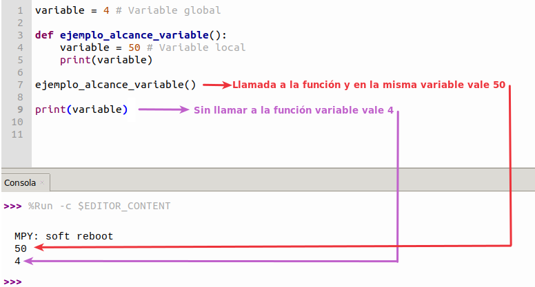

# <FONT COLOR=#8B008B>Constantes y variables en Python</font>
Una vez vistos los tipos de datos vamos a estudiar las constantes y variables en Python, que son, tipos, como crearlas, etc.

## <FONT COLOR=#007575>**Constantes**</font>
Pues tengo una mala noticia a este respecto y es que **en Python las constantes no existen** por lo que debemos utilizar una variable para almacenar una constante. Lo que si existe es una convención en cuanto al nombre de la variable, que es utilizar letras mayúsculas para dar nombre a la variable. De esta forma cuando nos encontramos una variable con todo en mayúsculas sabremos que es un valor que no hay que alterar. Pero esto no es mas que una convención para saber que PI o IVA son valores que no debemos cambiar aunque podamos. Se recomienda repasar la sección Python PEP 8 del apartado [Introducción](../guias/intro.md) a Python.

~~~PY
PI = 3.14159265
RADIO = 15.5
LONGITUD = PI * RADIO

print(f'{PI=}')
print(f'{RADIO=}')
print("Longitud del circulo:", "%.8f" % LONGITUD)
~~~

Quenos devuelve el siguiente resultado:

~~~
PI=3.141593
RADIO=15.5
Longitud del circulo: 48.69468689
~~~

En el código de arriba, hemos añadido .8 entre % y f al operador %f. Esto significa que queremos redondear el número hasta 8 dígitos decimales.

Existen una serie de constantes que forman parte de Python y a las que no podemos cambiarles el valor. Estas son:

* Valores booleanos ```True``` y ```False```.
* Valor nulo o *null* ```None```.
* Ellipsis (...) para indicar que un programa no  está completo.
* ```pass``` que puede sustituir a ```...```
* @property, quenos sirve para indicar cuales serán los métodos para gestionar el atributo. Pero cuidado con su uso porque puede ocurrir que:

~~~py
class Constantes:

    @property
    def PI(self):  # Definimos la constante
        return 3.141592


constantes = Constantes()  # Creamos el objeto

print(constantes.PI)  # Primer acceso a la constante PI

Constantes.PI = 50 # Alteramos la constante

print(constantes.PI)  # Segundo acceso a la constante PI

constantes.PI = 100  # Alteramos la constante

print(constantes.PI)  # Tercer acceso a la constante PI
~~~

Nos genera la siguiente salida:

~~~
3.141592
50
100
~~~

Donde claramente hemos alterado el valor de la constante.

## <FONT COLOR=#007575>**Variables**</font>
En Python, como en cualquier lenguaje de programación, definir unavariable es reservar un espacio en memoria en nuestro programa para que se almacene el valor de dicha variable. El valor puede ser un número real, un número entero, una cadena de texto, etc. La forma de crearlas es darles nombre y asignarles valor.

Como ya sabemos, una variable se declara, se utiliza, se le puede reasignar o cambiar el valor y volver a utilizarla a lo largo de un programa. Es importante saber que las variables en Python no necesitan especificar su tipo de antemano, característica que se indica diciendo que son variables dinámicas. Observemos el código siguiente:

~~~py
variable = 'Cadena'
print(variable) # Escribe Cadena
variable = 50
print(variable) # Escribe 50
~~~

Algo que aparentemente no es correcto Python lo realiza sin problema gracias a la flexibilidad de tipos de las variables. Aunque esto no es una práctica recomendable porque hace que el código sea bastante ilegible.

En Python no es necesario declarar previamente las variables, basta con definirlas y asignarles valor con el signo '='. Tampoco es necesario declarar el tipo ya que este se asigna automáticamente. Es decir, que sin especificar el tipo Python lo asigna según el valor dado a esa variable:

~~~py
entero = 4
real = 3.1416
cadena = 'Cadena'
print(type(entero))
print(type(real))
print(type(cadena))
~~~

Retorna el siguiente resultado:

~~~
<class 'int'>
<class 'float'>
<class 'str'>
~~~

### <FONT COLOR=#AA0000>Reglas para nombrar variables</font>
Las principales son:

* **El nombre no puede comenzar con un número**. Un nombre de variable tiene que comenzar por una letra mayúscula o minúscula o el símbolo de subrayado o guión bajo ("_"). Tampoco se admiten caracteres esepciales.
* **El nombre de la variable solo puede contener caracteres alfanuméricos y guines bajos**. Un nombre de variable puede contener caracteres en mayúsculas, minúsculas, números y guiones bajos. No se admiten espacios en los nombres de variables.
* **Case sensitive**. En Python se distinguen las mayúsculas y las minúsculas en los nombres de variables, lo que significa que ```var```, ```Var``` y ```VAR``` son tres variables distintas.

A continuación vemos ejemplos de nombre de variables válidos y no válidos:

~~~py
# Nombre válidos
var = 55
mi_var = 55
miVar = 55
mi_var = 55
_mi_var = 55
MIVAR = 55

# Nombres NO válidos
mi var = 55
mi-var = 55
2var = 55
~~~

### <FONT COLOR=#AA0000>Unpacking</font>
El desempaquetado es el proceso de extraer variables discretas de elementos iterables como listas, tuplas o diccionarios. Un ejemplo lo aclara mejor:

~~~py
valores = [1, 2, 3, 4]
print(valores)

w, x, y, z = valores
print(w)
print(x)
print(y)
print(z)
~~~

Que origina la siguiente salida:

~~~
[1, 2, 3, 4]
1
2
3
4
~~~

También es posible realizar la operación contraria, es decir, empaquetar valores de variables en una lista, tupla o diccionario. Por ejemplo:

~~~py
frutas = ('Pera', 'Caqui', 'Naranja')
print(frutas)

fruta_1, fruta_2, fruta_3 = frutas
print(fruta_1)
print(fruta_2)
print(fruta_3)
~~~

Que produce la siguiente salida:

~~~
('Pera', 'Caqui', 'Naranja')
Pera
Caqui
Naranja
~~~

## <FONT COLOR=#007575>**Alcance (scope) de una variable**</font>
El alcance de una variable es la parte del programa en la que dicha variable se puede utilizar porque es reconocida, siendo imposible utilizar variables que están fuera del alcance de esa zona, y si tratamos de utilizarlas se nos producirá un error.

En Python existen dos tipos de alcance, el global y el local.

### <FONT COLOR=#AA0000>Variables locales</font>
Cuando una variable se declara dentro de una función o clase su alcance es local. Es posible que una variable local tenga el mismo nombre que una global y lo que ocurrirá es que dentro del alcance de la variable local la global no tendrá efecto pues queda oculta por la local. Esta es, evidentemente, una práctica muy poco recomendable pues puede causar bastante confusión. Veamos un ejemplo para aclararlo.

<center>

  
*Uso no recomendado de nombres locales y globales*

</center>

### <FONT COLOR=#AA0000>Variables globales</font>
Cuando una variable se declara fuera de cualquier función o clase tiene un alcance global y puede ser accedida desde cualquier parte del programa, incluidas las funciones y clases. Si una variable se utiliza antes de ser asignada dentro de una función o clase será asumida como variable global en Python.

Lo correcto para declarar variables globales en Python es precederlas de la palabra reservada ```global```, indicando de esta forma como debe ser tratada la variable y que su valor puede ser accedido y modificado desde cualquier parte del programa. Para Utilizar ```global``` debemos primero declarar la variable y posteriormente inicializarla, porque si lo hacemos todo en una sola línea se nos producirá un error de sintaxis. Si solamente queremos utilizar la variable global en una función o clase y modificar su valor localmente en la misma, un ejemplo puede ser el siguiente:

~~~py
global variable_global # Se declara el ambito expresamente
variable_global = 4 # Se inicializa (es opcional)

def ejemplo_alcance_variable():
    variable = 50 # Variable local
    print(variable) # Salida = 50
    
    variable_global = 10 # Se modifica la variable global para su uso en la funcion
    print(variable_global) # Salid = 10
    
ejemplo_alcance_variable() # Llamada funcion que imprime 50 y 10

print(variable_global) # Salida = 4
~~~

En el ejemplo vemos como modificar y utilizar la variable global sin que su valor inicial quede alterado. La salida del ejemplo anterior es:

~~~
50
10
4
~~~

Ahora bien, si lo que necesitamos es, además de utilizar la variable global, poder modificarla desde la función o clase, entonces necesitamos llamar a la variable desde la función exactamente igual que con su declaración. En el ejemplo anterior modificamos así:

~~~py
global variable_global # Se declara el ambito expresamente
variable_global = 4 # Se inicializa (es opcional)

def ejemplo_alcance_variable(): 
    variable = 50 # Variable local
    print(variable) # Salida = 50
    
    global variable_global # Se cambia de valor la variable global
    variable_global = 10 # Se modifica la variable global para su uso en la funcion
    print(variable_global) # Salid = 10
    
ejemplo_alcance_variable() # Llamada funcion que imprime 50 y 10

print(variable_global) # Salida = 4
~~~

Para obtener la salida:

~~~
50
10
10
~~~

Vemos ahora como la modificación de la variable global desde la función permanece cuando salimos de la misma.
