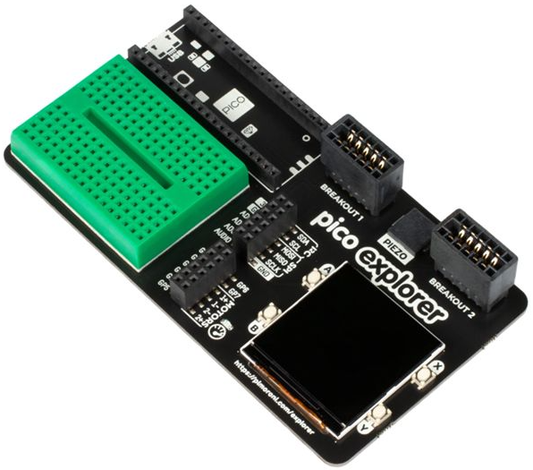
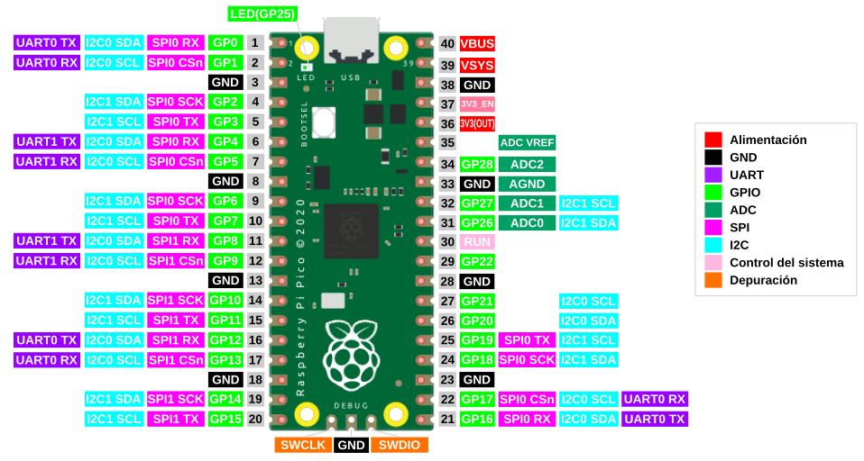
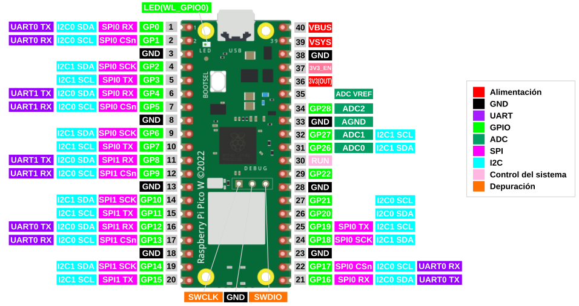
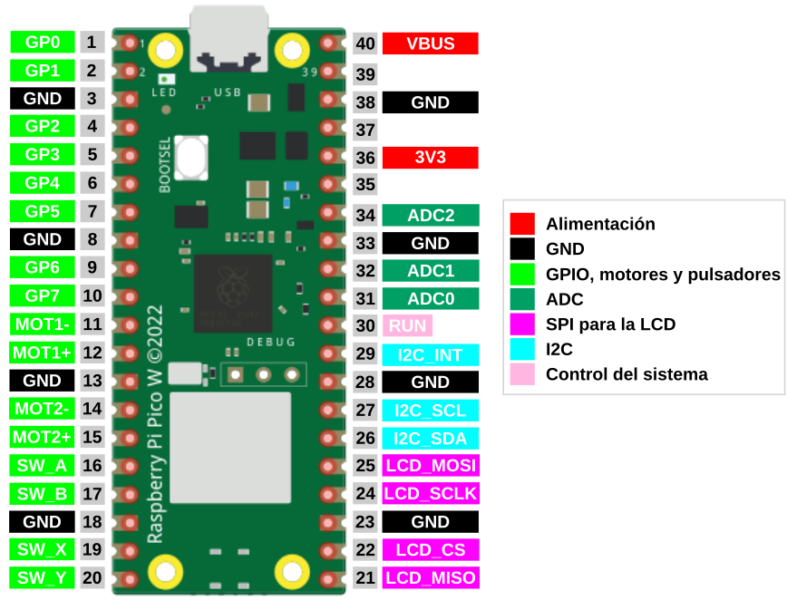

# Introducción
La placa **Pico Explorer** es una placa de expansión para la Raspberry Pi Pico o Pico W fabricada por [Pimoroni](https://shop.pimoroni.com/), diseñada para el aprendizaje de circuitos básicos de electrónica mediante la realización de experimentos reales. La placa incluye componentes funcionales como una mini protoboard, controladores de motor, un altavoz, una pantalla con cuatro botones utilizables y conectores de Breakout Garden para módulos de expansión. En la imagen siguiente vemos su aspecto.

  
*Aspecto de la placa Pico Explorer*

## **Características**

* Altavoz piezoeléctrico
* Pantalla LCD IPS de 1,54" (240 x 240px)
* Cuatro pulsadores controlables por el usuario
* Dos controladores de motor puente en H (con LED indicador de sobrecorriente)
* Conectores de pines GPIO y ADC de fácil acceso
* Dos enchufes I2C Breakout Garden
* Mini placa protoboard de pruebas
* Patitas adhesivas de silicona
* Compatible con Raspberry Pi Pico/Pico W
* No se requiere soldadura (siempre que la Pico tenga las tiras de pines soldados).
* Dimensiones: aproximadas 117 mm x 63 mm x 20 mm (largo x ancho x alto)
* Requiere de [Bibliotecas C/C++ y MicroPython](https://github.com/pimoroni/pimoroni-pico)
* [Esquemático](./datasheet/pico_explorer_schematic.pdf)

## **Pinout**

### Raspberry Pi Pico

  
*Distribución de pines en la Pi Pico*

### Raspberry Pi Pico

  
*Distribución de pines en la Pi Pico W*

### Placa Pico Explorer

  
*Distribución de pines en la Pico Explorer*

