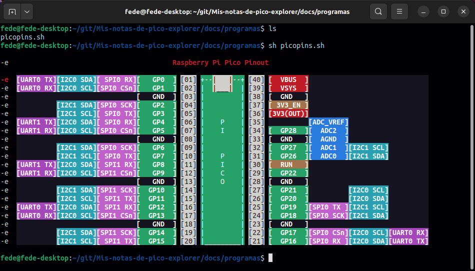

# <FONT COLOR=#8B008B>Introducción</font>
La placa **Pico Explorer** es una placa de expansión para la Raspberry Pi Pico o Pico W fabricada por [Pimoroni](https://shop.pimoroni.com/), diseñada para el aprendizaje de circuitos básicos de electrónica mediante la realización de experimentos reales. La placa incluye componentes funcionales como una mini protoboard, controladores de motor, un altavoz, una pantalla con cuatro botones utilizables y conectores de Breakout Garden para módulos de expansión. En la imagen siguiente vemos su aspecto.

<center>

  
*Aspecto de la placa Pico Explorer*

</center>

## <FONT COLOR=#007575>**Características**</font>

* Altavoz piezoeléctrico
* Pantalla LCD IPS de 1,54" (240 x 240px)
* Cuatro pulsadores controlables por el usuario
* Dos controladores de motor puente en H (con LED indicador de sobrecorriente)
* Conectores de pines GPIO y ADC de fácil acceso
* Dos enchufes I2C Breakout Garden
* Mini placa protoboard de pruebas
* Patitas adhesivas de silicona
* Compatible con Raspberry Pi Pico/Pico W
* No se requiere soldadura (siempre que la Pico tenga las tiras de pines soldados).
* Dimensiones: aproximadas 117 mm x 63 mm x 20 mm (largo x ancho x alto)
* Requiere de [Bibliotecas C/C++ y MicroPython](https://github.com/pimoroni/pimoroni-pico)
* [Esquemático](./datasheet/pico_explorer_schematic.pdf)

## <FONT COLOR=#007575>**Pinouts**</font>

### <FONT COLOR=#AA0000>Raspberry Pi Pico</font>

<center>

  
*Distribución de pines en la Pi Pico*

</center>

### <FONT COLOR=#AA0000>Raspberry Pi Pico W</font>

<center>

  
*Distribución de pines en la Pi Pico W*

</center>

### <FONT COLOR=#AA0000>Placa Pico Explorer</font>

<center>

  
*Distribución de pines en la Pico Explorer*

</center>

## <FONT COLOR=#007575>**Pinout desde la línea de comandos**</font>
Voy a exponer a título de curiosidad el trabajo visto en el [blog original no oficial de Raspberry Pi](https://www.raspberrypi-spy.co.uk/) de [Matt Hawkins](https://mastodon.social/@RPiSpy) donde podemos encontrar un script .sh que no dibuja el pinout de la Pi Pico en una ventana de terminal cuando lo invocamos. La web es muy recomendable por la cantidad de información y ejemplos que desarrolla con la Pi Pico.

El script lo podemos descargar desde:

* wget https://raw.githubusercontent.com/RPiSpy/pi-pico/main/picopins.sh
* git clone https://github.com/RPiSpy/pi-pico.git
* [Este enlace](./programas/picopins.sh)

Una vez descargado nos dirigimos al directorio donde está el archivo y hacemos que el script sea ejecutable mediante ```chmod +x piconpins.sh```.

Ya podemos ejecutar el script tecleando en la línea de comandos ```./piconpins.sh``` o ```sh piconpins.sh``` para obtener el siguiente resultado:

<center>

  
*Pinout de la Pi Pico desde la línea de comandos*

</center>

Si queremos tener disponible el script lo podemos llevar al directorio de sistema /bin. En mi caso le voy a cambiar el nombre a pinoutpico haciendo ```sudo cp picopins.sh /bin/pinoutpico```. El nuevo fichero también debe tener permiso de ejecución, por lo que debemos dirigirnos al directorio /bin y en una terminal teclear ```sudo chmod +x pinoutpico```. Ahora ya podemos invocar ```pinoutpico``` desde cualquier directorio siempre que lo necesitemos.
