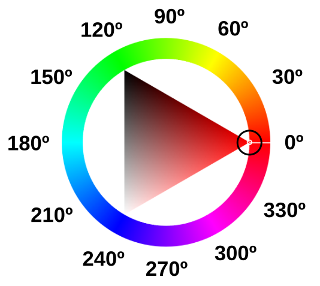
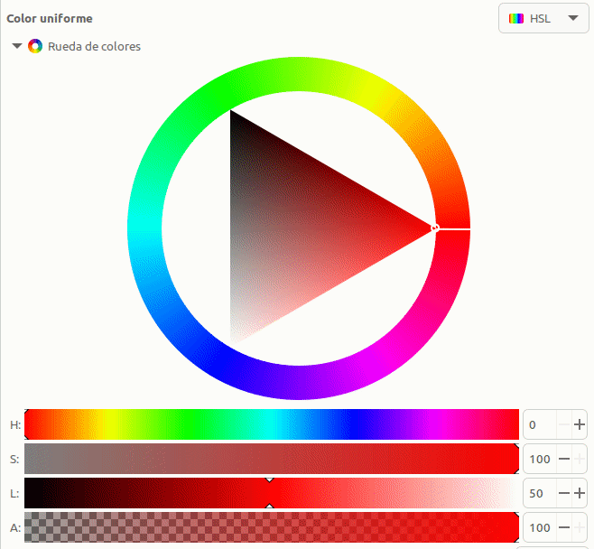
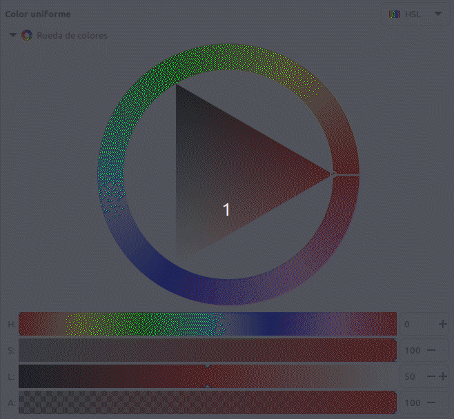
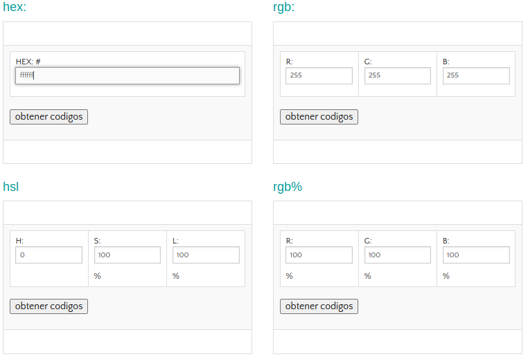
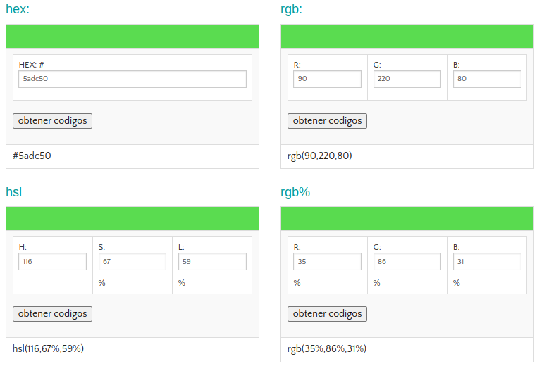

# Modelo de color HSL
El modelo **HSL** o a veces **HSI** (siglas del inglés Hue, Saturation, Lightness o Intensity; traducido por, ‘matiz, saturación, luminosidad o intensidad’), define un modelo de color en términos de sus componentes constituyentes.

En el modelo de color **HSV**, un color se define por su matiz o tono (H), su saturación (S) y su luminosidad o intensidad (L). Ahora las siglas no significan colores como en RGB, sino parámetros.

La variedad de colores se obtiene cambiando los tres canales de color de tono (H), saturación (S) y luminosidad (L) y superponiéndolos entre sí. Este modo de color cubre los colores que puede percibir la visión humana.

Se suele representar mediante la rueda de color, como vemos a continuación:

  
*Rueda de color HSL*

* **Tono, matiz o Hue (H)**. En el círculo cromático el grado 0 (o 360º si hemos dado una vuelta completa) del Hue es el color rojo. El circulito rodeado corresponde al ángulo en la rueda de color. Cada ángulo representa un color. En esa posición la saturación S por defecto tomma su valor máximo de 100, y el brillo (L) es de 50. Nos podemos mover con estas condiciones por la rueda y obtener los distintos colores para esos valores de saturación o brillo.

  
*Cambios de tono (H) en la rueda de color HSL*

* **Saturación o Saturation (S)**. Indica la intensidad de un tono concreto. Los valores varian entre 0 y 100, siendo 100 el máximo de saturación posible y 0 el mínimo, que dará como resultado, gris. El parámetro cambia sus valores moviendose dentro del triángulo en la línea del díametro del círculo que corresponde a la posición del ángulo determinado por H.

  
*Cambios de saturación (S) en la rueda de color HSL*

Observamos que al acercarnos al gris el valor de H se restablece a su valor por defecto. Hasta ese punto el tono se mantiene en el valor definido.

* **Luminosidad o Lightness (L)**. El parámetro se refiere a como de claro u oscuro es un color. Si queremos aclarar un color nos moveremos hacia el blanco y si quiero oscurecerlo hacia el negro.

  
*Cambios de luminosidad (L) en la rueda de color HSL*

Hay un parámetro que suele acompañar a la rueda de color que es el Alfa (A), que puede variar entre 0 y 100 y se refiere al grado de opacidad del color, correspondiendo 100 a totalmente opaco y 0 a totalmente transparente.

## **Convertir RGB a HSL**
Nos vamos a basar en un ejemplo descrito por los valores R=90, G=220, B=80 correspondiente a un tono verde oscuro.

  
*R=90, G=220, B=80*

* **Paso 1. Máximo y Mínimo**. Convertimos los valores RGB a valores en el rango 0-1 dividiendo por 255 cada valor.

$R = \dfrac{90}{255}= 0.353 \space; \space G = \dfrac{220}{255}= 0.863 \space; \space B = \dfrac{80}{255}= 0.314$

$\boxed{R = 0.353 \space; \space G = 0.863 \space(Max) \space; \space B = 0.314 \space(Min)}$

* **Paso 2. Luminancia**. Calculamos la Luminancia sumando los valores máximo y mínimo obtenidos en el paso 1 y lo dividimos por 2.

$L \space = \space \dfrac{0.863 + 0.314}{2} \space= \space 0.5885 \space\approx59 \%$

$\boxed{L \space = \space 0.5885 \space \approx 59 \%}$

* **Paso 3. Saturación**. A la hora de calcular la saturación S tendremos en cuenta que:

>
- <b>Si los valores máximo y mínimo son iguales: No hay saturación.
- Si todos los valores RGB son iguales: Tono gris mas o menos oscuro o claro dependiendo de la luminosidad.
- Si no hay saturación el Tono será 0º.</b>

Si no se da alguna de las condiciones anteriores sabemos que hay Saturación, que se calcula según sea el nivel de Luminancia:

$\Rightarrow$ **Si $L \leq 0.5$**

$S = \dfrac{Max-Min}{Max+Min}$

$\Rightarrow$ **Si $L > 0.5$**

$S = \dfrac{Max-Min}{2.0-Max-Min}$

$S = \dfrac{0.863-0.314}{2-0.863-0.314} = \dfrac{0.549}{0.823}=0.667 \approx 67 \%$

$\boxed{S = 0.667 \approx 67 \%}$

* **Paso 4. Tono**. La fórmula del Tono depende de qué canal de color RGB es el valor máximo. Las tres fórmulas diferentes son:

$\Rightarrow$  Si **Rojo** es el máximo, entonces:

$H = \dfrac{G-B}{Max-Min}$

$\Rightarrow$  Si **Verde** es el máximo, entonces:

$H = 2.0 + \dfrac{B-R}{Max-Min}$

$H = 2.0 + \dfrac{0.314-0.353}{0.863-0.314} = 2.0 + \dfrac{(-0.039)}{0.549} = 1.929$

$\boxed{H=1.929}$

$\Rightarrow$  Si **Azul** es el máximo, entonces:

H = 4.0 + \dfrac{R-G}{Max-Min}$

El valor obtenido de H lo multiplicamos por 60 para convertirlo en grados en el círculo cromático. Si resulta un valor negativo de H le sumamos 360.

$H = 1.929 \times 60 = 115.74 \approx 116 \space grados$

$\boxed{H=116 \space grados}$

Resultado final:

R = 90, G = 220, B = 80

H = 116, S = 67, L = 59

## **Convertir HSL a RGB**
En el mismo sitio en que hemos basado la conversión de RGB a HSL de [Nikolai Waldman](https://www.niwa.nu/2013/05/math-behind-colorspace-conversions-rgb-hsl/) está documentado como hacerlo a la inversa, pero nosotros no lo vamos a hacer de este modo.

Se encuentran facilmente en la web páginas con calculadoras que permiten convertir de un modelo a otro con tan solo introducir los valores. Algunas incluso indican las fórmulas de cálculo, que usualmente están basadas en la entrada [HSL and HSV](https://en.wikipedia.org/wiki/HSL_and_HSV#Converting_to_RGB) de la Wikipedia. A título de ejemplo aquí pongo la de [rapidtables](https://www.rapidtables.org/convert/color/hsl-to-rgb.html), que ofrece muchas calculadoras en línea gratuitas

Hay una forma de hacerlo a partir de un programa libre como es Inkscape, publicado bajo licencia **GNU General Public License, version 3** y que hemos utilizado para las animaciones donde se han explicado los conceptos y donde además se pueden obtener otros datos y por supuesto modificarlos.

Es muy sencillo de utilizar y nos ofrece además otras posibilidades interesantes. Veamos como llegar a ello una vez abierto Inkscape con un archivo en blanco.

Dibujamos cualquier cosa y abrimos las opciones de Relleno y borde del objeto y desde ahí ya podemos cambiar el modelo de color, activar la rueda, mover la rueda o los valores lineales, volver a cambiar de modelo, etc y se nos irán mostrando los valores convetidos de uno a otro, como se observa en la animación siguiente cuando cambiamos del modelo HSL a RGB.

  
*Modelos de color con Inkscape*

## **Convertidor HEX, RGB, HSL**
Se trata de una herramienta que nos resultará útil cuando trabajamos con colores:

[Herramienta de conversión de los códigos de colores: HEX, RGB y HSL](https://w3.unpocodetodo.info/utiles/conversor.php)

El aspecto de la calculadora al iniciar el enlace es:

  
*Aspecto inicial de la calculadora*

En la imagen vemos la calculadora con el ejemplo anterior:

  
*Aspecto de la calculadora con un ejemplo*

