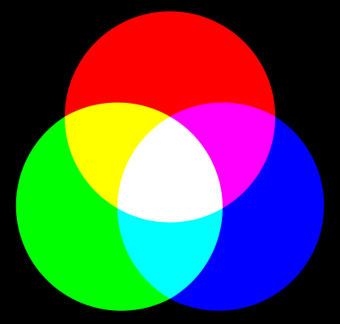
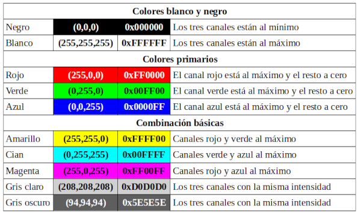
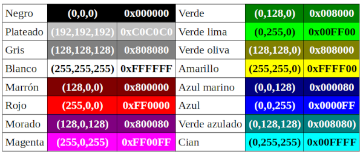
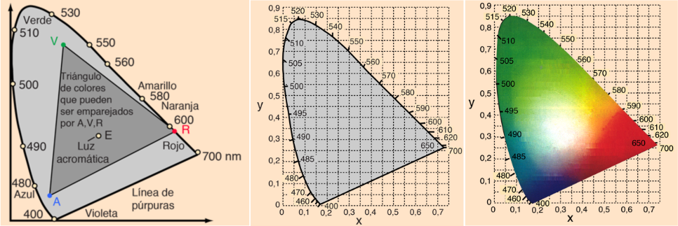
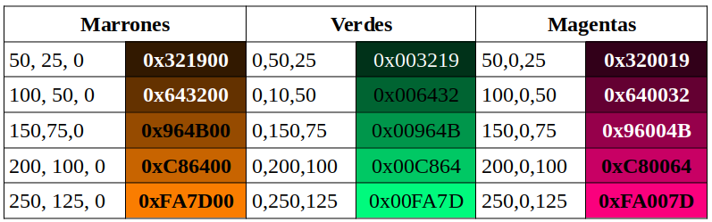

# Modelo de color RGB
RGB son las siglas de Red, Green, Blue (Rojo, Verde, Azul) y define la composición del color según la intensidad de los colores primarios de la luz.

Un [color primario](https://es.wikipedia.org/wiki/Color_primario#Colores_primarios_de_luz_(RGB)) se considera así cuando no se puede obtener por la mezcla de ningún otro color. El concepto se idealiza en base a la respuesta biológica de las células receptoras (conos) del ojo humano.

El modelo de color RGB se basa en la idea de que es posible representar un color mediante la adición de los tres colores primarios. El modelo RGB no define por si mismo lo que es rojo, verde y azul, por lo que los mismos valores RGB pueden mostrar colores muy diferentes según el dispositivo en que se usen.

  
*Modelo aditivo de colores rojo, verde y azul [Fuente wikipedia](https://es.wikipedia.org/wiki/RGB) *

Cuando se trata de programación la mezcla de colores se indica asignando a cada color primario un valor, que normalmente varia entre 0 y 255 (1 byte), de manera que a medida que el valor aumenta este aporta mas intensidad a la mezcla. De esta forma cada color se define por un conjunto de valores escritos entre paréntesis y separados por comas.

Desde el punto de vista que nos ocupa es importante la codificación hexadecimal de los colores, que utiliza la combinación de tres códigos de dos digitos para expresar las diferentes intensidades de los colores primarios.

Con esta base se definen los colores que vemos a continuación:

  
*Definición base de colores*

A partir de aquí se puede definir cualquier color por combinación de los tres primarios.

La especificación HTML 4.01 define los siguiente 16 colores:

  
*Especificacion de colores para HTML 4.01*

Venimos indicando que el color RGB se obtiene por intensidad de los colores. Pues bien, y sin ánimo de entrar en mayores detalles, existe un sistema de color denominado CIE (Comission Internationale de l´Eclairage, que es la comisión internacional sobre la iluminación) que nos ofrece un diagrama de cromaticidad basado en el hecho de que el ojo humano tiene tres tipos diferentes de conos, por lo que la respuesta del ojo se describe mejor en términos de tres valores. Sin embargo, una vez que se logra esto cualquier color puede expresarse por sus coordenadas x,y. En la imagen siguiente observamos los diagramas de percepción del color del ojo humano en términos de dos parámetros.

  
*Diagramas de percepción del color del ojo humano [Fuente](http://hyperphysics.phy-astr.gsu.edu/hbasees/hph.html) *

Asociamos RGB con los vértices del triángulo que en este caso se han nombrado en español con RVA.

Si situamos los colores vistos anteriormente en el gráfico, podemos decir que:

* Si dos coeficientes son 0, el color se sitúa en el vértice que corresponde al valor no nulo.
* Si un coeficiente es 0, el color se sitúa en uno de los lados del triángulo.
* Si ningún coeficiente es 0, el color se sitúa en un punto interior del triángulo

Como estamos representando tres valores en un diagrama de dos coordenadas, obtenemos como resultado que a cada punto de este diagrama le corresponde una familia completa de colores. Es decir, si tenemos colores que tienen la misma proporción de rojo, verde y azul, a todos ellos les corresponde el mismo punto y solamente se diferencian por la intensidad. En la imagen vemos las variaciones de intensidad de tres colores diferentes de los situados en cada uno de los lados del triángulo.

  
*Variaciones de intensidad*

