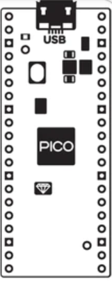

# Como comenzar
Lo primero que debemos hacer es posicionar nuestra Raspberry Pi Pico o PicoW en su posición teniendo la precuación de orientarla adecuadamente según nos marca el serigrafiado de la placa que vemos en la imagen siguiente, donde está indicado el conector USB como clara referencia.

  
*Serigrafia en la placa Pico Explorer*

Estas notas se van a dedicar a crear programas en MicroPython para RaspBerry Pi Pico, por lo tanto aclaremos algunos conceptos:

* **Python** es un lenguaje de programación de alto nivel, limpio, elegante. ágil y sencillo, que facilita el aprendizaje de la programación dada su curva de aprendizaje.
* **Python** no es un lenguaje compilado sino interpretado por lo que se puede experimentar mientras se programa. Dispone de una libreria estándar y de multitud de librerias desarrolladas que permiten realizar tareas complejas de forma mas sencilla que otros lenguajes.

* **MicroPython** es un eficiente interprete del lenguaje Python que se ha optimizado para funcionar en microcontroladores y ambientes restringidos.
* El **interprete** se encarga de procesar el código de programa para hacer posible que el hardware ejecute lo que en él se indica. El interprete se sitúa como una capa lógica de software entre el código y el hardware.
* **MicroPython** dispone de módulos que permiten el acceso al hardware del microcontrolador y dispone de multitud de librerias para las distintas tareas.

Dado el hardware que vamos a utilizar es recomendable comenzar descargando y copiando [MicroPython uf2 personalizado de Pimorini](https://github.com/pimoroni/pimoroni-pico/releases/) en nuestra Rasberry Pi Pico; ya que incluye todas las liberias que necesitaremos para usarlo.

En otro apartado vamos a ver como comenzar con RBP Pico, que versión descargar de MicroPython y comenzaremos a trabajar con todo ello.
