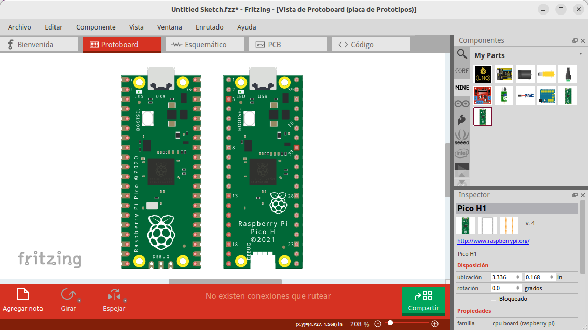

# La Pi Pico y Pico W
Realizaremos una breve descripción de los modelos lanzados de la Pi Pico, describiendo sus principales características. El modelo Pico W es totalmente similar con la salvedad de que integra conectividad WiFi.

* La Raspberry Pi Pico se lanzó al mercado el 21 de enero de 2021.
* La Pico W se lanzó el 30 de junio de 2022 como reemplazo directo de la Pi Pico para trabajar IoT.

  
*Partes principales en la Pi Pico*

  
*Partes principales en la Pi Pico W*

En la tabla siguiente vemos las principales características de la Pi Pico.

|caracteristicas y especificaciones|Valores|
|---|---|
|Microntrolador|RP2040|
|Núcleos|Dos (dual core)|
|Arquitectura de nucleo|32-bits ARM Cortex-M0+|
|Reloj de la CPU|Configurable hasta 133MHz|
|Memoria RAM|264 KBytes de SRAM|
|Memoria Flash|2 MBytes Q-SPI|
|Lenguajes soportados|MicroPython, C y C++|
|Alimentación|5V DC por micro USB|
|Alimentación alternativa|2 a 5V DC por VSYS (pin 39)|
|Tensión MCU|3.3V DC|
|Tensión GPIO|3.3V DC|
|Interface USB|USB 1.1 |
|GPIO|26 entradas/salidas digitales|
|ADC|3x12 bits a 500ksps|
|Sensor de temperatura|integrado de 12 bits|
|UART|2|
|I2C|2|
|SPI|2|
|PWM|16|
|Timer|Un timer con 4 alarmas|
|RTC|Un contador en tiempo real|
|PIO|2 IO programables de alta velocidad|
|LED en placa|Un LED programable (GP25)|
|Botón en placa|Un botón BOOTSEL|
|Puerto de depuración|Puerto de 3 pines ARM Serial Wire Debug|
|Inalámbrico|IEEE 802.11 b/n/g de 2.4 GHz. Bluetooth 5.2|
|Antena|Incorporada en la propia placa|

La Pi Pico está diseñada para integrarse en otros productos, bien a partir de SMT (Surface Mount Technology) gracias al diseño de borde de los pines, o bien a través de tiras de pines.

  
*Pi Pico para SMT y tiras de pines*

Entre los 26 pines GPIO se pueden configurar como:

* 3 como ADC de 12 bits a 500 ksps (kilo muestras por segundo)
* 2 como UART
* 2 como SPI
* 2 como I2C
* Hasta 16 como pines PWM

Internamente viene con un temporizador con 4 alarmas, y un contador en tiempo real y los periféricos duales de E/S programables (PIO) que son E/S de alta velocidad flexibles y programables por el usuario. Puede emular interfaces como tarjetas SD y VGA.

En la imagen siguiente vemos la posible configuración de pines PWM en la Raspberry Pi Pico.

  
*Pines PWM en la Pi Pico*

<b>IMPORTANTE:</b> Los pines GPIO de la Pi Pico trabajan a 3,3V como voltaje máximo de entrada y/o salida. Si aplicamos tensiones superiores a cualquiera de ellos podemos dañar la placa de manera irreversible.

## **La familia Pi Pico**
La familia de Raspberry Pi Pico está formada por la cuatro placas que vemos en la imagen siguiente:

  
*La familia Pi Pico  Imagen obtenida de [aquí](https://github.com/raspberrypi/documentation/blob/develop/documentation/asciidoc/microcontrollers/raspberry-pi-pico/about_pico.adoc) *

### Pi Pico y Pico H
La Raspberry Pi Pico viene con medios agujeros en el borde que permiten soldarla directamente a otras placas base, mientras que la Pico H viene con terminales pre-soldados.

Ambas placas tienen tres pines *Serial Wire Debug (SWD)*. En la Pico H viene soldado un pequeño conector de 3 vias con retención tipo JST, mientras que la Pico tiene tres agujeros pasantes junto a los medios agujeros del borde de la placa.

A continuación tenemos diferentes archivos sobre información de las placas.

* Enlace al [pinout](../datasheet/docum_pico/pico_picoH/Pico-Pinout.pdf) en pdf
* Enlace al [esquema público](../datasheet/docum_pico/pico_picoH/RPI-PICO_esquema.pdf) en pdf
* En la imagen siguiente vemos los modelos [Fritzing](https://fritzing.org/) de la [Pico](../datasheet/docum_pico/pico_picoH/Pico.fzpz) y de la [Pico H](../datasheet/docum_pico/pico_picoH/PicoH.fzpz) en el IDE del mismo.

  
*Pi Pico y Pico H en Fritzing*

* En la imagen podemos ver el [modelo .STEP](../datasheet/docum_pico/pico_picoH/Pico.step) en FreeCAD en el IDE del mismo.

  
*Pi Pico en FreeCAD*

* [Hoja de datos de la Pi Pico](../datasheet/docum_pico/pico_picoH/pico-datasheet.pdf)

### Pi Pico W y Pico WH
Raspberry Pi Pico W añade interfaces inalámbricas integradas de banda única de 2,4 GHz (802.11n) utilizando el chip Infineon CYW43439, manteniendo el factor de forma Pico. La interfaz inalámbrica integrada de 2,4 GHz tiene las siguientes características:

* WPA3
* Punto de acceso compatible con hasta cuatro clientes
* Bluetooth 5.2. Compatibilidad con Bluetooth BLE y Bluetooth Classic

La antena es una antena integrada con licencia de ABRACON (anteriormente ProAnt). La interfaz inalámbrica está conectada mediante SPI al microcontrolador RP2040.

Debido a las limitaciones de pines, algunos de los pines de la interfaz inalámbrica son compartidos. El CLK se comparte con el monitor VSYS, por lo que sólo cuando no hay una transacción SPI en curso puede leerse VSYS a través del ADC. El Infineon CYW43439 DIN/DOUT e IRQ comparten un pin en el RP2040. Sólo cuando una transacción SPI no está en progreso es adecuado comprobar si hay IRQs. La interfaz funciona típicamente a 33MHz.

Para un mejor rendimiento inalámbrico, la antena debe estar en un espacio libre. Por ejemplo, poner metal debajo o cerca de la antena puede reducir su rendimiento tanto en términos de ganancia como de ancho de banda. Añadir partes metálicas conectadas a tierra a los lados de la antena puede mejorar su ancho de banda.

A continuación tenemos diferentes archivos sobre información de las placas.

* Enlace al [pinout](../datasheet/docum_pico/picoW/PicoW-Pinout.pdf) en pdf
* En la imagen siguiente vemos el modelo [Fritzing](https://fritzing.org/) de la [Pico W](../datasheet/docum_pico/picoW/PicoW.fzpz) en el IDE del mismo.

  
*Pi Pico W en Fritzing*

* En la imagen podemos ver el [modelo .STEP](../datasheet/docum_pico/picoW/PicoW.stp) en FreeCAD en el IDE del mismo.

  
*Pi Pico W en FreeCAD*

* [Hoja de datos de la Pi Pico W](../datasheet/docum_pico/picoW/pico-w-datasheet.pdf)
