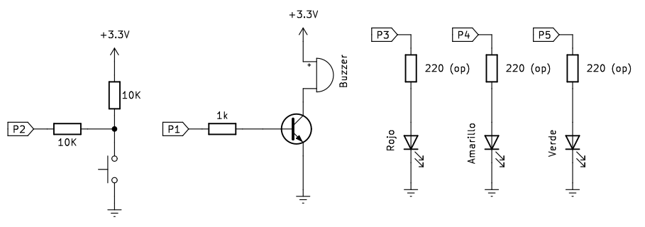

# <FONT COLOR=#8B008B>Semáforo</font>
Un control de tráfico semafórico es un sistema que cambia las luces según un temporizador, vigila a los peatones que quieren cruzar e incluso puede ajustar la temporización de los semáforos con otros cercanos en función del tráfico, con la idea  de garantizar la fluidez de toda la red.

Aunque construir un sistema de gestión del tráfico a gran escala es un proyecto muy avanzado, podemos construir un simulador en miniatura con una Raspberry Pi Pico.

El objetivo del proyecto es crear un minisistema de paso de peatones con varios diodos LED, un pulsador y un zumbador.

## <FONT COLOR=#007575>**Sólo los diodos LED**</font>
El programa inicial con solo los diodos LEDs es el siguiente:

~~~py
# --1--> Importar módulos necesarios
import machine
import utime # <--1--

# --2--> Configurar pines y asignar a variables
led_rojo = machine.Pin(3, machine.Pin.OUT)
led_ambar = machine.Pin(4, machine.Pin.OUT)
led_verde = machine.Pin(5, machine.Pin.OUT) # <--2--

while True:
    # --3--> Secuencia de encendido y apagado de los LEDs
    led_rojo.value(1)  # Enciende rojo
    utime.sleep(5)     # durante 5 segundos
    led_ambar.value(1) # Sin apagar rojo enciende ambas
    utime.sleep(2)     # durante 2 segundos
    led_rojo.value(0)  # apaga rojo
    led_ambar.value(0) # apaga ambar
    led_verde.value(1) # enciende verde
    utime.sleep(5)     # durante 5 segundos
    led_verde.value(0) # apaga verde
    led_ambar.value(1) # enciende ambar
    utime.sleep(2)     # durante 2 segundos
    led_ambar.value(0) # apaga ambar
    # <--3--

~~~

El patrón de encendido y apagado se repetirá indefinidamente hasta que pulsemos 'stop' o quitemos la alimentación al circuito.

<div class="cuadrado">
CUIDADO:<br>

Tenemos que recordar siempre que un LED requiere una resistencia limitadora de corriente para ser conectado a la Raspberry Pi Pico. Si estamos utilizando la placa Pico Explorer esta resistencia es opcional debido a que la placa monta una resistencia serie de 100 ohmios en serie con cada pin GPIO disponible en los conectores dupont hembra. Si conectamos un LED sin resistencia limitadora lo mejor que nos puede pasar es que el LED se queme y deje de funcionar, siendo el peor resultado que le ocurra eso a la Pi Pico.</br>

</div>
<style>
.cuadrado{
padding:10px;
margin:0px;
background-color: #FFD0D0;
border: solid 3px #FF0000;
color: black;
}
</style>

## <FONT COLOR=#007575>**Con pulsador y sonido**</font>
Los semáforos reales no son sólo para los vehículos, sino también para proteger a los peatones, dándoles la oportunidad de cruzar con seguridad una vía muy transitada. Para añadir funcionalidad al semáforo anterior vamos a necesitar añadir un botón pulsador y un zumbador al montaje.

Para convertir el semáforo anterior en un paso de peatones es necesario que el peatón pueda solicitar al semáforo que quiere cruzar la calle y un avisador sonoro que le indique cuando puede cruzar.

Necesitamos una manera de monitorizar el estado del botón de manera constante, es decir, saber si el botón hasido presionado para interrumpir la secuencia de encendido y apagado normal de las luces. El programa tiene que ser capaz de registrar si el botón ha sido pulsado, pero de una forma que no interrumpa la secuencia del semáforo. Para hacer esto vamos a utilizar la librería: ```_thread```.

Un thread es un hilo o subproceso que en realidad es un programa parcialmente independiente. Como la RapberryPi Pico tiene un microcontrolador RP2040 de doble núcleo podemos hacer que el subproceso de vigilancia del botón se ejecute al mismo tiempo que lo hace el hilo o subprograma de secuencia de luces. Pero si hacemos esto vamos a necesitar una forma de que el nuevo subproceso pueda pasar información al subproceso principal. Esto se puede conseguir utilizando variables globales. Las variables con las que has estado trabajando antes de esto se conocen como variables locales, y sólo funcionan en una sección del programa. Una variable global funciona en todas partes, lo que significa que un hilo puede contener el valor y otro puede comprobar si se ha cambiado. Se recomienda repasar el apartado [Constantes y variables en Python](../guias/variables.md).

El siguiente paso es definir nuestro ```hilo``` o ```thread```. Para hacer esto añadimos una línea ```def``` que defina el hilo y le ponemos un nombre descriptivo:

~~~py
def leer_boton_thread():
~~~

Es un hilo para leer la entrada del botón. Como es habitual tras el fin de la definición, MicroPython necesita que todo lo que tenga que formar parte del hilo esté sangrado, para saber dónde empieza y termina el hilo.

Si desde el hilo necesitamos que MicroPython pueda cambiar el valor de la variable global, tenemos que incluir la siguiente línea:

~~~py
def leer_boton_thread():
    global boton_pulsado
~~~

Si sólo necesitamos comprobar el valor, no es necesario incluir esta línea, pero sin ella no se puede hacer ningún cambio en la variable global.

A continuación, creamos un bucle infinito y dentro del mismo una sentencia condicional que comprueba si el valor del botón es 1. Debido a a la resistencia pull-down interna de la Pico (configura en la definición del pin), cuando no se pulsa el botón, el valor leído es 0, por lo que el código condicional nunca se ejecuta. Ahora bien, cuando el botón esté pulsado se ejecutará la línea que pone la variable a ```True```, haciendo saber al resto del programa que el botón ha sido pulsado. El retardo de 10ms es para que el bucle no se ejecute demasiado rápido y de tiempo a actualizar los valores en los hilos.

Puedes notar que no hay nada en el hilo que restablezca la variable button_pressed a False cuando se suelta el botón después de pulsarlo. Hay una razón para ello: mientras que usted puede
pulsar el botón de un cruce de frailecillo en cualquier momento durante el ciclo del semáforo, sólo tiene efecto cuando el semáforo se ha puesto en rojo y es seguro cruzar. Todo lo que tiene que hacer tu nuevo hilo es cambiar la variable cuando se haya pulsado el botón; el hilo principal se encargará de restablecerla a cuando el peatón haya cruzado la calle sin peligro.

Definir un hilo no lo pone en marcha. Es posible iniciar un hilo en cualquier punto de un programa, y hay que decirle específicamente a la librería ```_thread``` cuándo queremos lanzar el hilo. A diferencia de ejecutar una línea normal de código, ejecutar el hilo no detiene el resto del programa, cuando el hilo se inicia, MicroPython continuará y ejecutará la siguiente línea de programa incluso mientras ejecuta la primera línea del nuevo hilo. Para nuestro ejemplo, justo después del código del hilo vamos a crear la línea que vemos a continuación:

~~~py
# --3--> Funcion que actua como hilo
def leer_boton_thread():
    global boton_pulsado
    while True:
        if boton.value() == 1:
            boton_pulsado = True
        utime.sleep(0.01) #<--3--
     
_thread.start_new_thread(leer_boton_thread, ()) # Iniciar hilo
~~~

Esta línea indica a la biblioteca ```_thread``` que inicie el hilo que se definió anteriormente. 

El programa completo es:

~~~py
# --1--> Importar módulos necesarios
import machine
import utime
import _thread # <--1--

# --2--> Configurar pines y asignar a variables
led_rojo = machine.Pin(3, machine.Pin.OUT)
led_ambar = machine.Pin(4, machine.Pin.OUT)
led_verde = machine.Pin(5, machine.Pin.OUT) 
boton = machine.Pin(2, machine.Pin.IN, machine.Pin.PULL_DOWN)
buzzer = machine.Pin(1, machine.Pin.OUT)
global boton_pulsado # Delaracion de variable global
boton_pulsado = False # Inicializacion de variable global
# <--2--

# --3--> Funcion que actua como hilo
def leer_boton_thread():
    global boton_pulsado
    while True:
        if boton.value() == 1:
            boton_pulsado = True
        utime.sleep(0.01) #<--3--
        
_thread.start_new_thread(leer_boton_thread, ()) 

while True:
    if boton_pulsado == True:
        led_rojo.value(1)
        for i in range(10):
            buzzer.value(1)
            utime.sleep(0.2)
            buzzer.value(0)
            utime.sleep(0.2)
        global boton_pulsado
        boton_pulsado = False
    # --4--> Secuencia de encendido y apagado de los LEDs
    led_rojo.value(1)  # Enciende rojo
    utime.sleep(5)     # durante 5 segundos
    led_ambar.value(1) # Sin apagar rojo enciende ambas
    utime.sleep(2)     # durante 2 segundos
    led_rojo.value(0)  # apaga rojo
    led_ambar.value(0) # apaga ambar
    led_verde.value(1) # enciende verde
    utime.sleep(5)     # durante 5 segundos
    led_verde.value(0) # apaga verde
    led_ambar.value(1) # enciende ambar
    utime.sleep(2)     # durante 2 segundos
    led_ambar.value(0) # apaga ambar
    # <--4--
~~~

En este punto, el hilo entra rápidamente en su bucle, comprobando el botón miles de veces por segundo para ver para ver si ya ha sido pulsado. El hilo principal, mientras tanto, continuará con la parte principal del programa.

Si ejecutamos el programa y pulsamos el botón, observaremos que el semáforo sigue su patrón exactamente como antes, sin retrasos ni pausas. Si pulsamos el botón, se comienza a ejecutar una sección de código que empieza encendiendo el LED rojo rojo para detener el tráfico y luego hace sonar el timbre diez veces haciendo que el peatón sepa que es hora de cruzar.

## <FONT COLOR=#007575>**Esquema completo**</font>
El montaje a realizar es el siguiente:

<center>

  
*Esquema de montaje del semáforo con pulsador y sonido*

</center>
