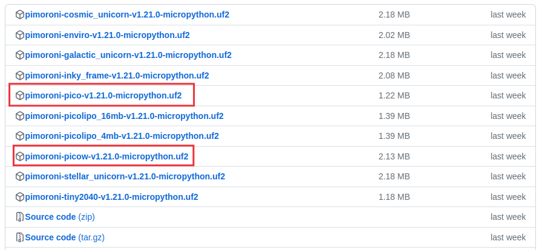
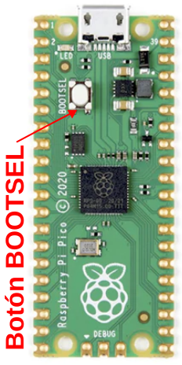
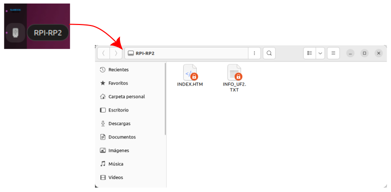

# Firmware
Para programar la Pi Pico se pueden utilizar herramientas basadas en los estándares [MicroPython](https://micropython.org/) y [CircuitPython](https://circuitpython.org/) así como el [IDE de Arduino](https://www.arduino.cc/). Por otra parte, existe una herramienta de programación basada en [Snap!](https://snap.berkeley.edu/) que se denomina [MicroBlocks](https://microblocks.fun/) que ofrece una forma sencilla de iniciarse en la programación de forma grafica. Thonny es otra plataforma de software libre y de código abierto de tamaño compacto, interfaz sencilla, por lo que es un IDE de Python ideal para principiantes. El [sitio oficial de Thonny](https://thonny.org/) y sus [repositorios](https://github.com/thonny/thonny) de código abierto nos ofrecen tanto el programa como la información del mismo. En estas notas vamos a trabajar fundamentalmente con Thonny y con MicroBlocks.

Para terminar con la preparación de nuestra placa y comenzar a trabajar con la misma vamos a ver como grabar el firmware en la Pi Pico y como instalar y usar el compilador Thonny que usaremos para programar la Pi Pico.

## **Instalación del firmware**
Ya hemos indicado que vamos a utilizar la versión de MicrPython de Pimorini. Podemos obtener la versión en: <https://github.com/pimoroni/pimoroni-pico/releases/latest/>. Para instalar MicroPython, tenemos que copiar el archivo .uf2 apropiado de la página de versiones al dispositivo PI Pico mientras está en modo DFU/bootloader.

### ¿Que archivo descargar?
En la [página de versiones] tenemos todos los archivos disponibles de los que a nosotros nos van a interesar uno de los dos que se describen en la tabla e imagen siguientes:

| Placa  | Que archivo uf2 utilizo  |
|---|---|
| Raspberry Pi Pico y otras  placas con RP22040 inalámbricas (Plasma 2040, Interstate 75, Servo 2040, Motor 2040, Tiny 2040 2MB) | pimoroni-pico-vx.x.x-micropython.uf2  |
| Raspberry Pi Pico W y otras  placas Pico W (Automation 2040 W, Inventor 2040 W, Plasma Stick, Interstate 75 W)| pimoroni-picow-vx.x.x-micropython.uf2  |

  
*Archivos a descargar para la Pi Pico*

### Grabar firmware .uf2 en la Pi Pico
Para copiar el archivo a la Pico, debemos ponerla en modo de gestor de arranque. Para hacer esto, mantenemos presionado el botón BOOTSEL mientras conectamos el cable USB al ordenador; ahora debería aparecer como una unidad llamada **RPI-RP2**.

  
*Localización del botón BOOTSEL*

 Así es como se ve en Ubuntu:

  
*Unidad RPI-RP2 montada*

Copiamos el archivo descargado en la unidad. La Pico se reinicia y, transcurridos unos segundos, ejecutará MicroPython. Es muy probable que no notemos ninguna diferencia pero ahora la Pico está *cantando canciones piratas para si misma en voz baja*.

A partir de ahora, la Pico ya no aparecerá como una unidad cuando la conectamos y será necesario usar un interprete para comunicarnos con ella. Este interprete se llama **Thonny**, **MicroBlocks**, etc.
