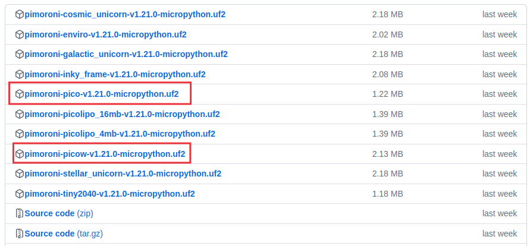

# Firmaware y software
Para terminar con la preparación de nuestra placa y comenzar a trabajar con la misma vamos a ver como grabar el firmware en la Pi Pico y como instalar y usar el compilador Thonny que usaremos para programar la Pi Pico.

## **Instalación del firmware**
Ya hemos indicado que vamos a utilizar la versión de MicrPython de Pimorini. Podemos obtener la versión en: <https://github.com/pimoroni/pimoroni-pico/releases/latest/>. Para instalar MicroPython, tenemos que copiar el archivo .uf2 apropiado de la página de versiones al dispositivo PI Pico mientras está en modo DFU/bootloader.

### ¿Que archivo descargar?
En la [página de versiones] tenemos todos los archivos disponibles de los que a nosotros nos van a interesar uno de los dos que se describen en la tabla e imagen siguientes:

| Placa  | Que archivo uf2 utilizo  |
|---|---|
| Raspberry Pi Pico y otras  placas con RP22040 inalámbricas (Plasma 2040, Interstate 75, Servo 2040, Motor 2040, Tiny 2040 2MB) | pimoroni-pico-vx.x.x-micropython.uf2  |
| Raspberry Pi Pico W y otras  placas Pico W (Automation 2040 W, Inventor 2040 W, Plasma Stick, Interstate 75 W)| pimoroni-picow-vx.x.x-micropython.uf2  |

  
*Archivos a descargar para la Pi Pico*

### Grabar firmware .uf2 en la Pi Pico

## **Instalar Thonny**
