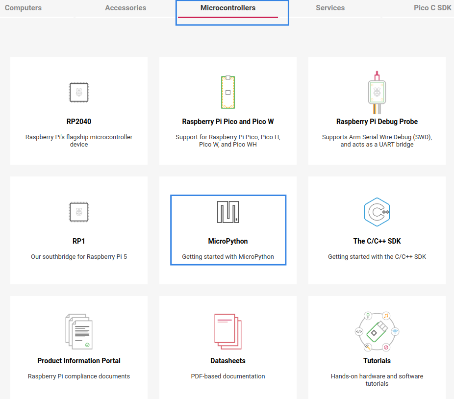

# Firmware genérico
Hay veces que vamos a necesitar trabajar con un firmware diferente al descrito, bien para tener acceso a funciones o módulos que en el de Pimoroni no existen o bien para compatibilizar algunos sensores o actuadores. Vamos a ver dos casos:

**1.-** Descargar desde el [sitio oficial de Raspberry Pi Pico](https://www.raspberrypi.com/documentation/microcontrollers/). Esto nos dará acceso a la web oficial de documentación para Raspberry Pi y microcontroladores. En la página navegamos para seleccionar según vemos en la imagen siguiente:

  
*Acceso al firmware oficial de Raspberry*

Esto nos abre la página de documentación donde se explican diferentes aspectos y en concreto en el apartado **Drag-and-Drop MicroPython** nos ofrece los dos enlaces de descarga para las versiones Pico y Pico W:

* [Raspberry Pi Pico](https://micropython.org/download/rp2-pico/rp2-pico-latest.uf2)
* [Raspberry Pi Pico W](https://micropython.org/download/rp2-pico-w/rp2-pico-w-latest.uf2) con soporte WiFi y Bluetooth LE

Descargamos e instalamos según nuestra versión de Pi Pico de la misma forma que lo hicimos en [Firmware Pimoroni](http://127.0.0.1:8000/Mis-notas-de-pico-explorer/up/firm/).

**2.-** Utilizar los de algún fabricante como Freenove que enlazamos a continuación:

* [Firmware Python de Freenove para Pi Pico](../firmwares_usados/rp2-pico-20230117-unstable-v1.19.1-806-gfc745d85f.uf2)
* [Firmware Python de Freenove para Pi Pico W](../firmwares_usados/rp2-pico-w-20220926-unstable-v1.19.1-451-gbdbc44474.uf2)

Una vez copiado el firmware en la Pico y reiniciada estamos en situación de continuar con nuestro trabajo.