# Inicio con Raspberry Pi Pico
Vamos a realizar una introducción a Raspberry Pi Pico mostrando los pasos necesarios para montarla, configurarla y prepararla para la programación con MicroPython. También veremos como trabajar con algunas placas que se conectan a los breakout garden.

No vamos a profundizar en exceso en los contenidos, aunque si es necesario podemos recurrir a:

* Busquedas en la web sobre el tema. Existen multitud de páginas con información mas o menos detallada, aunque siempre debemos asegurarnos de que la información es confiable.
* El libro [Getting Started with MicroPython on the Raspberry Pi Pico](https://shop.pimoroni.com/products/get-started-with-micropython-on-raspberry-pi-pico).
* El sitio oficial de [Raspberry Pi](https://www.raspberrypi.com/).
* La hoja de datos de Pico: [Datasheet de Pico](https://datasheets.raspberrypi.org/pico/pico-datasheet.pdf).
* Repositorio de Github [Pimoroni Pico Libraries and Examples](https://github.com/pimoroni/pimoroni-pico).

## **Sobre Raspberry Pi**
La Raspberry Pi es una placa construida con un microcontrolador RP2040 a la que si añadimos un teclado, un ratón y un monitor se convierte en un ordenador que ejecuta Linux con un buen nivel de procesamiento y memoria RAM.

Raspberri Pi Pico está orientada a computación física, es decir, para conectarla a sensores y actuadores. A diferencia de la Pi, la Pico está dotada de conversores analógico a digital (ADC) pra ampliar la gama de sensores y entradas. La mayoría de los pines son de tipo PIO (Programmable Input Output) de propósito general. En el RP2040 estos pines están controlados por el IO programable, lo que significa que se actualizan en segundo plano con muy poco uso de la CPU. Esto hace que las entradas/salidas programables sean tan rápidas que se puede alcanzar una resolución de 14 bits en lugar de los 8 bits habituales.

La Raspberry Pi Pico es programable a través de USB con C, C++ o MicroPython, siendo este último lenguaje el que nos ocupará aquí.

Desde el mes de julio de 2022 además se puede conseguir la Pico W con conectividad inalámbrica.

## **Lo que vamos a necesitar**

* Una Raspberry Pi Pico o Pico W

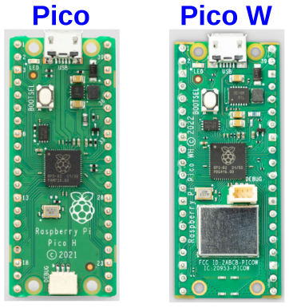  
*Aspecto de las Pi Pico y Pico W*

* Un cable micro USB para conectar la Pico al ordenador y así poder programarla. Lo único a tener en cuenta aquí es que el cable debe ser apto para alimentación y datos. Esto se indica porque algunos cables de teléfonos antiguos por ejemplo, solamente suministran alimentación.

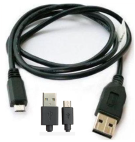  
*Cable USB micro*

* Tiras de pines rectos macho de paso 2.54 mm para poder conectar la Pi Pico a la placa Pico Explorer (veremos como soldarlas mas adelante). Usualmente se comercializan como tiras de 40 pines que debemos cortar en dos trozos de 20 como los que vemos en la imagen siguiente:

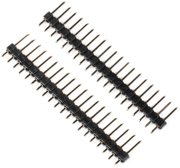  
*Tiras de 20 pines rectos macho de paso 2.54 mm*

* Un ordenador desde el que programar la Pi Pico con el software (usaremos Thonny) que vamos a utilizar instalado.

## **Soldar las tiras de pines**
Aunque vamos a dar unos consejos prácticos de soldadura y partienfdo de la base de que las PCB actuales son fáciles de soldar, si no tenemos herramientas adecuadas y una mínima experiencia es aconsejable adquirir la Pi Pico con las tiras de pines ya soldadas.

### Equipo básico de soldadura
Es relativamente sencillo localizar en la web información de como realizar soldaduras electrónicas para ver como se hace, pero omitimos recomendar ninguno concreto, pues sobre todo, el éxito o fracaso va a depender del equipamiento que tengamos para soldar, y si no tenemos previsto utilizarlo con cierta frecuencia casi mejor no adquirir ninguno y solicitar a alguien que nos suelde las tiras.

En mi caso voy a enumerar y describir brevemente el equipo que yo utilizo con el que llevo trabajando muchos años.

1.- Alfombrilla o tapete de silicona. Permite tener el material ordenado y evita quemaduras o rayaduras accidentales sobre la superficie de trabajo.

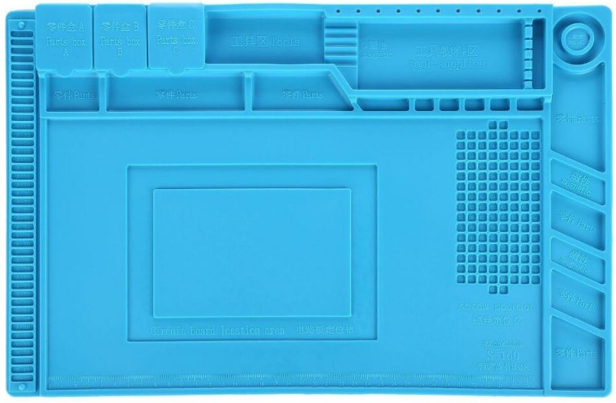  
*Alfombrilla de silicona de 45x30*

2.- Soldador. Es la herramienta principal para esta tarea y no puede sere de baja calidad. Hay que huir de los típicos que encontramos muy económicos. En mi caso dispongo de dos tipos, ambos de bastante calidad.

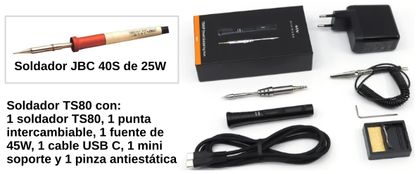  
*Soldadores*

3.- Estaño de 0.5 a 1mm de diámetro. Se recomienda el uso de estaño libre de plomo. En la imagen vemos un carrete de Sn99.3-Cu0.7.

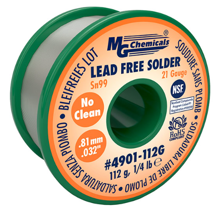  
*Estaño*

4.- Soporte para soldador. Imprescindible si queremos evitar quemaduras accidentales.

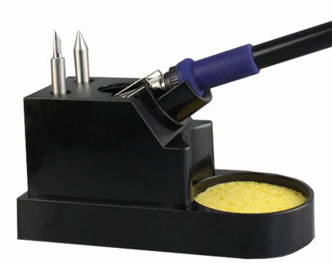  
*Soporte para soldador*

5.- Limpiador de puntas de soldador. Permite eliminar en caliente los restos de estaño y resina de la punta del soldador manteniendola en perfectas condiciones de uso.

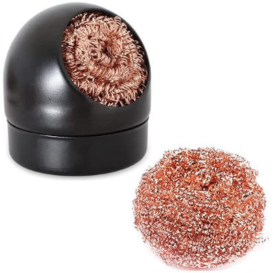  
*Limpiador de puntas de soldador*

6.- Algunas herramientas de uso básico en electrónica como pinzas, alicates de corte, tijeras, destornilladores, etc.

### Teoría de soldadura
Una vez pertrechados con el equipamiento vamos a recomendar unos tutoriales básicos de soldadura:

* El primero es en forma de comic realizado por Mitch Altman (conocimientos de soldadura), Andie Nordgren (adaptación a comic) y Jeff Keyzer (diseño y edición) titulado [Soldar es fácil, aquí está como hacerlo](../datasheet/fullsoldercomic_spanish.pdf). El comic data de 2001 y recomienda el uso del estaño tradicional con aleación de Estaño/Plomo al 60/40 con núcleo de resina. Actualmente este tipo de estaño no se usa habitualmente debido a la alta toxicidad del plomo aunque es fácil de encontrar en el mercado. Existen directivas comunitarias europeas que prohiben su uso. Se recomienda encarecidamente la lectura de este comic, resulta instructivo y entretenido.
* El segundo son dos infografias de Adafruit que aunque están en inglés se entienden perfectamente. Estas las podemos encontrar en la [colección de tarjetas que tiene en Github](https://github.com/adafruit/Reference-Cards) y son [Card 4 Back.pdf](../datasheet/Card%204%20Back.pdf) y [Card 4 Front.pdf](../datasheet/Card%204%20Front.pdf) que reproducimos como imágenes a continuación.

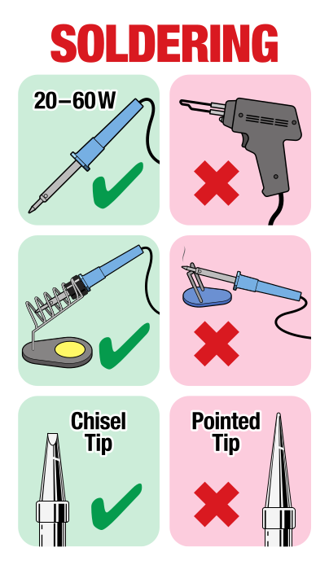  
*Card 4 Front*

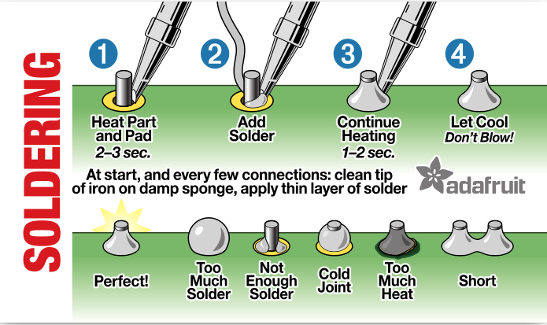  
*Card 4 Back*

### Soldar las tiras de pines
Las tiras de pines debemos soldarlas de manera que queden perpendiculares a la base de la Pi Pico y, para ello, lo más fácil y comodo es pincharlas a la distancia apropiada sobre una placa protoboard. La parte que pinchamos en la protoboard es la parte mas larga de los pines.

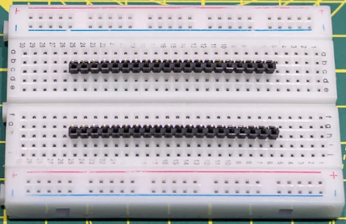  
*Colocación de las tiras en una protoboard*

Colocamos encima de las tiras la Pi Pico con la frambuesa mirando hacia arriba.

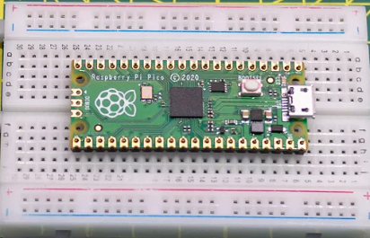  
*Colocación de la Pi Pico sobre las tiras de pines*

Procedemos a soldar cada uno de los pines. Para ello se recomienda soldar los pines de las cuatro esquinas asegrándonos de que la placa está apoyada correctamente. Si no está todo correcto ahora es el momento de realizar las correcciones oportunas porque más adelante ya no podremos. Sobre todo comprobar que están a 90º y podemos continuar con el resto de pines. Se recomienda no soldar los pines uno al lado del otro para evitar sobrecalentamientos de la placa, siendo una buena técnica ir cambiando de una tira a otra hasta completar todas las soldaduras.

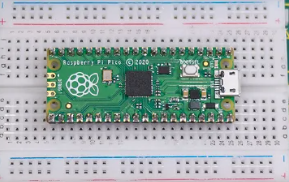  
*Tiras de pines soldadas*

Ya podemos retirar la Pi Pico de la protoboard y colocarla en su lugar en la Pico Explorer. Se recomienda para hacerlo sujetar la placa por los bordes largos y balancearla suavemente o incluso ayudarno de un pequeño destornillador que nos permita hacer palanca, pero debemos hacerlo con cuidado para no doblar ningún pin.
