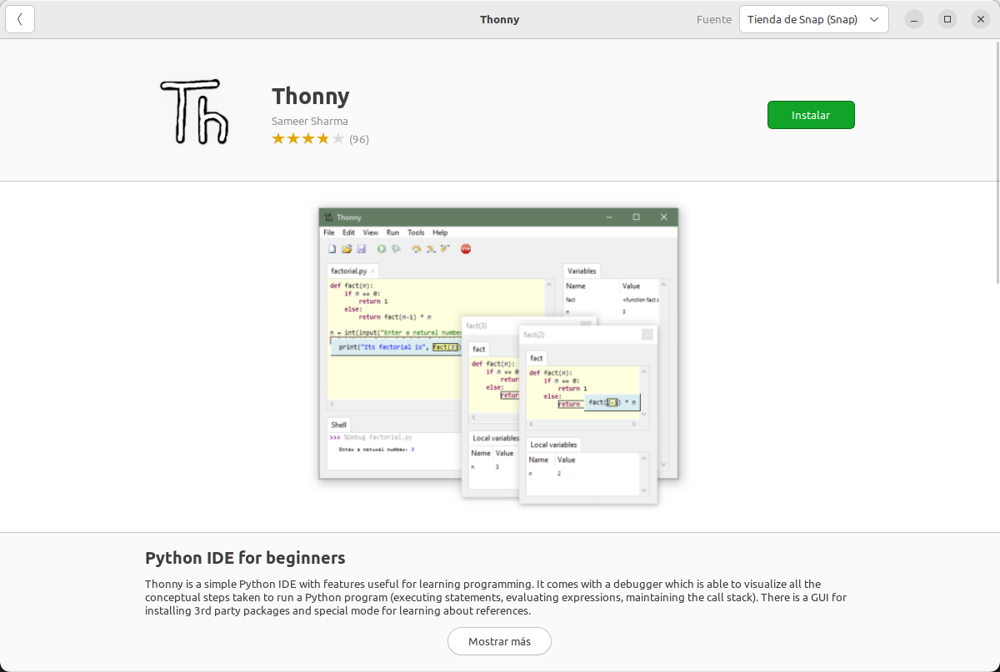
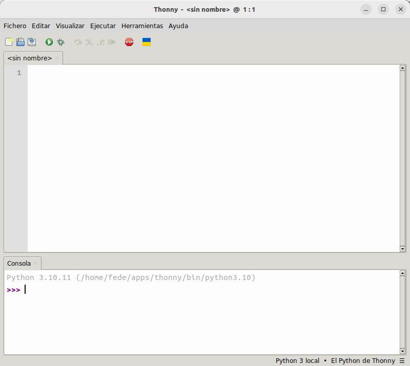
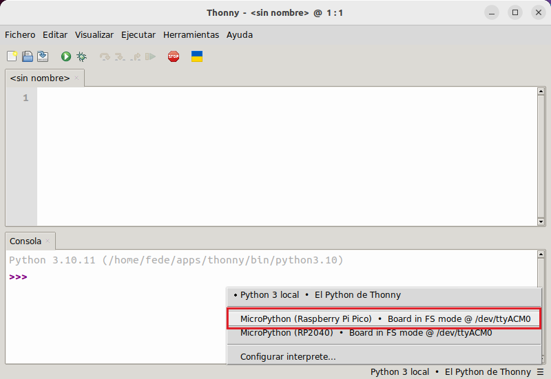
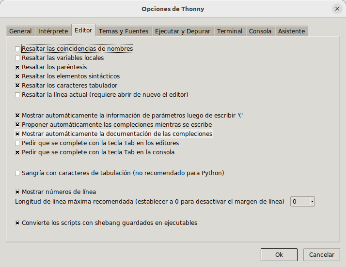
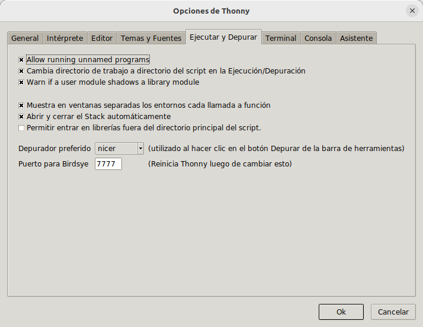
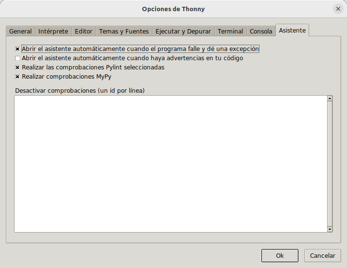
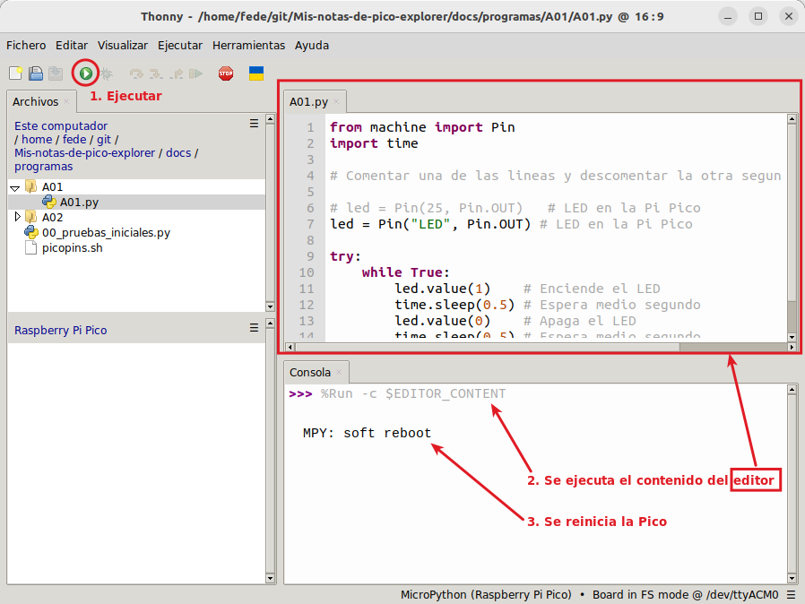

# <FONT COLOR=#8B008B>Software Thonny</font>
Thonny es un sencillo editor gráfico para aprender Python siendo un principiante en el tema.

## <FONT COLOR=#007575>**Instalar Thonny**</font>
Thonny es un IDE (Integrated Development Environment o entorno de desarrollo integrado) de Python y es el software que utilizaremos para programar la Pico.

Si trabajamos desde un Raspberry Pi es muy probable que ya tengamos Thonny instalado y tan solo tengamos que actualizar a la versión mas reciente para disponer de las opciones específicas de Pico. Abrimos una terminal, por ejemplo con Ctrl+Alt+T y escribimos:

```sudo apt update && sudo apt upgrade -y```

y presionamos Enter para que se ejecute.

Si estamos trabajando en un ordenador, las versiones disponibles para Linux, Mac o Windows están [aquí](https://thonny.org/) listas para descargar e instalar.

En el caso de Ubunto lo tenemos disponible en la tienda Snap a través de Ubuntu Software.

<center>

  
*Thonny en la tienda Snap*

</center>

Una vez instalado lo ejecutamos y veremos la ventana siguiente:

<center>

  
*IDE de Thonny*

</center>

Pero seguro que instalando desde las distribuciones de paquetes o tienda Snap no obtenemos la última versión. Si queremos instalar esta última versión en Ubuntu 22.04 debemos visitar el [repositorio de versiones de Thonny](https://github.com/thonny/thonny/releases/) y descargar el archivo .bash de la versión que queramos.

<center>

  
*Repo de versiones de Thonny*

</center>

Abrimos una terminal en el directorio donde tengamos el archivo descargado, thonny-4.1.3.bash en este caso, y tecleamos:

<center>

  
*Ejecutamos thonny-4.1.3.bash*

</center>

Una vez finalizadas todas las tareas tenemos Thonny listo para ejecutar.

<center>

  
*Thonny-4.1.3.bash instalado*

</center>

Ya estamos listos para ejecutar la versión de Thonny, que en este caso se distingue porque aparece una banderita de Ucrania que permite solidarizarse con el pais.

<center>

  
*IDE Thonny-4.1.3*

</center>

## <FONT COLOR=#007575>**Descripción del IDE de Thonny**</font>
Una vez instalado, la primera vez que abrimos el programa se muestra la ventana que vemos a continuación.

<center>

  
*Partes del IDE Thonny-4.1.3*

</center>

A continuación realizamos una breve descripción de las partes numeradas:

1. Barra de título, donde vemos el nombre del programa y el nombre del archivo actual que por defecto es <sin nombre>.
2. Barra de menús, que nos da acceso a todas las partes de Thonny.
3. Barra de herramientas, con accesos rápidos a las tareas habituales.
4. Editor, donde se escribe el código de nuestra aplicación. Es una pestaña con el nombre del archivo y pueden coexistir varias pestañas, lo que permite tener varios archivos abiertos y cambiar rapidamente de uno a otro con tan solo hacer clic en la pestaña.
5. Intérprete de comandos o consola, desde donde interactuar con nuestro ordenador. En realidad esta zona se denomina REPL (Read, Evaluate, Print y Loop) que traducido sería **[bucle Lectura-Evaluación-Impresión](https://es.wikipedia.org/wiki/REPL)**. Esto viene a significar algo así como "lee lo escrito, evalúa el código escrito, imprime los resultados y vuelve a empezar".
6. Barra de estado, donde indica con que Python está trabajando y nos da acceso a la configuración del intérprete.

Desde el menú "Visualizar" se pueden activar y desactivar las herramientas de Thonny. A Continuación vemos este menú desplegado. Activar (o desactivar si ya está activa) una herramienta es hacer clic sobre su nombre en este menú.

<center>

  
*Menú Visualizar*

</center>

Describimos brevemente estas herramientas.

* Archivos (Árbol de archivos). Especialmente útil cuando trabajamos en proyectos con varios archivos.
* Asistente. Un ayudante del editor Python que nos guiará en los problemas en la ejecución o al implementar la aplicación.
* Ayuda. Ayuda sobre el uso de la aplicación, del depurador, etc.
* Esquema. Es un árbol con todas las funciones, objetos y métodos definidos en nuestra aplicación. Es como un vistazo general a la aplicación que nos permite movernos con rapidez por la misma. Simplemente cuando hacemos clic en un método, función o clase, nos desplazamos a ella.
* Excepción. Es donde se muestran los errores, cuando los hay.
* Inspector de objetos. Permite examinar las variables que se muestran tanto en heap como en Variables.
* Montículo (heap). Cuando lo activamos podemos ver el valor de las variables.
* Notas. Para tener un lugar donde hacer anotaciones y tenerlas siempre a mano. Lo que escribamos aquí se guar de manera automática y se carga en el siguiente arranque de Thonny.
* PORHACER. Visualiza las etiquetas #TODO que hemos puesto como aviso de que la tarea está pendiente.
* Pila (stack). Nos da una visión de la parte de la aplicación en la que nos encontramos en tiempo de ejecución.
* Variables. Nos permite identificar, en tiempo de ejecución, cada una de las variables de nuestra aplicación. Si tenemos activado el heap lo que se muestra es el identificador de la variable, mientras que si no está activado heap veremos el valor de la variable.
* Árbol del programa. Es otra visión o punto de vista del programa que permite analizar el funcionamiento del mismo de una manera totalmente diferente.

## <FONT COLOR=#007575>**Configuración básica de Thonny**</font>
Thonny es fácil de configurar dada lo básica que es la misma. Podemos acceder a la configuración o bien desde el menú *Herramientas* o bien desde la parte inferior derecha de la ventana. En este último caso se abrirá la ventana en la pestaña *Interprete*.

<center>

  
*Acceso a la ventana de configuración*

</center>

### <FONT COLOR=#AA0000>General</font>
En esta pestaña se configuran aspecto generales de la aplicación, como la posibilidad de lanzar varias instancias de Thonny, reabrir todos los archivos de la última sesión o configurar el idioma.

<center>

  
*Pestaña General*

</center>

### <FONT COLOR=#AA0000>Intérprete</font>
Thonny permite seleccionar diferentes intérpretes, es decir, diferentes versiones de Python. Como regla regla general, se utiliza el mismo intérprete que el que ejecuta Thonny. Sin embargo, en nuestro caso, usaremos un intérprete concreto. Necesitamos tener seleccionado 'MicroPython (Raspberry Pi Pico)' como intérprete de Python; esto se puede hacer clicando en el cuadro en la parte inferior derecha. Thonny puede ofrecernos instalar MicroPython, pero no necesitamos hacerlo ya que ya tenemos la variante de MicroPython que necesitamos instalada. Teniendo las Pi Pico conectada a un puerto USB esta acción nos devolverá algo similar a la imagen siguiente:

<center>

  
*Selección del Intérprete*

</center>

Tras la selección Thonny muestra el siguiente aspecto:

<center>

  
*Thonny tras la selección del Intérprete*

</center>

Si no vemos la ventana como la de arriba, podemos probar a hacer clic en el botón rojo de detener para interrumpir cualquier proceso que se esté ejecutando.

Si Thonny tiene problemas para la detección automática la podemos seleccionar manualmente desde la pestaña de configuración *Intérprete*, desde donde podremos seleccionar la placa y el puerto de forma correcta.

<center>

  
*Pestaña Intérprete*

</center>

### <FONT COLOR=#AA0000>Editor</font>
En esta pestaña podemos seleccionar diferentes opciones que nos ayudarán en nuestro día a día programando.

<center>

  
*Pestaña Editor*

</center>

### <FONT COLOR=#AA0000>Temas y fuentes</font>
Esta pestaña está orientada a cambiar el aspecto estético de la aplicación según nuestras preferencias.

<center>

  
*Pestaña Temas y fuentes*

</center>

### <FONT COLOR=#AA0000>Ejecutar y depurar</font>
Para configurar una serie de ayudas que mejorean el funcionamiento y permiten trabajar mas comodamente, como por ejemplo la de abrir y cerrar el *Stack* automáticamente.

<center>

  
*Pestaña Ejecutar y depurar*

</center>

### <FONT COLOR=#AA0000>Terminal</font>
En esta pestaña podemos configurar las opciones del terminal.

<center>

  
*Pestaña Terminal*

</center>

### <FONT COLOR=#AA0000>Consola</font>
En esta pestaña podemos configurar las opciones referentes al comportamiento al terminar un proceso o una aplicación.

<center>

  
*Pestaña Consola*

</center>

### <FONT COLOR=#AA0000>Asistente</font>
En esta pestaña quizá la opción mas interesante sea la de habilitar o deshabilitar la apertura del asistente, de forma automática, cuando se produce un error en el programa. También es interesante activar este comportamiento para los *warning*.
<center>

  
*Pestaña Asistente*

</center>

## <FONT COLOR=#007575>**Primeros pasos con Thonny**</font>
Conectamos la Pi Pico con el firmware grabado al ordenador mediante un cable USB, arrancamos Thonny y hacemos clic en el 'Shell' o consola, obtendremos un cursor parpadeante. Escribiendo instrucciones en este cuadro damos órdenes a la Pico directamente, una orden cada vez (esto se llama REPL, o Read-Eval-Print Loop). En la animación siguiente vemos su funcionamiento.

<center>

  
*Ordenes en la consola (REPL)*

</center>

Pero tal vez lo que queramos sea poner mas de una línea de instrucciones para componer un programa y que al ejecutarlo se realicen las acciones programadas. Esto lo hacemos en la ventana de programa, como por ejemplo en la animación siguiente:

<center>

  
*Programa básico*

</center>

### <FONT COLOR=#AA0000>Funcionamiento en línea</font>
Podemos trabajar con la Raspberry Pi Pico en línea o conectada para compilar o depurar programas, pero es necesario tenerla conectada al ordenador.

Las ventajas que esto no ofrece son:

* Podemos utilizar Thonny para compilar o depurar programas.
* A través de la ventana "Shell", obtenemos la información de errores y los resultados de salida generados durante la ejecución del programa. También es posible consultar información de funciones para ayudar a mejorar el programa.

Las desventajas son:

* Para trabajar en línea la Raspberry Pi Pico tiene que estar conectada a un ordenador y ejecutar con Thonny.
* Si la Raspberry Pi Pico se desconecta del ordenador, el programa no se ejecutará de nuevo cuando se vuelve a conectar la Pi Pico.

Partimos de Thonny reciente abierto y lo primero que hacemos es localizar un proyecto para abrirlo o bien crear uno nuevo. El proceso de apertura es el de la animación siguiente:

<center>

  
*Abrir un programa desde Thonny*

</center>

En la animación observamos lo fácil que es abrir el archivo y ejecutarlo haciendo clic en el botón ***Ejecutar el script actual*** o pulsando ***F5***. Cuando estamos en modo de ejecute en línea, podemos hacer clic en ***Detener/Reiniciar el backend*** en Thonny o pulsar ***Ctrl+C*** para salir del programa. Esta acción límpia el contenido de la consola al igual que la combinación de teclas ***Ctrl+L***.

### <FONT COLOR=#AA0000>Funcionamiento sin conexión</font>
La Raspberry Pi Pico no necesita estar conectada al ordenador y a Thonny para ejecutar los programas almacenados en ***main.py*** en el dispositivo una vez que lo alimentemos.

La ventaja es que se pueden ejecutar programas cuando se enciende sin conectarse a la computadora y Thonny.

La desventaja es que el programa se detendrá automáticamente cuando se produzca un error o la Raspberry Pi Pico se quede sin energía. En esta situación el código no se puede cambiar fácilmente.

Cuando se alimenta, la Raspberry Pi Pico comprobará automáticamente si existe ***main.py*** en el dispositivo. Si está presente, ejecuta los programas en ***main.py*** y luego entra en el modo de comandos del shell. Es decir, si queremos que nuestro programa se ejecute offline basta con guardarlo con el nombre ***main.py***. Si ***main.py*** no existe, el sistema entrará en el modo de comandos shell directamente.

<a name="ejecutar"></a>

## <FONT COLOR=#007575>**Ejecutando código**</font>
Con la Pi Pico conectada al ordenador podemos hacer clic sobre el botón ejecutar y ver como parpadea el LED en la placa y la información que se muestra en la consola.

<center>

  
*Ejecutar un programa desde Thonny*

</center>

Si ahora hacemos clic en el botón de parada/reinicio el programa se detiene, el LED se apaga y se muestra información en la consola.

<center>

  
*Detener un programa desde Thonny*

</center>

De esta forma estamos ejecutando código online o en conexión. Si ahora desconectamos el cable USB del ordenador, Thonny nos va a mostrar el siguiente mensaje:

<center>

  
*Conexión perdida*

</center>

Ahora volvemos a conectar el cable USB y recuperamos la conexión haciendo clic en el botón STOP. En esta situación hacemos clic derecho sobre el nombre del archivo A01.py y escogemos la opción ***Subir a /*** para grabar el programa en la Pi Pico.

<center>

  
*Subir a /*

</center>

Podemos observar como ahora hay un archivo en la Pi Pico con el mismo nombre que el que teniamos en el IDE de Thonny.

<center>

  
*Archivo subido a la Pi Pico*

</center>

Pero este archivo por si solo no puede ejecutarse en la Pi Pico ya que el interprete MicroPython que contiene espera un archivo ```main.py```. Lo que vamos a hacer es [descargar el archivo main.py](../programas/main/main.py), que está en un directorio del mismo nombre, y lo copiamos en el directorio de A01. Simplemente indicar por ahora que desde MicroPython se invoca la ejecución de este archivo main.py. Una vez copiado el archivo al directorio lo llevamos a la Pico de la misma forma que antes. Tendremos la siguiente situación:

<center>

  
*Archivo main.py subido a la Pi Pico*

</center>

Desconectamos el cable USB y lo volvemos a conectar. El LED en la pico parpadea según el programa A01.py mientras que Thonny se muestra como vemos a continuación:

<center>

  
*Ejecución desde la Raspberry Pi Pico*

</center>

El código se está ejecutando sin conexión (offline) entre Thonny y la Pico. Si queremos volver a tomar el control desde Thonny basta con hacer clic en el botón STOP y se mostrará la ventana siguiente:

<center>

  
*Vuelta al modo online*

</center>
