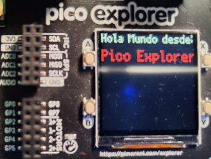

# <FONT COLOR=#8B008B>Funciones de referencia de la placa Pico Explorer</font>
La Pico Explorer Base incorpora:

* Una pantalla LCD IPS (In Plane Switching) de 1,14" (240 x 240 pixels)
* Cuatro pulsadores
* Un zumbador/altavoz piezoeléctrico
* Un controlador de motores DRV8833.
* Conectores tipo dupont de uso general.
* Placa prooboard pequeña.
* Conectores tipo jardinera.

## <FONT COLOR=#007575>**Funciones**</font>

### <FONT COLOR=#AA0000>Pantalla</font>
Pico Explorer utiliza la biblioteca Pico Graphics para dibujar gráficos y escribir texto en la pantalla. En el enlace [Referencia de la función PicoGraphics MicroPython](https://github.com/pimoroni/pimoroni-pico/tree/main/micropython/modules/picographics) podemos encontrar toda la información de esta biblioteca y en este otro enlace, [La libreria PicoGraphics](../upy/picographics.md) en esta misma web información en castellano obtenida del primer enlace.

En la placa Pico Explorer no es posible (por ahorro de pines para usar en otras funciones) regular la iluminación de fondo de la pantalla por lo que ```set_backlight``` no tiene ningún efecto en este caso.

Un ejemplo comentado nos ayudará a empezar a comprendrer el funcionamiento de la librería:

~~~py
from picographics import PicoGraphics, DISPLAY_PICO_EXPLORER

# Configura pantalla
display = PicoGraphics(display=DISPLAY_PICO_EXPLORER)
# Crea colores de pluma para escribir con ella
BLANCO = display.create_pen(255, 255, 255)
ROJO = display.create_pen(255,0,0)
# Establece fuente y cambia el pluma a blanco
display.set_font("bitmap8")
display.set_pen(BLANCO)
# Muestra un texto
display.text("Hola Mundo desde:", 0, 0, scale=3)
# cambia pluma a rojo
display.set_pen(ROJO)
# Muestra un texto
display.text("Pico Explorer", 0, 40, scale=4)

# Actualiza la pantalla
display.update()
~~~

El resultado lo vemos en la imagen siguiente:

<center>

  

</center>

El programa lo podemos descargar desde este [enlace](../programas/ejem_hola_mundo_pantalla.py)

### <FONT COLOR=#AA0000>Botones</font>
En Pico Explorer tenemos disponibles cuatro botones, A, B, X e Y que están conectados a los GPIO 12, 13, 14 y 15 respectivamente. El módulo ```pimoroni``` tiene una clase de nombre ```Button``` para manejar los botones incluyendo la eliminación de rebotes y la repetición automática.

La forma de trabajar con los botones es sencilla, tenemos que importar la  clase desde el módulo:

~~~py
from pimoroni import Button
~~~

Y después crear instancias de ```button``` con los GPIO correspondiente:

~~~py
botonA = Button(12)
botonB = Button(13)
botonX = Button(14)
botonY = Button(15)
~~~

La clase tiene la forma:

<center>

~~~py
Button(button, invert=True, repeat_time=200, hold_time=1000)
~~~

</center>

Si se mantiene presionado el botón, la clase devolverá ```True``` en el intervalo de tiempo comprendido entre ```repeat_time``` y ```hold_time``` y cuando se alcance ```hold_time``` regresará ```True``` cada ```repeat_time```/3 milisegundos.

Tenemos disponibles dos métodos para leer el estado del botón:

* Con función de repetición: ```estado = botonA.read()```
* Sin la función de repetición: ```estado = botonA.raw()```

### <FONT COLOR=#AA0000>ADC (conversión analógica a digital)</font>
La Pico Explorer dispone de tres canales ADC conectados a los pines 26, 27 y 28 de la Pi Pico. El módulo ```pimoroni``` implementa la clase ```Analog``` que permite leer los valores de tensión de esos pines.

Para trabajar con esta clase hay que importarla desde el módulo:

~~~py
from pimoroni import Analog
~~~

Y después crear instancias de ```Analog``` con los pines correspondiente:

~~~py
adc0 = Analog(26)
adc1 = Analog(27)
adc2 = Analog(28)
~~~

El valor de los pines se lee haciendo:

~~~py
leer_analogica = adc0.read_voltage()
~~~

### <FONT COLOR=#AA0000>Motores</font>
Los pines dedicados a motores en la Pico Explorer son controlados por PWM mediante el driver [DRV8833](../datasheet/drv8833.pdf) que integra la placa y que contiene un puente en H doble. Lo mas aconsejable es utilizar la clase ```Motor``` del módulo ```pimoroni``` para el manejo de estos pines.

Para comenzar a usar motores lo primero es importar la clase ```Motor```.

~~~py
from motor import Motor
~~~

Ahora instaciamos la clase para crear un objeto motor así:

~~~py
motor1 = Motor((8,9))
~~~

Y ya podemos comenzar a utilizar las funciones disponibles para la clase ```Motor```

~~~py
Motor(pins, direction=NORMAL_DIR, speed_scale=1.0, zeropoint=0.0, deadzone=0.05, freq=25000, mode=SLOW_DECAY, ph_en_driver=False)
pins()
enable()
disable()
is_enabled()
duty()
duty(duty)
speed()
speed(speed)
frequency()
frequency(freq)
stop()
coast()
brake()
full_negative()
full_positive()
to_percent(in)
to_percent(in, in_min, in_max)
to_percent(in, in_min, in_max, speed_min, speed_max)
direction()
direction(direction)
speed_scale()
speed_scale(speed_scale)
zeropoint()
zeropoint(zeropoint)
deadzone()
deadzone(deadzone)
decay_mode()
decay_mode(mode)
~~~

Con ```motor1.enable()``` activamos el motor con su última velocidad conocida. Si es la primera vez esta velocidad será cero. Cuando hayamos terminado con el motor, lo desactivamos con ```motor1.disable()```. Existen diversas maneras de controlar un motor que vamos a ver a continuación.

#### <FONT COLOR=#880088>Control por velocidad</font>
La velocidad es una forma intuitiva de controlar un motor y se expresa como un número que puede representar revoluciones por minuto o una velocidad angular o lineal. De forma predeterminada la velocidad puede tomar valores entre -1.0 y +1.0 pero se pueden establecer valores diferentes con ```speed_scale```.

La velocidad la podemos configurar llamando a ```.speed(vel)``` siendo ```vel``` un número fraccionario o de coma flotante. Si el motor esta deshabilitado esto lo habilita y se almacena el ciclo de trabajo resultante.

Para saber la velocidad actual del motor invocamos ```.speed()``` sin parámetros. Si el motor está deshabilitado devuelve la última velocidad que se proporcionó cuando se habilitó.

Con el método ```.full_negative()``` ordenamos al motor que alcance su velocidad máxima negativa y con ```.full_positive()``` la positiva. En ambos casos se habilta el motor si no lo estaba.

Para detener el motor usamos ```.stop()```. El motor también se puede detener por inercia con ```.coast()``` o frenando con ```.brake()```.

#### <FONT COLOR=#880088>Control por porcentaje</font>
Si necesitamos que el motor funcione dependiendo de algún sensor o dispositivo que entrega valores que nos son facilmente convertibles a velocidades del motor. Para solucionar esto disponemos del método ```.to_percent(in)``` en la biblioteca. También disponemos de ```.to_percent(in, in_min, in_max)``` que configura un porcentaje entre los valores mínimo y máximo proporcionados y también de ```.to_percent(in, in_min, value_min, value_max)``` que configura un porcentaje entre dos velocidades proporcionadas con una entrada entre un mínimo y un máximo.

Si  el motor está desabilitado estos métodos lo habilitan.

#### <FONT COLOR=#880088>Control por ciclo de trabajo</font>
Es el control PWM de velocidad y sentido de giro de los motores en el que el porcentaje de tiempo que las señales están activas es lo que se conoce como ciclo de trabajo.

El ciclo de trabajo se puede configurar con ```.duty(duty)```, que toma un valor entre -1.0 y +1.0 como entrada ```duty```. Esto habilita al motor si no lo está y recalcula la velocidad.

Para obtener el ciclo de trabajo actual invocamos a ```.duty()``` sin ninguna entrada.

La mayoría de los motores tienen un valor de ciclo de trabajo por debajo del cual hay demasiada fricción para moverse, produciendo un zumbido audible al intentarlo. Para evitar esto se puede establecer una zona muerta del ciclo de trabajo invocando a ```.deadzone(deadzone)``` que es un número real entre 0.0 y 1.0. Cuando establezcamos un ciclo de trabajo para un motor, este solamente será enviado al motor si es igual o mayor a la zona muerta enviada. Si está por debajo, el motor se detendrá. El valor por defecto de ```deadzone``` es 0.05.

Podemos leer el valor de zona muerta invocando ```.deadzone()```.

### <FONT COLOR=#AA0000>Audio</font>
Los pines para PWM con audio son GP0 a GP7 en Pico Explorer. El pin que seleccionemos como salida PWM de audio tenemos que conectarlo mediante un puente con el pin nombrado **AUDIO** que es el pin que conecta con el zumbador piezoeléctrico.

Para configurar el altavoz lo primero es importar ```Buzzer``` desde el módulo ```pimoroni```, para ello:

~~~py
from pimoroni import Buzzer
~~~

Una vez importado podemos crear una instancia del mismo haciendo:

~~~py
altavoz = Buzzer(0) # usando GP0
~~~

Ya podemos reproducir tonos de audio con:

~~~py
altavoz.set_tone(frecuencia)
~~~

El parámetro frecuencia debe estar comprendido entre 1 y 5000 para frecuencias humanas audibles.

El altavozse puede silenciar con:

~~~py
altavoz.set_tone(0)
~~~

El siguiente código hace sonar un tono de 440 Hz durante 2 segundos en el altavoz.

~~~py
from pimoroni import Buzzer
import time
altavoz = Buzzer(0)
altavoz.set_tone(440)
time.sleep(2)
altavoz.set_tone(0)
~~~

### <FONT COLOR=#AA0000>Pines GPIO</font>
Los 8 pines de entrada/salida de propósito general de la Pico Explorer están conectados de GP0 a GP7 y se puede utilizar ```machine``` de la misma forma que se utiliza en la Pi Pico.

~~~py
import machine
GP0 = machine.Pin(0, machine.Pin.IN, machine.Pin.PULL_DOWN) # pin como entrada
GP1 = machine.Pin(1, machine.Pin.OUT) # pin como salida
~~~

Cuando conectamos diodos LED externos a la placa Pico Explorer, debemos tener en cuenta que GP0-GP7 ya tienen integradas una resistencia de 100 ohmios cada pin, que se realiza a través de dos arrays de cuatro resistencias de 100 ohmios. Esto hace que no sea necesario incluir resistencias externas para evitar que el LED externo demande una corriente excesiva de esos pines.

### <FONT COLOR=#AA0000>Ranuras jardinera / I2C</font>
Estas ranuras permiten conectar dispositivos I2C a Pico Explorer:

* [Lista de brotes disponibles en la tienda oficial](https://github.com/pimoroni/pimoroni-pico/blob/main/README.md#breakouts)

En Pico Explores los pines GP20 (SDA) y GP21 (SCL) son los utilizados para interfaces tipo I2C y son diferentes de los pines predeterminados de tipo jardinera que utiliza Pimoroni, por lo que siempre que usemos estos conectores tenemos que especificar que estamos utilizando la placa Pico Explorer. Tenemos dos formas de hacer esto:

1. Utilizando las constantes del módulo ```pimoroni```.

~~~py
from pimoroni_i2c import PimoroniI2C
from pimoroni import PICO_EXPLORER_I2C_PINS

i2c = PimoroniI2C(**PICO_EXPLORER_I2C_PINS)
~~~

2. Especificando los números de pines.

~~~py
from pimoroni_i2c import PimoroniI2C

i2c = PimoroniI2C(sda=(20), scl=(21))
~~~

### <FONT COLOR=#AA0000>Pines</font>
A continuación damos un listado de pines de la Pico Explorer agrupados por funciones. Esta lista de pines la podemos encontrar también en la parte posterior de la placa Pico Explorer.

#### <FONT COLOR=#880088>GPIO</font>
Los pines GPIO (General Purpose Input Output) o pines de entrada/salida de propósito general son:

* GP0 = 0
* GP1 = 1
* GP2 = 2
* GP3 = 3
* GP4 = 4
* GP5 = 5
* GP6 = 6
* GP7 = 7

#### <FONT COLOR=#880088>Botones</font>

* Botón A = 12
* Botón B = 13
* Botón X = 14
* Botón Y = 15

#### <FONT COLOR=#880088>Motores</font>

* Motor 1 (-) = 8
* Motor 1 (+) = 9
* Motor 2 (-) = 10
* Motor 2 (+) = 11

#### <FONT COLOR=#880088>SPI</font>
Utilizados para la pantalla son:

* SPI MISO - 16
* LCD CS - 17
* SPI SCK - 18
* SPI MOSI - 19

#### <FONT COLOR=#880088>I2C</font>

* I2C SDA - 20
* I2C SCL - 21
* I2C INT - 22

#### <FONT COLOR=#880088>Pines analógicos</font>

* ADC0 = 26
* ADC1 = 27
* ADC2 = 28
